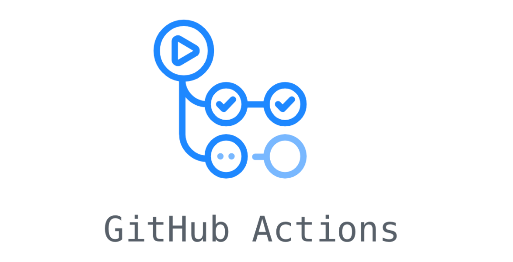

# CI/CD Pipelines

<p align="center">
  
</p>

## Overview

CI/CD for Artifact-ML relies on GitHub actions.

The github actions workflows powering our CI/CD pipeline delegate to shell scripts.

The latter are organized under the `.github/scripts` directory.

All scripts are unit-tested using the [Bats](https://github.com/bats-core/bats-core) framework.

Tests are organized in `.github/tests`. Their directory structure mirrors that of `.github/scripts`.


## GitHub Actions Workflows

<p align="center">
  
</p>

### Workflow Name Convention

All Github Actions workflows follow the naming convention:

<p align="center">
  <strong><code>AREA_TRIGGER[SCOPE]</code></strong>
</p>

- **AREA** – high level operation spec (e.g. `CI`, `SONAR`, `RELEASE`).
- **TRIGGER** – event that triggers the workflow (`PUSH`, `PR`, `SCHEDULE`).
- **SCOPE** – relevant component or branch (`CORE`, `EXPERIMENT`, `TORCH`).

### GitHub Actions Workflow Registry

#### Push Triggers

##### Component: core
- `ci_push_core.yml` (workflow name: CI_PUSH[CORE]): runs CI checks when changes are pushed to branches other than `main` and `dev-core` involving files in the `core` component directories,
- `ci_push_dev_core.yml` (workflow name: CI_PUSH[DEV_CORE]): runs CI checks when changes are pushed to `dev-core` (always merges of `feature`/ `fix` branches through pull request),

##### Component: experiment
- `ci_push_experiment.yml` (workflow name: CI_PUSH[EXPERIMENT]): runs CI checks when changes are pushed to branches other than `main` and `dev-experiment` involving files in the `experiment` component directories,
- `ci_push_dev_experiment.yml` (workflow name: CI_PUSH[DEV_EXPERIMENT]): runs CI checks when changes are pushed to `dev-experiment` (always merges of `feature`/ `fix` branches through pull request),

##### Component: torch
- `ci_push_torch.yml` (workflow name: CI_PUSH[TORCH]): runs CI checks when changes are pushed to branches other than `main` and `dev-torch` involving files in the `torch` component directories,
 - `ci_push_dev_torch.yml` (workflow name: CI_PUSH[DEV_TORCH]): runs CI checks when changes are pushed to `dev-torch` (always merges of `feature`/ `fix` branches through pull request),
 
##### Branch: main
- `ci_push_main.yml` (workflow name: CI_PUSH[MAIN]): runs CI checks when changes are pushed to `main` (always merges of `dev`/ `hotfix`/ `setup` branches through pull request). **After CI passes, automatically runs the version bump job** which parses the commit description and message to identify the relevant component and bump type, updates the relevant `pyproject.toml`, and pushes the change along with a git tag. The tag push then **automatically triggers** the `PUBLISH[PYPI]` workflow.
- `lint_message_push_main.yml` (workflow name: LINT_MESSAGE_PUSH[MAIN]): validates the message carried by a merge commit pushed to `main`---asserts that the message is of the form "Merge pull request #<`PR_number`> from <`username`>/<`branch-name`>" (or "...<`username`>:<`branch-name`>") where `<branch_name>` is one of the appropriate source branches i.e. `dev-<component_name>`, `hotfix-<component_name>`/`<descriptive_name>`, or `setup-<component_name>/<descriptive_name>`,
- `lint_description_push_main.yml` (workflow name: LINT_DESCRIPTION_PUSH[MAIN]): validates the description carried by a merge commit pushed to `main`---asserts that the description is a valid PR title according to the appropriate semantic versioning prefix convention (see *Versioning and PRs to `main`*),
- `bump_component_push_main.yml` (workflow name: BUMP_COMPONENT_PUSH[MAIN]): **manual-only fallback** for version bumping---can be triggered via workflow dispatch if the automatic bump in `CI_PUSH[MAIN]` needs to be re-run or if manual intervention is required.

#### Tag Triggers

- `publish.yml` (workflow name: PUBLISH[PYPI]): publishes packages to PyPI when version tags are pushed (format: `artifact-<component>-v<version>`) or when manually triggered via workflow dispatch---extracts component and version information, builds the package using Poetry, publishes to PyPI using Trusted Publishing (OIDC), and creates a GitHub Release with the built artifacts (tag triggers only). **Note:** This workflow is automatically triggered when `CI_PUSH[MAIN]` pushes a version tag after bumping.
- `publish_test.yml` (workflow name: PUBLISH[TEST_PYPI]): publishes packages to TestPyPI when manually triggered via workflow dispatch---extracts component information, builds the package using Poetry, and publishes to TestPyPI using Trusted Publishing (OIDC) for testing purposes before production release.

#### PR Triggers

##### dev-core
- `enforce_source_branch_naming_pr_dev_core.yml` (workflow name: ENFORCE_SOURCE_BRANCH_NAMING_PR[DEV_CORE]): ensures that branches being PR'd to `dev-core` follow the naming convention: `feature-core/<descriptive_name>`, `fix-core/<descriptive_name>`,
- `enforce_change_dirs_pr_dev_core.yml` (workflow name: ENFORCE_CHANGE_DIRS_PR[DEV_CORE]): ensures PRs to `dev-core` only modify files in their corresponding directories,
- `sonar_pr_dev_core.yml` (workflow name: SONAR_PR[DEV_CORE]): runs **tests with coverage** and **SonarCloud analysis** for PRs targeting `dev-core` that touch files under `artifact-core/**`;

##### dev-experiment
- `enforce_source_branch_naming_pr_dev_experiment.yml` (workflow name: ENFORCE_SOURCE_BRANCH_NAMING_PR[DEV_EXPERIMENT]): ensures that branches being PR'd to `dev-experiment` follow the naming convention: `feature-experiment/<descriptive_name>`, `fix-experiment/<descriptive_name>`,
- `enforce_change_dirs_pr_dev_experiment.yml` (workflow name: ENFORCE_CHANGE_DIRS_PR[DEV_EXPERIMENT]): ensures PRs to `dev-experiment` only modify files in their corresponding directories,
- `sonar_pr_dev_experiment.yml` (workflow name: SONAR_PR[DEV_EXPERIMENT]): runs **tests with coverage** and **SonarCloud analysis** for PRs targeting `dev-experiment` that touch files under `artifact-experiment/**`,

##### dev-torch
- `enforce_source_branch_naming_pr_dev_torch.yml` (workflow name: ENFORCE_SOURCE_BRANCH_NAMING_PR[DEV_TORCH]): ensures that branches being PR'd to `dev-torch` follow the naming convention: `feature-torch/<descriptive_name>`, `fix-torch/<descriptive_name>`,
- `enforce_change_dirs_pr_dev_torch.yml` (workflow name: ENFORCE_CHANGE_DIRS_PR[DEV_TORCH]): ensures PRs to `dev-torch` only modify files in their corresponding directories,
- `sonar_pr_dev_torch.yml` (workflow name: SONAR_PR[DEV_TORCH]): runs **tests with coverage** and **SonarCloud analysis** for PRs targeting `dev-torch` that touch files under `artifact-torch/**`,

##### main
- `lint_title_pr_main.yml` (workflow name: LINT_TITLE_PR[MAIN]): ensures PR titles to `main` follow the appropriate semantic versioning prefix convention (see *Versioning and PRs to `main`*),
- `enforce_source_branch_naming_pr_main.yml` (workflow name: ENFORCE_SOURCE_BRANCH_NAMING_PR[MAIN]): ensures that branches being PR'd to `main` follow the naming convention: `dev-<component>`, `hotfix-<component>/*`, or `setup-<component>/*`
- `enforce_change_dirs_pr_main.yml` (workflow name: ENFORCE_CHANGE_DIRS_PR[MAIN]) - Ensures:
  - PRs from `dev-core` to `main` only modify files in the `artifact-core` directory
  - PRs from `dev-experiment` to `main` only modify files in the `artifact-experiment` directory
  - PRs from `dev-torch` to `main`only modify files in the `artifact-torch` directory
  - PRs from `hotfix-core/*` branches to `main` only modify files in the `artifact-core` directory
  - PRs from `hotfix-experiment/*` branches to `main` only modify files in the `artifact-experiment` directory
  - PRs from `hotfix-torch/*` branches to `main` only modify files in the `artifact-torch` directory
  - PRs from `hotfix-root/*` or `setup-root/*` branches to `main` only modify files outside the component source code directories (`artifact-core/artifact_core/`, `artifact-experiment/artifact_experiment/`, `artifact-torch/artifact_torch/`).
- `sonar_pr_main.yml` (workflow name: SONAR_PR[MAIN]): runs **tests with coverage** and **SonarCloud analysis** on all components for PRs targeting `main`,


## CICD Scripts

The github actions workflows powering our CI/CD pipeline delegate to shell scripts.

The latter are organized under the `.github/scripts` directory.

<p align="center">
  
</p>

### Execution Context

All scripts are designed to run from the repository root.

This means:

- Workflow files (`.github/workflows/*.yml`) execute scripts using paths relative to the repository root (e.g., `.github/scripts/linting/check_is_merge_commit.sh`),
- Scripts reference other scripts using paths relative to the repository root (e.g., `.github/scripts/linting/lint_commit_description.sh`),
- CICD script functional tests run scripts from the repository root context.

This approach aligns with GitHub Actions' standard execution context, where workflows run from the repository root.

### Script Registry

#### Linting Scripts (`.github/scripts/linting/`)

- `check_is_merge_commit.sh`:
  - **Given:** the currently checked-out commit (typically `$GITHUB_SHA`/`HEAD`).
  - **Does:** counts parent commits; if >1, it’s a merge commit. Prints the parent count to stdout.
  - **Outcome:** exits `0` for merge commits (multi-parent), `1` otherwise.

- `detect_bump_pattern.sh`:
  - **Given:** a text string (e.g., PR title or commit body).
  - **Does:** lowercases the text and checks if it **starts with** a `bump_type` prefix i.e. `patch:`, `minor:`, `major:`, `no-bump:` or their scoped counterparts e.g. `patch(scope):`.
  - **Outcome:** prints the bump type (`patch` | `minor` | `major` | `no-bump`) to stdout; exits `1` if no valid prefix.

- `extract_branch_info.sh`:
  - **Given:** a branch name following the repository’s branch-naming convention.
  - **Does:** validates the **shape** and parses `branch_type` and `component_name`. Rules:
    - `dev-<component>` *(no trailing `/…` allowed)*
    - `<branch_type>-<component>/<descriptive-name>` for **non-dev** types
  - **Outcome:** prints JSON `{"branch_type":"…","component_name":"…"}` to stdout on success; exits `1` if the branch name doesn’t follow one of the valid shapes.
  - **Examples:**
    - `dev-core` --> `{"branch_type":"dev","component_name":"core"}`
    - `dev-experiment` --> `{"branch_type":"dev","component_name":"experiment"}`
    - `dev-torch` --> `{"branch_type":"dev","component_name":"torch"}`
    - `hotfix-core/fix-ci` --> `{"branch_type":"hotfix","component_name":"core"}`
    - `hotfix-torch/patch-loader-crash` --> `{"branch_type":"hotfix","component_name":"torch"}`
    - `setup-core/seed` --> `{"branch_type":"setup","component_name":"core"}`
    - `setup-experiment/init-config` --> `{"branch_type":"setup","component_name":"experiment"}`
    - `feature-torch/add-dataloader` --> `{"branch_type":"feature","component_name":"torch"}`
    - `feature-core/improve-logging` --> `{"branch_type":"feature","component_name":"core"}`
    - `fix-core/harden-ci` --> `{"branch_type":"fix","component_name":"core"}`
    - `fix-experiment/typo-in-docs` --> `{"branch_type":"fix","component_name":"experiment"}`

- `lint_branch_name.sh`:
  - **Given:** `<branch_name>` and optional space-separated lists:
    - **`<ALLOWED_COMPONENTS>`** (default: `root core experiment torch`)
    - **`<ALLOWED_BRANCH_TYPES>`** (default: `dev hotfix setup`)
  - **Does:**
    1) Calls `extract_branch_info.sh` to **validate the branch shape** and parse `branch_type` + `component_name`. Shape rules:
       - `dev-<component>` *(no trailing `/…` allowed)*
       - `<branch_type>-<component>/<descriptive-name>` for **non-dev** types (e.g., `hotfix`, `setup`; plus any others your extractor supports)
    2) Verifies **`branch_type ∈ ALLOWED_BRANCH_TYPES`** and **`component_name ∈ ALLOWED_COMPONENTS`**.
  - **Outcome:**
    - **Success (`exit 0`)** → prints the parsed JSON to **stdout** (e.g. `{"branch_type":"dev","component_name":"core"}`)
    - **Failure (`exit 1`)** → prints guidance (allowed components/types and example shapes) to **stderr**.

- `lint_pr_title.sh`:
   - **Given:** `"PR Title"` and optionally `[branch_name]`.
   - **Does:** enforces that the title starts with a `bump_type` prefix (`patch:`, `minor:`, `major:`, `no-bump:` or their scoped counterparts e.g. `patch(scope):`). If a `branch_name` is provided and its component parses to `root`, then only `no-bump:` is allowed.
   - **Outcome:** prints the `bump_type` to stdout on success; exits `1` with a clear message if the prefix is missing/invalid or the root rule is violated.

- `lint_commit_description.sh`:
  - **Given:** the **body/description** of the last commit (merge commit in typical PR merges).
  - **Does:** ensures the description begins with a semantic prefix by passing it to `detect_bump_pattern.sh`.
  - **Outcome:** prints the resolved bump type to stdout (`patch` | `minor` | `major` | `no-bump`) and exits `0`; if empty or missing the prefix, prints errors and exits `1`.

- `lint_commit_message.sh`:
  - **Given:** the **subject** of the last commit (expected GitHub merge subject like `Merge pull request #123 from user/branch` or `... user:branch`).
  - **Does:** extracts the `branch` from the subject and validates its naming via `extract_branch_info.sh`.
  - **Outcome:** prints the `component_name` to stdout on success; exits `1` if the subject isn’t a merge format or the branch naming is invalid.

- `lint_merge_commit_description.sh`:
  - **Given:** current commit context (CI).
  - **Does:** confirms the commit is a **merge commit** (`check_is_merge_commit.sh`), then validates the **merge commit description** by invoking `lint_commit_description.sh`.
  - **Outcome:** prints `bump_type` to stdout on success; exits `1` if not a merge commit or the description/prefix validation fails.

- `lint_merge_commit_message.sh`:
  - **Given:** current commit context (CI).
  - **Does:** verifies that the current commit **is a merge commit** (`check_is_merge_commit.sh`), then validates the **merge commit subject** by invoking `lint_commit_message.sh`.
  - **Outcome:** prints the parsed **component_name** to stdout on success; exits `1` if the commit isn’t a merge or if the subject validation fails.


#### Publishing Scripts (`.github/scripts/publishing/`)

- `extract_component_from_tag.sh`:
  - **Given:** `<event_name>` (`push` | `workflow_dispatch`), `<ref_name_or_tag>` (Git tag or ref name), and `<manual_component_input>` (component name for manual triggers).
  - **Does:** extracts the component name and version from a Git tag (e.g., `artifact-core-v1.0.0`) for tag-based triggers, or uses the manual component input for workflow dispatch triggers. Validates tag format for push events (must match `artifact-<component>-v<major>.<minor>.<patch>`).
  - **Outcome:** prints JSON object with `component` and `version` fields to stdout (e.g., `{"component":"core","version":"1.0.0"}` for tags, or `{"component":"core","version":"manual"}` for manual triggers); exits `1` with `::error::` prefixed diagnostics if validation fails or required parameters are missing.
  - **Examples:**
    - Tag push: `extract_component_from_tag.sh "push" "artifact-core-v1.0.0" ""` → `{"component":"core","version":"1.0.0"}`
    - Manual trigger: `extract_component_from_tag.sh "workflow_dispatch" "" "experiment"` → `{"component":"experiment","version":"manual"}`

#### Path Enforcement Scripts (`.github/scripts/enforce_path/`)

- `ensure_changed_files_in_dir.sh`:
  - **Given:** `<component_dir>` (repo-root prefix, e.g., `artifact-core`) and `<base_ref>` (e.g., `main`).
  - **Does:** fetches `origin/<base_ref>`, computes `merge-base(origin/<base_ref>, HEAD)`, and diffs `MB..HEAD`; then verifies every changed path **starts with** `<component_dir>/`.
  - **Outcome:** exits `0` if all changed files are under `<component_dir>/`; otherwise exits `1` and lists the offending paths.

- `ensure_changed_files_outside_dirs.sh`:
  - **Given:** `<base_ref>` and one or more `<dir>` prefixes (repo-root, e.g., `docs`, `packages/app`).
  - **Does:** fetches `origin/<base_ref>`, computes `merge-base(origin/<base_ref>, HEAD)`, diffs `MB..HEAD`; then checks that **no** changed path starts with any forbidden `<dir>/` (regex-escaped, trailing slash normalized).
  - **Outcome:** exits `0` if all changes are **outside** the listed directories; otherwise exits `1` and prints the paths that violate the rule.


#### Version Bump Scripts (`.github/scripts/version_bump/`)


- `get_bump_type.sh`:
  - **Given:** the current commit context (typically the PR merge commit).
  - **Does:** reads the **commit description/body** of the current commit, passes it to `detect_bump_pattern.sh`, and validates that it starts with `patch:` / `minor:` / `major:` / `no-bump:` (or their scoped counterparts e.g. `patch(scope):`).
  - **Outcome:** prints the resolved bump type (`patch` | `minor` | `major` | `no-bump`) to stdout; exits `1` if the description is empty or lacks a valid prefix.

- `get_component_name.sh`:
  - **Given:** the current commit context (expected to be a GitHub **merge commit**).
  - **Does:** parses the **commit subject** (e.g., `Merge pull request #123 from user/branch` or ``Merge pull request #123 from user:branch`), extracts the `branch` portion, then runs `extract_branch_info.sh` to validate branch naming and access the component name (`dev|hotfix|setup`).
  - **Outcome:** prints the **component name** (e.g., `core`) to stdout; exits `1` if the commit isn't a merge or the branch naming is invalid.

- `get_pyproject_path.sh`:
  - **Given:** a **component name** (e.g., `core`, `experiment`, `torch`, or `root`).
  - **Does:** maps the component name to its artifact directory (e.g., `core` → `artifact-core`), resolves the expected `pyproject.toml` location, and verifies the file exists. For `root` or no component, uses the repository root `pyproject.toml`.
  - **Outcome:** prints the repo-relative path to `pyproject.toml` to stdout (e.g., `artifact-core/pyproject.toml`); exits `1` with an error if it cannot find the required file.

- `update_pyproject.sh`:
  - **Given:** `<pyproject_path>` and `<bump_type>` (`patch|minor|major`).
  - **Does:** uses **Poetry's `version` command** to bump the version in the given `pyproject.toml`. Poetry handles reading the current version, calculating the new version according to semantic versioning rules, and updating the file in place.
  - **Outcome:** prints the **new version** to stdout (e.g., `1.3.0`) and exits `0`; exits `1` if the file is missing, bump type is invalid, or Poetry encounters an error.
  - **Note:** Requires Poetry to be installed and available in PATH.

- `get_component_tag.sh`:
  - **Given:** `<component_name>` and `<version>` (e.g., `artifact-core` and `1.3.0`).
  - **Does:** formats a tag string according to your convention (e.g., `artifact-core-v1.3.0`).
  - **Outcome:** prints the **tag name** to stdout; exits `1` if inputs are empty or malformed.

- `push_version_update.sh`:
  - **Given:** the modified repo state, `<tag_name>`, and commit message context.
  - **Does:** stages changes (e.g., `pyproject.toml`), creates a commit, creates/updates the Git tag, and pushes commit + tag to the remote (typically `origin`). Can be gated by CI permissions on forks.
  - **Outcome:** prints a short summary (commit and tag) to stderr/stdout and exits `0`; exits `1` on any git error (e.g., auth, non-fast-forward, missing remote).

- `bump_component_version.sh`:
  - **Given:** `<bump_type>`, `<component_name>`, and optionally an explicit `<pyproject_path>`.
  - **Does:** resolves the `pyproject.toml` (via `get_pyproject_path.sh` if needed), uses Poetry to bump the version (`update_pyproject.sh`), computes the **tag** (`get_component_tag.sh`), and pushes the changes with the tag (`push_version_update.sh`).
  - **Outcome:** prints the **new version** and **tag** to stdout (or logs), exits `0` on success; exits `1` if any step fails (resolve, update, tag, or push).

- `job.sh`:
  - **Given:** CI context on a PR merge (or equivalent), with all helper scripts available.
  - **Does:** extracts **bump type** from the merge **description** (`get_bump_type.sh`), extracts **component name** from the merge **subject** (`get_component_name.sh`), derives/locates the component’s `pyproject.toml` (`get_pyproject_path.sh`), and invokes `bump_component_version.sh` to perform the version bump and push a version tag.
  - **Outcome:** performs an end-to-end automated version bump for the component implicated by the PR; exits `0` on success and `1` with actionable errors if inputs or validations fail.


## CICD Script Functional Tests

### Implementation Pattern

Unit-tests for the CI/CD scripts are implemented using the [Bats](https://github.com/bats-core/bats-core) framework.

They reside in the `.github/tests` directory. Their organization mirrors that of `.github/scripts`.

Their implementation typically adheres to the following pattern:

1. set up a fake environment with mocked dependencies,
2. run the script under consideration,
3. assert correctness,
4. clean up the test environment.

### Execution

To execute the tests, use the following command (from the monorepo root):

```bash
# Run all tests
bats -r .github/tests

# Run tests for a specific directory
bats -r .github/tests/linting
bats -r .github/tests/version_bump

# Run a specific test file
bats .github/tests/linting/test_lint_pr_title.bats
```

## Relevant Pages

For a specification of the project's **DevOps pipelines** please consult the relevant [docs](devops_processes.md).