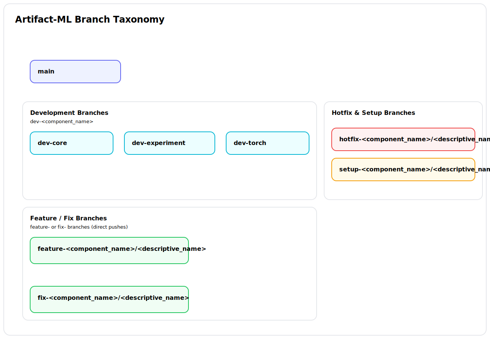
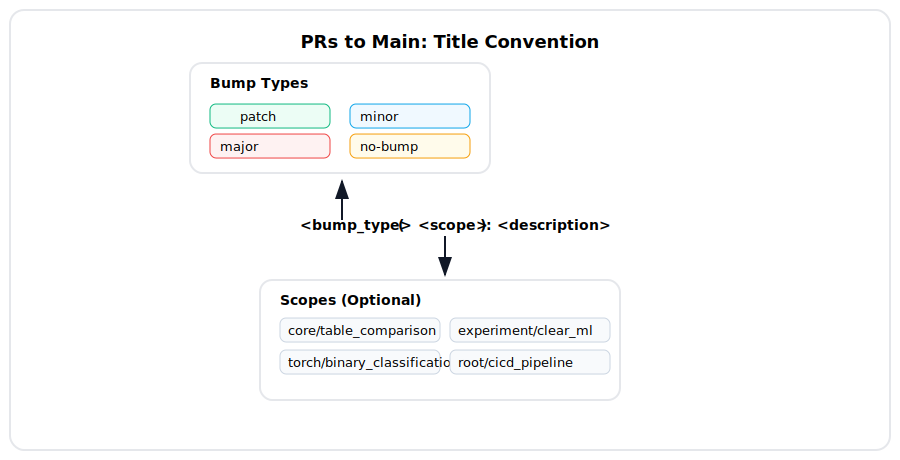

# DevOps Processes

  

## Repository Structure and Project Components
Artifact-ML is comprised of three single-purpose subrepos---with independent versioning and release cycles---gathered under a single monorepo. These are:
- `artifact-core`,
- `artifact-experiment`,
- `artifact-torch`.

The project is correspondingly partitioned in the following *components* (providing a way to refer to designated project subdirectories):
- `root` (files in the monorepo root, outside of all subrepo directories),
- `core` (files in the `artifact-core` subrepo),
- `experiment` (files in the `artifact-experiment` subrepo),
- `torch` (files in the `artifact-torch` subrepo).

- The `root` component can only be modified by merging `setup-root/*`/ `hotfix-root/*` directly into main (via PR).
- The subrepo (`core`, `experiment`, `torch`) components can be modified by:
   - merging `setup-<component_name>/*`/ `hotfix-<component_name>/*` directly into main (via PR),
   - merging feautre/ fix branches into `dev-<component_name>` (via PR) and awaiting its periodic merge into main. 

  

## Branches

- **main**: `main`
   - Role: The most recent stable release of Artifact-ML.
   - Update:
      - Updated by periodically merging in `dev` branches---resulting in new version releases.
      - Updated by merging in `hotfix` branches through pull request.
      - Updated by merging in `setup` branches through pull request.

- **Development Branches**: `dev-<component_name>`
   - Role: Component-specific development branches used as buffers for recent changes.
   - Update: Updated by merging in `feature`/ `fix` branches through pull request.
   - Examples: `dev-core`, `dev-experiment`, `dev-torch`.

- **Feature/Bug Fix Branches**: `feature-<component_name>/<descriptive_name>`, `fix-<component_name>/<descriptive_name>`
   - Role: Used for regular development work.
   - Update: Updated by direct pushes.
   - Restrictions: Should only modify files in one component directory (enforced when opening a PR to `dev-<component_name>`).
   - Example: `feature-<experiment>/add-login`

- **Hotfix Branches**: `hotfix-<component_name>/<descriptive_name>`
   - Role: Used for urgent fixes that need to be applied directly to `main`.
   - Update: Updated by direct pushes.
   - Restrictions: Should only modify files in one component directory (enforced when opening a PR to `main`).
   - Examples: `hotfix-core/fix-critical-bug`, `hotfix-experiment/fix-validation-issue`, `hotfix-torch/fix-model-loading`

- **Setup Branches**: `setup-<component_name>/<descriptive_name>`
   - Role: Used for initial setup or configuration changes
   - Update: Updated by direct pushes.
   - Restrictions: 
      - Always use with `no-bump` bump type (as setup changes should not trigger version bumps).
      - Should only modify files in the specified component directory (enforced when opening a PR to `main`).
   - Examples: `setup-core/initial-config`, `setup-experiment/update-docs`, `setup-torch/add-examples`
  

  

## Versioning and PRs to `main`
In line with semantic versioniing, we adopt the following version bump types (bump types for short):

- `patch`: For backwards-compatible bug fixes (including hotfixes)
- `minor`: For backwards-compatible feature additions
- `major`: For backwards-incompatible changes
- `no-bump`: For changes that don't require a version bump

Version bumps occur automatically (via desginated github workflows). To achieve this, PRs targetting `main` must follow a naming convention:

their titles should be prefixed via `<bump_type>:`, (or `<bump_type>(scope):`).

Examples of PR titles to main:
- `patch: fix login validation bug`
- `patch: fix critical security vulnerability` (for hotfixes)
- `minor: add user profile page`
- `major: redesign authentication system`
- `no-bump: update documentation`

You can also use scoped versions:
- `patch(experiment/neptune): fix neptune client login bug`
- `no-bump(torch/docs): update artifact-torch README`

Pull requests related to the `root` component (e.g. from `hotfix-root/*` or `setup-root/*`) **must** use the `no-bump` prefix (this is enforced by the relevant workflows).

Periodically, designated contributors open PRs from component `dev` branches to `main`---resulting in associatd version bumps according to the above.

  

## Artifact-ML Release Flow

The following diagram summarizes the project's release flow:

  

## Relevant Pages

For a specification of the project's **CI/CD pipelines** please consult the relevant [docs](cicd_pipelines.md).