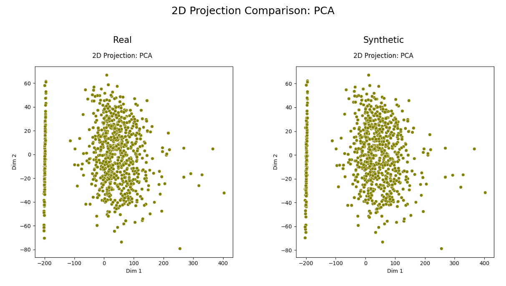
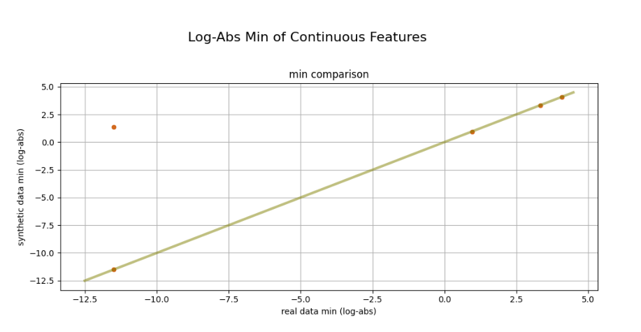

# ⚙️ Artifact-ML

> Artifact is a modular framework for reusable, standardized validation across machine learning experiments. It enables the design of generic validation plans that work across models, datasets, and training frameworks.


<p align="center">
  
</p>


---

## 📋 Overview & Purpose

Artifact is a modular framework for reusable, standardized validation across machine learning experiments.

It enables the design of generic validation plans that work across models, datasets, and training frameworks.

It thereby offers data scientists and ML engineers working in the same application domain a means to produce and share common---and easily customizable---validation plans.

The upshot is:

- the **reduction of duplicated code** (no model-specific validation plans),
- the **elimination of varaince** in validation results arising from unwanted discrepancies in validation logic,
- the reduction of friction in the research process as researchers become able to iterate on new ideas that are fairly evaluated with minimal high-level specifications.

To illustrate: in the context of tabular synthetic data generation, models will ultimately produce pandas dataframes. This restriction is sufficient to produce general validation plans that are applicable to any tabular synthesizer and easily customizable by selecting abstract enumerations associated to common validation artifacts (e.g. marginal distribution comparison plots).`

<style>
  .img-row {
    display: flex;
    justify-content: center;
    align-items: flex-start;
    gap: 24px;
    flex-wrap: wrap;
    max-width: 1400px;
    margin: 0 auto;
  }
  .img-row img {
    flex: 0 0 45%;
    max-width: 700px;
    width: 100%;
    height: auto;
    display: block;
  }

  /* optional: on very narrow screens, stack them */
  @media (max-width: 800px) {
    .img-row img {
      flex: 0 0 100%;
      max-width: none;
    }
  }
</style>

<div class="img-row">
  
  
  
</div>


## 🏗️ Framework Components

The Artifact framework consists of three main repositories:

### 1. [artifact-core](https://github.com/vasileios-ektor-papoulias/artifact-core)

The core framework providing the foundation for reusable validation. It defines the base abstractions and interfaces for creating validation artifacts, as well as concrete implementations for common validation tasks.

Key features:
- A **flexible minimal interface** for the computation of heterogeneous validation artifacts in thematically related ML experiments.
- Modular architecture with pluggable components.
- Type-safe interfaces using Python generics.

### 2. artifact-experiment-tracking

A repository for experiment tracking with the Artifact framework. It introduces executable validation plan abstractions that utilize artifact-core and export to various experiment tracking backends.

Key features:
- Executable validation plan abstractions.
- Integration with popular experiment tracking tools.
- Standardized reporting and visualization.

### 3. artifact-torch

A deep learning framework built on top of artifact-core, providing implementations for common deep learning tasks.

Key features:
- Integration with PyTorch: lightweight PyTorch extension to ensure type-safety and compatibility with Artifact's validation plans.
- Extendible/ customizable trainer abstraction covering the full training/ validation pipeline for thematically related neural networks (e.g. tabular synthesizers).

## 🎯 Design Philosophy

Our design is motivated by two fundamental principles:

### Project-Agnostic Validation Achieved With Flexible Hierarchical Types

ML research projects focusing on the same application domain can utilize shared validation logic.

Capitalizing on this can facilitate:

- the elimination of code duplication arising from tailoring a fixed high-level validation plan to a multiple model interfaces,
- the elimination of varaince in validation results arising from unwanted discrepancies in validation logic,
- the reduction of unnecessary coupling between research and engineering code---thereby freeing researchers to rapidly iterate on new ideas/ architectures.

Making this happen comes down to designing, writing and deploying general validation plans requiring only the ***minimal structure shared by a given family of thematically related models***.

To illustrate: any tabular data synthesizer should be able to produce a synthetic data table---and together with the original training data, this should be the only resources required to evaluate it. The upshot is that one can design general ML experiments: applicable to any tabular synthesizer requiring only these resources. This ultimately decouples research code from engineering code (e.g. training/validation): the latter would be project-agnostic and applicable to any tabular data generation project. To try out a new synthesizer one would only implement the forward pass, and then hook into pre-existing experiments on which competing models have been trained and evaluated.

Evidently, it's crucial to identify model families through concrete specifications of the ***minimal shared structure*** unifying them. We've pursued this goal by carefully designing flexible hierarchical types for the resources required to execute validation plans---and thereby implicitly grouping models by their ability to produce them.

### Pluggable Architecture

The base `ArtifactEngine` class is designed to provide a highly adaptable interface, requiring only a customizable resource object to perform computations. This design facilitates integration with other popular ML frameworks and tools.

This idea is central to the project's philosophy.

Our goal is to provide unified validation plans for thematically related ML models. If our attempt is to be successful, these plans shouldn't be framework dependent.

- If you already have calculation units in your project, you can subclass them to utilize an artifact engine with resources that fit your specific needs.
- The generic resource type allows for seamless integration with different data structures and formats.
- Artifacts can be extended and customized without modifying the core engine.

## 🚀 Getting Started

To get started with Artifact, you'll need to install the appropriate components based on your needs:

### Using artifact-core

```bash
git clone https://github.com/vasileios-ektor-papoulias/artifact-core.git
cd artifact-core
poetry install
```

For more details on using artifact-core, see the [artifact-core README](https://github.com/vasileios-ektor-papoulias/artifact-core/blob/main/README.md).

## 🔮 Future Work

The Artifact framework lays the foundation for a broader vision of standardized validation across different ML domains.

Future work will focus on:

### Expanding Validation Capabilities

We plan to continue expanding the framework by releasing engines tailored to other types of ML experiments:

- synthetic tabular time-series generation,
- synthetic image generation,
- text generation,
- binary classification,
- multiclass classification.

These extensions will maintain the same core philosophy of decoupling validation logic from model implementation, allowing researchers to focus on innovation while ensuring consistent evaluation practices.

### Enhanced Integration

Future versions will provide deeper integration with popular ML frameworks and tools:

- integration with other machine learning frameworks (e.g. TensorFlow),
- support for distributed validation on large datasets (e.g. integration with PySpark),
- cloud-native deployment options.

## 🤝 Contributing

Contributions are welcome! Please follow our structured contribution process:

### For Regular Development

1. Create a feature branch (e.g., `feature/add-login`) from the appropriate dev branch (`dev-core`, `dev-experiment`, or `dev-torch`).
2. Make your changes (only modify files within one component directory).
3. Create a PR to the corresponding dev branch.
4. Designated reviewers will handle merging dev branches to main with appropriate version bump prefixes.

### For Urgent Hotfixes

1. Create a branch named `hotfix-<component_name>/<descriptive-name>` from main (e.g., `hotfix-core/fix-critical-bug`).
2. Make your changes (only modify files within the specified component directory).
3. Create a PR directly to main with a title that starts with "patch:" or "no-bump:".

### For Setup and Configuration

1. Create a branch named `setup-<component_name>/<descriptive-name>` from main (e.g., `setup-experiment/update-docs`).
2. Make your changes (only modify files within the specified component directory).
3. Create a PR directly to main with a title that starts with "no-bump:".

### For Monorepo Root Changes

1. Create a branch named `hotfix-root/<descriptive-name>` or `setup-root/<descriptive-name>` from main.
2. Make your changes (only modify files outside of the artifact-core, artifact-experiment, and artifact-torch directories).
3. Create a PR directly to main with a title that starts with "no-bump:".

For more detailed information about our CI/CD pipeline and contribution guidelines, please see the [README-CICD](.github/README-CICD.md).

## 📄 License

This project is licensed under the MIT License - see the LICENSE file for details.
