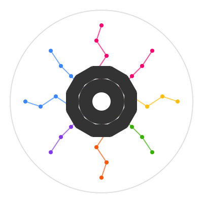
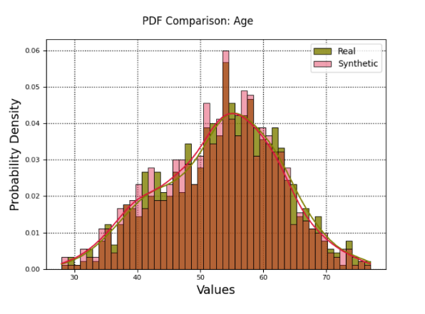

# ⚙️ Artifact-ML

> Artifact-ML provides shareable machine learning experiment infrastructure with a primary focus on declarative validation. It minimizes imperative code to eliminate duplication and promote concise, reusable experiment workflows.


<p align="center">
  
</p>


[](https://github.com/vasileios-ektor-papoulias/artifact-ml/actions/workflows/ci_main.yml)
[](https://codecov.io/gh/vasileios-ektor-papoulias/artifact-ml/flags#torch)
[](https://www.codefactor.io/repository/github/vasileios-ektor-papoulias/artifact-ml)
---

## 📋 Overview & Purpose

Machine learning experiment code is often cluttered with imperative logic and repeated boilerplate, making it difficult to maintain, scale, or reuse across projects. Artifact-ML addresses this by providing reusable experiment infrastructure with a primary focus on standardized validation.

It enables the design of shareable validation logic that is reusable by any experiment within a given task category.

This is achieved through carefully designed type hierarchies and clean interface contracts serving to decouple high-level experiment orchestration from low-level model implementation.

The project is organized into domain-specific toolkits, each offering validation workflows tailored to common machine learning tasks (e.g., tabular data synthesis, binary classification).

The upshot is:

- **Reduced friction in the research process** — researchers can focus on iterating and exploring new ideas, with immediate, effortless feedback enabled by the seamless presentation of declaratively defined validation artifacts.

- **Eliminated duplication of code** — no need for model-specific validation logic or imperative glue code; validation workflows are defined once and reused across experiments.

- **Consistent and trustworthy evaluation** — validation is standardized across experiments, eliminating variance caused by subtle discrepancies in custom logic.

For a concrete demonstration of the problem (and solution) addressed by Artifact, see our [**motivating example doc**](docs/motivating_example.md).

For a deep-dive into the core design philosophy underlying the project see our [**design philosophy doc**](docs/design_philosophy.md).

<p align="center">
  
</p>

## 🏗️ Packages

Artifact-ML consists of three packages:

### 1. [`artifact-core`](artifact-core/README.md)

The framework foundation, defining the base abstractions and interfaces for the design and execution of validation artifacts.

It offers pre-built out-of-the-box artifact implementations with seamless support for custom extensions.

### 2. [`artifact-experiment`](artifact-experiment/README.md)

The experiment orchestration and tracking extension to Artifact-ML.

It facilitates the design of purely declarative validation workflows leveraging `artifact-core`.

It provides fully automated tracking capabilities with popular backends (e.g. Mlflow).

### 3. [`artifact-torch`](artifact-torch/README.md)

A deep learning framework built on top of `artifact-core` and `artifact-experiment`, abstracting away engineering complexity to let researchers focus on architectural innovation.

It handles all training loop concerns aside from model architecture and data pipelines, enabling seamless, declarative customization via a system of typed callbacks.

Models, trainers, and workflows are all strongly typed, and the system leverages type variance and inference to ensure that the right callbacks fit the right trainers and workflows.

## 🚀 Getting Started

### Installation

```bash
git clone https://github.com/vasileios-ektor-papoulias/artifact-ml.git
```
#### 1. [`artifact-core`](artifact-core/README.md)
To install `artifact-core` run:

```bash
cd artifact-ml/artifact-core
poetry install
```
For details on getting started with `artifact-core`, consult the relevant [docs](artifact-core/README.md).

#### 2. [`artifact-experiment`](artifact-experiment/README.md)
To install `artifact-experiment` run:

```bash
cd artifact-ml/artifact-experiment
poetry install
```

For details on getting started with `artifact-experiment`, consult the relevant [docs](artifact-experiment/README.md).

#### 3. [`artifact-torch`](artifact-torch/README.md)
To install `artifact-torch` run:

```bash
cd artifact-ml/artifact-torch
poetry install
```

For details on getting started with `artifact-torch`, consult the relevant [docs](artifact-torch/README.md).

## 🔮 Future Development

We plan to actively expand the framework's scope and capabilities.

For a collection of future development avenues, please consult our [**future development doc**](docs/future_development.md).


## 🤝 Contributing

Contributions are welcome.

For relevant guidelines, please consult our [**contribution guidelines doc**](docs/contributing.md).


## 📄 License

This project is licensed under the [MIT License](https://img.shields.io/github/license/vasileios-ektor-papoulias/artifact-ml).