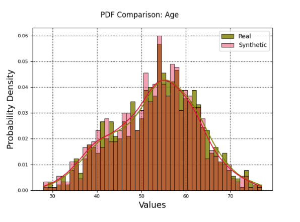

# Artifact-ML

> Reusable ML experiment workflows built declaratively.

<p align="center">
  
</p>

[](https://artifact-ml.readthedocs.io/en/latest/)


[](https://github.com/vasileios-ektor-papoulias/artifact-ml/actions/workflows/ci_push_main.yml)
[](https://codecov.io/gh/vasileios-ektor-papoulias/artifact-ml/)
[](https://www.codefactor.io/repository/github/vasileios-ektor-papoulias/artifact-ml)
---

## ⚙️ Overview

Artifact-ML eliminates imperative glue code in ML experiments by providing the tools to build **reusable** workflows **declaratively**.

By *reusable*, we refer to workflows that are defined once with the potential to be reused by any compatible model.

By *declarative*, we refer to building through expressing high-level intent---rather than catering to implementation details.

For additional context, please refer to our [value proposition](https://artifact-ml.readthedocs.io/en/latest/value_proposition/) and [motivating example](https://artifact-ml.readthedocs.io/en/latest/motivating_example/) docs.

<p align="center">
  
</p>

## 🏗️ Packages

The project comprises three packages:

- [`artifact-core`](https://github.com/vasileios-ektor-papoulias/artifact-ml/tree/main/artifact-core): a declarative interface for the computation of validation artifacts in ML experiments.
- [`artifact-experiment`](https://github.com/vasileios-ektor-papoulias/artifact-ml/tree/main/artifact-experiment): experiment orchestration extension for building reusable validation workflows with integrated tracking.
- [`artifact-torch`](https://github.com/vasileios-ektor-papoulias/artifact-ml/tree/main/artifact-torch): PyTorch integration for building reusable deep-learning workflows declaratively.

## 🚀 Quick Start

All three packages are published on PyPI: [`artifact-core`](https://pypi.org/project/artifact-core/), [`artifact-experiment`](https://pypi.org/project/artifact-experiment/), and [`artifact-torch`](https://pypi.org/project/artifact-torch/).

```bash
pip install artifact-core

pip install artifact-experiment

pip install artifact-torch
```

Each package pulls in the ones it builds on: `artifact-experiment` depends on `artifact-core`, and `artifact-torch` depends on both.

To install from source (e.g. for development), consult our [getting started guide](https://artifact-ml.readthedocs.io/en/latest/getting_started/).

## 📚 Documentation

Documentation for Artifact-ML is available at [**Artifact-ML Docs**](https://artifact-ml.readthedocs.io/en/latest/).

Package-specific docs are available at:

- [artifact-core docs](https://artifact-ml.readthedocs.io/en/latest/artifact-core)
- [artifact-experiment docs](https://artifact-ml.readthedocs.io/en/latest/artifact-experiment)
- [artifact-torch docs](https://artifact-ml.readthedocs.io/en/latest/artifact-torch)


## 🤝 Contributing

Contributions are welcome!

Please consult our [**contribution guidelines document**](https://artifact-ml.readthedocs.io/en/latest/Development/contributing).


## 📄 License

This project is licensed under the [MIT License](https://github.com/vasileios-ektor-papoulias/artifact-ml/blob/main/LICENSE).