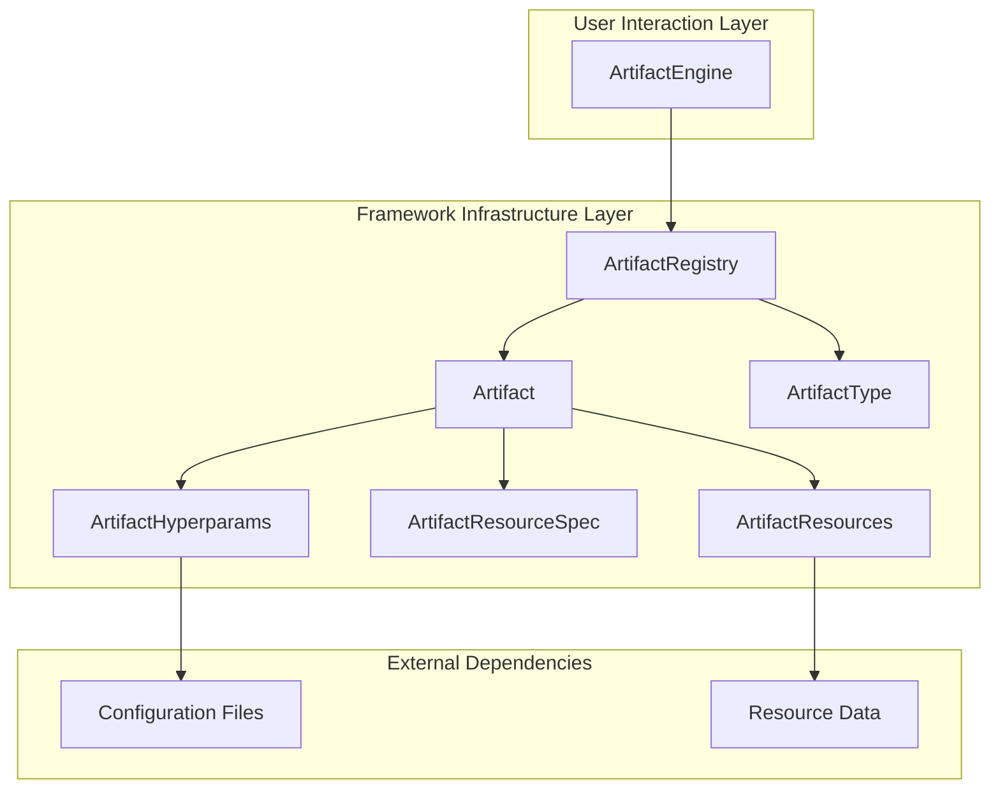

# ⚙️ artifact-core

> The core component of the Artifact framework, providing a flexible minimal interface for the computation of heterogeneous validation artifacts in machine learning experiments.


<p align="center">
  
</p>


---

## 📋 Overview

This repository serves as the foundation of the **Artifact** framework.

It stands alongside:
- [`artifact-experiment`](../artifact-experiment/README.md): The framework's experiment tracking extension, providing **executable validation plan abstractions** exporting results to popular tracking backends (e.g. Mlflow).
- [`artifact-torch`](../artifact-torch/README.MD): PyTorch integration for rapid prototyping with seamless validation using Artifact-ML.

`artifact-core` provides a **flexible minimal interface** for the computation of heterogeneous validation artifacts in machine learning experiments.

It defines the core abstractions and implementations that enable standardized validation across different domains, models and data modalities.

Here, we use the word *minimal* to express that public interfaces and method signatures are as thin as possible.

Standardized interfaces with minimal method signatures enable automated experiment orchestration through simple enum-based specifications.

By abstracting away unique parameter requirements (static data specifications, hyperparameters) into framework-managed components, `artifact-core` enables downstream client code (e.g. experiment scripts) to invoke a wide array of validation artifacts using only type enumerations---as opposed to artifact-specific argument profiles.

This design eliminates the need for custom integration code per artifact, enabling generic experiment scripts that scale seamlessly across diverse validation requirements with zero modification/ friction.

## 📚 Usage Sketch

```python
import pandas as pd
from artifact_core.libs.resource_spec.tabular.spec import TabularDataSpec
from artifact_core.table_comparison import (
    TableComparisonEngine,
    TableComparisonScoreType,
)

df_real = pd.read_csv("real_data.csv")

df_synthetic = pd.read_csv("synthetic_data.csv")

spec = TabularDataSpec.from_df(
    df=df_real, 
    cat_features=categorical_features, 
    cont_features=continuous_features
)

engine = TableComparisonEngine(resource_spec=spec)

dict_js_distance_per_feature = engine.produce_dataset_comparison_score_collection(
    score_collection_type=TableComparisonScoreCollectionType.JS_DISTANCE,
    dataset_real=df_real,
    dataset_synthetic=df_synthetic,
)

dict_js_distance_per_feature
```

<p align="center">
  
</p>

```python
from artifact_core.table_comparison import (
    TableComparisonPlotType,
)

pca_plot = engine.produce_dataset_comparison_plot(
    plot_type=TableComparisonPlotType.PCA_JUXTAPOSITION,
    dataset_real=df_real,
    dataset_synthetic=df_synthetic,
)

pca_plot
```

<p align="center">
  
</p>

```python
pdf_plot = engine.produce_dataset_comparison_plot(
    plot_type=TableComparisonPlotType.PDF,
    dataset_real=df_real,
    dataset_synthetic=df_synthetic,
)

pdf_plot
```

<p align="center">
  
</p>

## 🏗️ Architecture

`artifact-core` follows a layered architecture offering maximal extendibility while exposing a simple interface to end-users:



### User Interaction Layer
The interface boundary between users and the framework's validation capabilities.

### Framework Infrastructure Layer
The internal computational and management infrastructure that powers artifact execution.

### External Dependencies
External inputs and configurations that the framework depends on for operation.

This architecture enables artifact-core to provide a clean separation between user-facing interfaces and internal framework infrastructure. Users interact primarily with ArtifactEngine while the framework handles the complexity of artifact registration, instantiation, and execution through its internal infrastructure components.

## 📊 Core Entities

The framework operates by coordinating the interaction of specialized entities across the three aforementioned layers:

### **User Interaction Layer**
The primary interface layer that users interact with to orchestrate comprehensive validation workflows:

- **ArtifactEngine**: Simple yet flexible entry point providing a unified interface for executing individual validation artifacts. It manages registry access, handles artifact instantiation with appropriate configurations, and provides straightforward methods for computing validation results. Crucially method signatures are minimal, relegating secondary arguments like static data spec information and hyperparameters to be handled by the framework.
```python
engine = TableComparisonEngine(resource_spec=spec)
pca_plot = engine.produce_dataset_comparison_plot(
    plot_type=TableComparisonPlotType.PCA_PROJECTION_PLOT,
    dataset_real=df_real,
    dataset_synthetic=df_synthetic,
)
```

**Architecture Role**: ArtifactEngine serves as the main entry point that abstracts artifact lookup, instantiation, and execution complexity while providing a clean interface for individual artifact computation - users specify what artifact they want and the data to compute it on, and get back the validation result.

### **Framework Infrastructure Layer**
Internal framework components that provide the computational foundation and artifact management system:

- **Artifact**: Abstract computation units that define the `compute()` method contract. Artifacts are heterogeneous (multi-modal) and categorized by return type:
  - **Scores**: Single numerical metrics
  - **Arrays**: Numpy arrays containing computed data  
  - **Plots**: Matplotlib figures for visualization
  - **Collections**: Groups of related artifacts (e.g., multiple scores or plots)

- **ArtifactRegistry**: Management system that organizes artifacts by type and coordinates registration, retrieval, and instantiation. Artifacts in the same registry share resources, return types, and resource specification types.

- **ArtifactType**: Enumeration system that provides unique identifiers for different artifact implementations, enabling dynamic lookup and instantiation within registries.

- **ArtifactResources**: Generic data objects that artifacts operate on, providing the input datasets or resources required for validation computation. The design of resource types is central to the framework's extensibility—by defining domain-specific resource contracts, we naturally group thematically related models that share validation requirements, enabling them to leverage common validation logic regardless of their internal architectural differences.

- **ArtifactResourceSpec**: Protocol definitions that capture the structural properties and schema characteristics of validation resources (e.g., feature types and data schemas for tabular data).

- **ArtifactHyperparams**: Configuration objects that enable customizable artifact behavior through domain-specific parameter settings.

**Entity Coordination**: ArtifactEngine coordinates with ArtifactRegistry for artifact lookup and instantiation using ArtifactResourceSpec for type validation, while Artifact implementations use ArtifactResources for computation and ArtifactHyperparams for configuration. The interplay between ArtifactResources and ArtifactResourceSpec ensures type safety while enabling the framework's core capability of grouping diverse models by their validation resource compatibility.

### **External Dependencies**
Configuration and data inputs that drive artifact computation and enable framework customization:

- **Configuration Files**: JSON-based parameter definitions that control artifact behavior, enable project-specific customization, and support configuration inheritance through the `.artifact` directory system.

- **Resource Data**: Input datasets and validation resources that provide the raw data for artifact computation, typically domain-specific data formats (e.g., pandas DataFrames for tabular data).

**Integration Flow**: Configuration Files define artifact parameters loaded by ArtifactHyperparams, while Resource Data flows through ArtifactResources to enable domain-specific validation computations.

## 🎯 Domain-Specific Validation Toolkits

`artifact-core` enables domain-specific validation toolkits through resource type specialization.

Different domains (tabular data, images, text, time series, etc.) implement the core abstractions with their specific resource types, creating focused validation ecosystems while sharing the common infrastructure.

**Resource Type Specialization**: Each domain defines its own resource specification protocol and artifact resources, enabling type-safe validation workflows tailored to domain characteristics.

**Domain Registries**: For each domain, we provide specialized registries that group relevant artifacts by type (scores, plots, arrays, collections), enabling organized artifact management and dynamic instantiation within the domain.

**Domain Engines**: Specialized engines coordinate artifacts within a domain, providing unified interfaces for comprehensive validation while ensuring all artifacts share compatible resource types.

**Complete Toolkits**: Each domain provides both registries for artifact organization and engines for deployment, creating self-contained validation toolkits that leverage the common framework infrastructure.

**Extensible Ecosystems**: New domains can implement the core abstractions to create complete validation toolkits that integrate seamlessly with the broader Artifact framework.

### 📊 Table Comparison Engine

`artifact-core` provides a concrete implementation for the comparison of tabular datasets: the **TableComparisonEngine**.

This is intended to serve research projects in synthetic tabular data generation.

### TableComparisonEngine: Available Artifacts

#### Plots
- `PDF`: Overlaid probability density (or mass) plots for real and synthetic data
- `CDF`: Overlaid cumulative distribution plots for real and synthetic data
- `DESCRIPTIVE_STATS_ALIGNMENT`: Alignment of descriptive statistics between real and synthetic data
- `MEAN_ALIGNMENT`: Alignment of means between real and synthetic data
- `STD_ALIGNMENT`: Alignment of standard deviations between real and synthetic data
- `VARIANCE_ALIGNMENT`: Alignment of variances between real and synthetic data
- `MEDIAN_ALIGNMENT`: Alignment of medians between real and synthetic data
- `FIRST_QUARTILE_ALIGNMENT`: Alignment of first quartiles between real and synthetic data
- `THIRD_QUARTILE_ALIGNMENT`: Alignment of third quartiles between real and synthetic data
- `MIN_ALIGNMENT`: Alignment of minimum values between real and synthetic data
- `MAX_ALIGNMENT`: Alignment of maximum values between real and synthetic data
- `CORRELATION_HEATMAPS_JUXTAPOSITION`: Juxtaposed correlation matrix heatmaps for real and synthetic data
- `PCA_JUXTAPOSITION`: Visual PCA projection comparison between real and synthetic data
- `TRUNCATED_SVD_JUXTAPOSITION`: Visual truncated SVD projection comparison between real and synthetic data
- `TSNE_JUXTAPOSITION`: Visual t-SNE projection comparison between real and synthetic data

#### Scores
- `MEAN_JS_DISTANCE`: Average Jensen-Shannon divergence over all features
- `CORRELATION_DISTANCE`: Distance between correlation matrices

#### Score Collections
- `JS_DISTANCE`: Collection of Jensen-Shannon distances for all features

#### Array Collections
- `MEAN_JUXTAPOSITION`: Juxtaposition of real and synthetic mean values for all continuous features
- `STD_JUXTAPOSITION`: Juxtaposition of real and synthetic standard deviations for all continuous features
- `VARIANCE_JUXTAPOSITION`: Juxtaposition of real and synthetic variances for all continuous features
- `MEDIAN_JUXTAPOSITION`: Juxtaposition of real and synthetic median values for all continuous features
- `FIRST_QUARTILE_JUXTAPOSITION`: Juxtaposition of real and synthetic first quartile values for all continuous features
- `THIRD_QUARTILE_JUXTAPOSITION`: Juxtaposition of real and synthetic third quartile values for all continuous features
- `MIN_JUXTAPOSITION`: Juxtaposition of real and synthetic minimum values for all continuous features
- `MAX_JUXTAPOSITION`: Juxtaposition of real and synthetic maximum values for all continuous features

#### Plot Collections
- `PDF`: Collection of overlaid (real & synthetic) PDF plots for all features
- `CDF`: Collection of overlaid (real & synthetic) CDF plots for all features
- `CORRELATION_HEATMAPS`: Correlation matrix heatmaps for real and synthetic data

## 🔧 Implementation Guide

To better understand how the architecture works in practice, we go through the steps required to create a complete validation toolkit from scratch:

### 1. Define Artifact Types

First, you define enumerations for each type of artifact your engine will support:

```python
from enum import Enum
from artifact_core.base.artifact_dependencies import ArtifactType

class CustomScoreType(ArtifactType):
    CUSTOM_SCORE = "accuracy_score"
    
class CustomArrayType(ArtifactType):
    pass
    
class CustomPlotType(ArtifactType):
    pass
    
class CustomScoreCollectionType(ArtifactType):
    pass
    
class CustomArrayCollectionType(ArtifactType):
    pass
    
class CustomPlotCollectionType(ArtifactType):
    pass
```

These enumerations serve as identifiers for the different artifacts that can be computed by your engine.

### 2. Create a Resource Specification

The resource specification defines the structural properties of your validation resources:

```python
from dataclasses import dataclass
from typing import List, Dict, Optional
from artifact_core.base.artifact_dependencies import ResourceSpecProtocol

@dataclass
class CustomResourceSpec(ResourceSpecProtocol):
    validation_resource_structural_property: float
```

### 3. Define Resources

Resources are the data objects that artifacts will operate on:

```python
from dataclasses import dataclass
import numpy as np
import pandas as pd
from typing import Dict, List, Optional, Union

from artifact_core.base.artifact_dependencies import ArtifactResources

@dataclass
class CustomResources(ArtifactResources):
    resource_attribute: np.ndarray
```

### 4. Create Registries

Registries manage the organization and retrieval of artifacts:

```python
import json
from matplotlib.figure import Figure
import numpy as np
import os
from typing import Dict, Type, Optional, List

from artifact_core.base.registry import ArtifactRegistry

# Helper function to load configurations
def load_config_section(config_path: str, section: str) -> Dict[str, Dict[str, Any]]:
    if os.path.exists(config_path):
        with open(config_path, 'r') as f:
            config = json.load(f)
            return config.get(section, {})
    return {}

# Path to configuration file
CONFIG_PATH = 'path/to/custom_engine/config/raw.json'

# Create artifact registries
class CustomScoreRegistry(ArtifactRegistry[CustomScoreType, CustomResources, float, CustomResourceSpec]):
    @classmethod
    def _get_artifact_configurations(cls) -> Dict[str, Dict[str, Any]]:
        return load_config_section(
            config_path=CONFIG_PATH,
            section='scores'
            )

# Similar registries for other artifact types...
```

### 5. Implement Artifacts

Create concrete artifact implementations:

```python
from typing import Any, Optional, Union

from artifact_core.base.artifact import Artifact
from artifact_core.base.artifact_dependencies import NoArtifactHyperparams

@CustomScoreRegistry.register_artifact(CustomScoreType.CUSTOM_SCORE)
class CustomScore(Artifact[CustomResources, float, NoArtifactHyperparams, CustomResourceSpec]):
    def _validate(self, resources: CustomResources) -> CustomResources:
        if not hasattr(resources, "resource_attribute"):
            raise ValueError("Resources must contain resource_attribute")
        return resources
        
    def _compute(self, resources: CustomResources) -> float:
        return resources.resource_attribute.mean()
```

### 6. Deploy Artifacts through an Artifact Engine

Finally, create the engine that orchestrates the computation of artifacts:

```python
from typing import Type, Dict, Union

from artifact_core.base.engine import ArtifactEngine

class CustomArtifactEngine(ArtifactEngine[
    CustomResources,
    CustomResourceSpec,
    CustomScoreType,
    CustomArrayType,
    CustomPlotType,
    CustomScoreCollectionType,
    CustomArrayCollectionType,
    CustomPlotCollectionType
]):
    @classmethod
    def _get_score_registry(cls) -> Type[CustomScoreRegistry]:
        return CustomScoreRegistry
        
    # Similar methods for other registries...
        
    # Custom methods for your specific use case
    def produce_custom_score(
        self, 
        score_type: CustomScoreType, 
        resource_attribute: np.ndarray
    ) -> float:
        resources = CustomResources(resource_attribute=resource_attribute)
        return self.produce_score(score_type=score_type, resources=resources)
```

## 🚀 Using Artifact-Core

### 1. Computing Artifacts Using an Artifact Engine

Artifact engines provide the primary interface for computing validation artifacts. Create an engine instance with your resource specification, then use the engine's methods to compute individual artifacts or collections of artifacts by specifying the artifact type and input data. The engine handles all complexity of artifact lookup, instantiation, and execution, providing a clean interface where you specify what you want to compute and the data to compute it on. This declarative approach eliminates repetitive imperative code for artifact configuration, parameter management, and result handling.

```python
# Create engine with resource specification
engine = TableComparisonEngine(resource_spec=spec)

# Compute individual artifacts
score = engine.produce_dataset_comparison_score(score_type=ScoreType.MEAN_JS_DISTANCE, dataset_real=df_real, dataset_synthetic=df_synthetic)
plot = engine.produce_dataset_comparison_plot(plot_type=PlotType.PCA_JUXTAPOSITION, dataset_real=df_real, dataset_synthetic=df_synthetic)
```

### 2. Configuring Existing Artifacts in Your Project

When using `artifact-core` as a package in your own project, you can override the default configuration of existing artifacts:

#### How Configuration Override Works

1. Create a `.artifact-ml` directory in your project root
2. Create a configuration file named after the domain toolkit of interest (e.g., `table_comparison.json`)
3. Define your custom configuration in JSON format
4. Your configuration override will be automatically detected and merged with the default one

#### Example: Overriding Table Comparison Configuration

Create a file at `.artifact-ml/table_comparison.json` in your project root:

```json
{
  "scores": {
    "MEAN_JS_DISTANCE": {
      "n_bins_cts_histogram": 200,
      "categorical_only": true
    }
  },
  "plots": {
    "TSNE_JUXTAPOSITION": {
      "perplexity": 50,
      "learning_rate": 200,
      "max_iter": 2000
    }
  }
}
```

This configuration will override the default settings for the `MEAN_JS_DISTANCE` score and the `TSNE_JUXTAPOSITION` plot, while keeping the default settings for all other artifacts.

#### Configuration Structure

The configuration file follows the same structure as the default configuration:

```json
{
  "scores": {
    "score_type_name": {
      "param1": value1,
      "param2": value2
    }
  },
  "arrays": { ... },
  "plots": { ... },
  "score_collections": { ... },
  "array_collections": { ... },
  "plot_collections": { ... }
}
```

Only include the sections and parameters you want to override.

Your configuration will be merged with the default one automatically, with your settings taking precedence.

### 2. Creating Custom Artifacts

`artifact-core` supports project-specific custom artifacts, enabling users to extend domain toolkits with specialized validation logic tailored to their unique requirements.

Custom artifacts integrate seamlessly with the existing framework infrastructure while providing complete flexibility.

#### Creating Custom Artifacts

**A. Configure Custom Artifact Path**

Update the relevant domain toolkit configuration file (see the relevant section above) to point to your custom artifacts directory. Note that the required path is to be specified relative to the parent of the .artifact-ml folder hosting the relevant config file---typically your project root. The setup is clarified in the artifact-core demo.

```json
{
  "custom_artifact_path": "/path/to/your/custom_artifacts",
  "score_collections": {
    "CUSTOM_SCORE": {
      "param1": value1,
      "param2": value2
    }
  }
}
```

**B. Implement Custom Artifact**

Create your custom artifact by extending the appropriate base class.

Select the relevant domain-specific registry corresponding to your artifact's modality (e.g. score, array, plot etc.) and register your implementation.

```python
import pandas as pd
from artifact_core.base.artifact_dependencies import NO_ARTIFACT_HYPERPARAMS
from artifact_core.table_comparison.artifacts.base import TableComparisonScore
from artifact_core.table_comparison.registries.scores.registry import TableComparisonScoreRegistry

@TableComparisonScoreRegistry.register_custom_artifact("CUSTOM_SCORE")
class CustomScore(TableComparisonScore[NO_ARTIFACT_HYPERPARAMS]):
    def _compare_datasets(
        self, dataset_real: pd.DataFrame, dataset_synthetic: pd.DataFrame
    ) -> float:
        # Implement your custom validation logic
        custom_metric = compute_your_metric(dataset_real, dataset_synthetic)
        return custom_metric
```


If your custom artifact requires configuration parameters create a corresponding hyperparameters class and pass the desired values in the toolkit config file:

```python
from dataclasses import dataclass
from artifact_core.base.artifact_dependencies import ArtifactHyperparams

@dataclass
class CustomScoreHyperparams(ArtifactHyperparams):
    threshold: float
    use_weights: bool

@TableComparisonScoreRegistry.register_custom_artifact_hyperparams("CUSTOM_SCORE")
@dataclass
class CustomScoreHyperparams(ArtifactHyperparams):
    threshold: float
    use_weights: bool

@TableComparisonScoreRegistry.register_custom_artifact("CUSTOM_SCORE")
class CustomScore(TableComparisonScore[CustomScoreHyperparams]):
    def _compare_datasets(self, dataset_real: pd.DataFrame, dataset_synthetic: pd.DataFrame) -> float:
        # Access hyperparameters via self._hyperparams.threshold, self._hyperparams.use_weights
        return computed_score
```

```json
{
  "scores": {
    "CUSTOM_SCORE": {
      "threshold": 0.5,
      "use_weights": true
    }
  }
}
```

#### Using Custom Artifacts

Once configured, custom artifacts can be used exactly like built-in ones:

```python
# Use custom artifact with string identifier
custom_score = engine.produce_dataset_comparison_score(
    score_type="CUSTOM_SCORE",
    dataset_real=df_real,
    dataset_synthetic=df_synthetic,
)
```

#### Contributing Custom Artifacts

If you develop a custom artifact that could benefit the broader community, consider contributing it.

Custom artifacts that demonstrate broad applicability, statistical rigor, and clean implementation are excellent candidates for inclusion in the core framework.

## 🔧 Framework Extension

### 1. Contributing New Artifacts

The success of this project hinges on the availability of a rich corpus of validation artifacts.

Contributions are strongly encouraged and highly appreciated.

To contribute new artifacts to the `artifact-core` project:

1. Add a new value to the appropriate existing Enum (e.g., in `artifact_core/table_comparison/registries/scores/types.py`)
2. Create and register your hyperparameters class (inheriting from `ArtifactHyperparams`)
3. Add the default configuration values in the appropriate config file (e.g. in `artifact_core/table_comparison/config/raw.json`)
4. Create and register your artifact class (inheriting from `Artifact` with the appropriate generics matching the engine of interest)

#### Example: Contributing a New Score Artifact to the TableComparisonEngine

First, add your new score type to the existing enum in: artifact_core/table_comparison/registries/scores/types.py.
```python
class TableComparisonScoreType(ArtifactType):
    MEAN_JS_DISTANCE = "mean_js_distance"
    CORRELATION_DISTANCE = "correlation_distance"
    # Add your new score type
    NEW_TABLE_COMPARISON_SCORE = "new_table_comparison_score"
```
Then implement and register your artifact's hyperparameters:

```python
from artifact_core.base.artifact_dependencies import ArtifactHyperparams
from artifact_core.table_comparison.registries.scores.registry import TableComparisonScoreRegistry


@TableComparisonScoreRegistry.register_artifact_hyperparams(
    TableComparisonScoreType.MY_CUSTOM_SCORE
    )
@dataclass
class NewTableComparisonScoreHyperparams(ArtifactHyperparams):
    threshold: float,
    use_weights: bool
```

The corresponding contribution to the configuration file (`artifact_core/table_comparison/config/raw.json`) should then look like:

```json
{
  "scores": {
    "my_custom_score": {
      "threshold": 0.5,
      "use_weights": true
    }
  }
}
```

Should your contribution not require any hyperparameters, simply use the following as the generic parameter:

```python
from artifact_core.base.artifact_dependencies import NoArtifactHyperparams
```

In this case no hyperparams class needs to be registered and no configuration params need to be added to the config file.

The appropriate generics for table comparison scores are as follows:

```python
import pandas as pd

from artifact_core.base.artifact import Artifact
from artifact_core.libs.resource_spec.tabular.protocol import TabularDataSpecProtocol
from artifact_core.core.dataset_comparison.artifact import DatasetComparisonResources

Artifact[
        DatasetComparisonResources[pd.DataFrame],
        float,
        <HyperparamsT>,
        TabularDataSpecProtocol
        ]
```
However, note that we've provided more refined abstractions than the general artifact base class.

You should work with these instead: they implement core logic tailored to the specific artifact group in question.

To illustrate: all table comparison scores should inherit the following base:

```python
import pandas as pd

from artifact_core.table_comparison.artifacts.base import TableComparisonScore
from artifact_core.table_comparison.registries.scores.types import TableComparisonScoreType

TableComparisonScore[<HyperparamsT>]
```

Finally implement and register your artifact (accessing the relevant hyperparameters and resource spec):

```python
from typing import Dict, Any, Optional, Union, List
from dataclasses import dataclass
import pandas as pd

from artifact_core.table_comparison.artifacts.base import TableComparisonScore, TableComparisonArtifactResources
from artifact_core.table_comparison.registries.scores.registry import TableComparisonScoreRegistry
from artifact_core.table_comparison.registries.scores.types import TableComparisonScoreType
from artifact_core.libs.resource_spec.tabular.protocol import TabularDataSpecProtocol
from artifact_core.core.dataset_comparison.artifact import DatasetComparisonResources


@TableComparisonScoreRegistry.register_artifact(
    TableComparisonScoreType.MY_CUSTOM_SCORE
    )
class NewTableComparisonScore(
    TableComparisonScore[
        NewTableComparisonScoreHyperparams
        ]
    ):
    def _validate(
        self,
        resources: TableComparisonArtifactResources
        ) -> TableComparisonArtifactResources:
        if resources.dataset_real is None or resources.dataset_synthetic is None:
            raise ValueError(
                "Both real and synthetic datasets must be provided"
                )
        return resources
        
    def _compare_datasets(
        self,
        dataset_real: pd.DataFrame,
        dataset_synthetic: pd.DataFrame
        ) -> float:
        dataset_real = dataset_real[self._resource_spec.ls_cts_features]
        dataset_synthetic = dataset_synthetic[self._resource_spec.ls_cts_features]
        score = 1.0
        if score > self._hyperparams.threshold and self._hyperparams.use_weights:
            score = 2*score
        return score
```

## 🚀 Installation

### Using Poetry (Recommended)

```bash
git clone https://github.com/vasileios-ektor-papoulias/artifact-ml.git
cd artifact-ml/artifact-core
poetry install
```

## 🤝 Contributing

Contributions are welcome. Please refer to the [project's contribution guidelines](../docs/contributing.md) for development standards and submission procedures.

## 📄 License

This project is licensed under the [MIT License](https://img.shields.io/github/license/vasileios-ektor-papoulias/artifact-ml).
