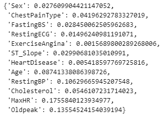
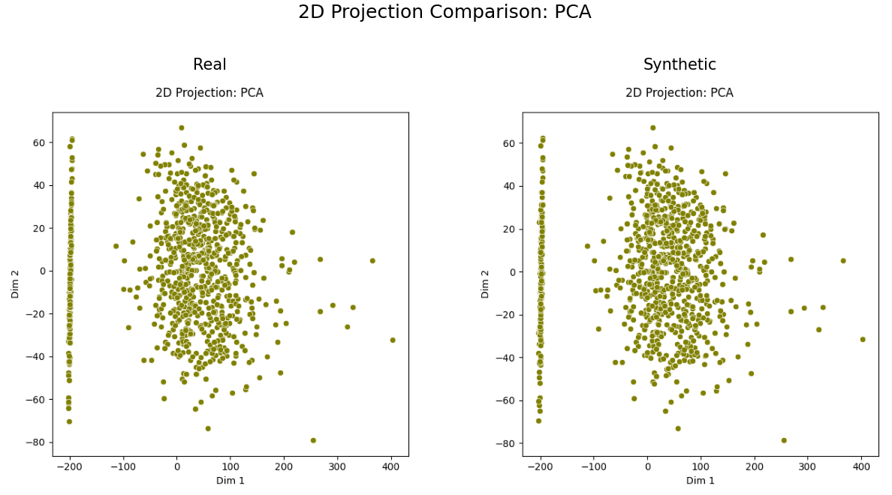

# ⚙️ artifact-core

> A unified minimal interface for the computation of heterogeneous validation artifacts in machine learning experiments.

<p align="center">
  
</p>

[](https://artifact-ml.readthedocs.io/en/latest/artifact_core)


[](https://github.com/vasileios-ektor-papoulias/artifact-ml/actions/workflows/ci_push_main.yml)
[](https://codecov.io/gh/vasileios-ektor-papoulias/artifact-ml/flags#core)
[](https://www.codefactor.io/repository/github/vasileios-ektor-papoulias/artifact-ml)

[](https://sonarcloud.io/summary/new_code?id=vasileios-ektor-papoulias_artifact-core&branch=main)
[](https://sonarcloud.io/summary/new_code?id=vasileios-ektor-papoulias_artifact-core&branch=main)
[](https://sonarcloud.io/summary/new_code?id=vasileios-ektor-papoulias_artifact-core&branch=main)
[](https://sonarcloud.io/summary/new_code?id=vasileios-ektor-papoulias_artifact-core&branch=main)


---

## 📋 Overview

This repository serves as the foundation of [**Artifact-ML**](https://github.com/vasileios-ektor-papoulias/artifact-ml/tree/main).

It stands alongside:

- [`artifact-experiment`](https://github.com/vasileios-ektor-papoulias/artifact-ml/tree/main/artifact-experiment): The framework's experiment tracking extension.
- [`artifact-torch`](https://github.com/vasileios-ektor-papoulias/artifact-ml/tree/main/artifact-torch): PyTorch integration for building reusable deep-learning workflows.

`artifact-core` provides a **unified minimal interface** for the computation of heterogeneous validation artifacts in machine learning experiments.

Here, we use the word *minimal* to refer to an interface that is as thin as possible given its purpose.

The goal is to enable declarative experiment orchestration through simple enum-based configuration.

By abstracting away unique parameter requirements (static data specifications, hyperparameters) into framework-managed components, `artifact-core` enables downstream client code (e.g. experiment scripts) to invoke a wide array of validation artifacts using only type enumerations---as opposed to artifact-specific argument profiles.

This design eliminates the need for custom integration code per artifact, enabling generic experiment scripts that scale seamlessly across diverse validation requirements with zero modification/ friction.

## 📚 Usage Sketch

```python
import pandas as pd

from artifact_core.table_comparison import (
    TableComparisonEngine,
    TableComparisonScoreCollectionType,
    TabularDataSpec
)

df_real = pd.read_csv("real_data.csv")

df_synthetic = pd.read_csv("synthetic_data.csv")

data_spec = TabularDataSpec.from_df(
    df=df_real, 
    cat_features=categorical_features, 
    cont_features=continuous_features
)

engine = TableComparisonEngine(resource_spec=data_spec)

dict_js_distance_per_feature = engine.produce_dataset_comparison_score_collection(
    score_collection_type=TableComparisonScoreCollectionType.JS_DISTANCE,
    dataset_real=df_real,
    dataset_synthetic=df_synthetic,
)

dict_js_distance_per_feature
```

<p align="center">
  
</p>

```python
from artifact_core.table_comparison import (
    TableComparisonPlotType,
)

pca_plot = engine.produce_dataset_comparison_plot(
    plot_type=TableComparisonPlotType.PCA_JUXTAPOSITION,
    dataset_real=df_real,
    dataset_synthetic=df_synthetic,
)

pca_plot
```

<p align="center">
  
</p>

```python
pdf_plot = engine.produce_dataset_comparison_plot(
    plot_type=TableComparisonPlotType.PDF,
    dataset_real=df_real,
    dataset_synthetic=df_synthetic,
)

pdf_plot
```

<p align="center">
  
</p>

## 🚀 Installation

Clone the [**Artifact-ML**](https://github.com/vasileios-ektor-papoulias/artifact-ml/tree/main) monorepo by running:

```bash
git clone https://github.com/vasileios-ektor-papoulias/artifact-ml.git
```

Install the `artifact-core` package by running:
```bash
cd artifact-ml/artifact-core
poetry install
```

## 📚 Documentation

Documentation for `artifact-core` is available at [**artifact-core docs**](https://artifact-ml.readthedocs.io/en/latest/artifact-core).

## 🤝 Contributing

Contributions are welcome!

Please consult our [**contribution guidelines document**](https://artifact-ml.readthedocs.io/en/latest/Development/contributing).

## 📄 License

This project is licensed under the [MIT License](https://img.shields.io/github/license/vasileios-ektor-papoulias/artifact-ml).
