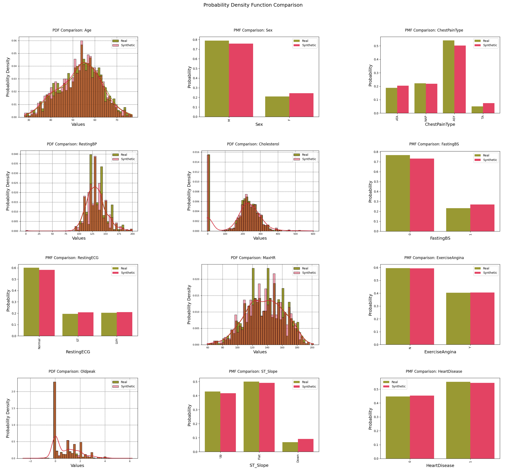

# ⚙️ artifact-core

> The core component of the Artifact framework, providing a flexible minimal interface for the computation of heterogeneous validation artifacts in machine learning experiments.


<p align="center">
  
</p>


---

## 📋 Overview

This repository serves as the foundation of the **Artifact** framework.

It stands alongside::
- **artifact-experiment**: Executable validation plans exporting results to popular experiment tracking services.
- **artifact-torch**: PyTorch integration for rapid prototyping: flexible model types and trainers supporting seamless validation using Artifact-ML.

`artifact-core` provides a **flexible minimal interface** for the computation of heterogeneous validation artifacts in machine learning experiments.

It defines the core abstractions, interfaces, and implementations that enable standardized validation across different models and datasets.

## 📚 Examples

```python
import pandas as pd
from artifact_core.libs.resource_spec.tabular.spec import TabularDataSpec
from artifact_core.table_comparison import (
    TableComparisonEngine,
    TableComparisonScoreType,
)

df_real = pd.read_csv("real_data.csv")

df_synthetic = pd.read_csv("synthetic_data.csv")

spec = TabularDataSpec.from_df(
    df=df_real, 
    cat_features=categorical_features, 
    cont_features=continuous_features
)

engine = TableComparisonEngine(resource_spec=spec)

dict_js_distance = engine.produce_dataset_comparison_score_collection(
    score_collection_type=TableComparisonScoreCollectionType.JS_DISTANCE,
    dataset_real=df_real,
    dataset_synthetic=df_synthetic,
)

dict_js_distance
```

<p align="center">
  
</p>

```python
from artifact_core.table_comparison import (
    TableComparisonPlotType,
)

pca_plot = engine.produce_dataset_comparison_plot(
    plot_type=TableComparisonPlotType.PCA_PROJECTION_PLOT,
    dataset_real=df_real,
    dataset_synthetic=df_synthetic,
)

pca_plot
```

<p align="center">
  
</p>

```python
pdf_plots = engine.produce_dataset_comparison_plot(
    plot_type=TableComparisonPlotType.PDF_PLOT,
    dataset_real=df_real,
    dataset_synthetic=df_synthetic,
)

pdf_plots
```

<p align="center">
  
</p>

## 🚀 Installation

### Using Poetry (Recommended)

```bash
git clone https://github.com/vasileios-ektor-papoulias/artifact-core.git
cd artifact-core
poetry install
```

### Using Pip

```bash
git clone https://github.com/vasileios-ektor-papoulias/artifact-core.git
cd artifact-core
pip install .
```

## 🏗️ Architecture

The framework follows a modular architecture with the following key components:

1. **Artifact**: A flexible computation unit utilizing generic resources, static resource specifications and hyperparameters to evaluate model outputs.
2. **ArtifactRegistry**: Manages the registration and retrieval of artifacts.
3. **ArtifactEngine**: High-level interface orchestrating the production of validation artifacts.

Artifacts are reusable components that compute specific validation metrics or visualizations.

They are heterogeneous (multi-modal). Based on their return value, they are categorized in the following groups:

- **Scores**: Single numerical metrics
- **Arrays**: Numpy arrays containing computed data
- **Plots**: Matplotlib figures for visualization
- **Collections**: Groups of related artifacts (e.g., multiple scores or plots)

Artifacts consume generic *resources* tailored to each use case. Their action is configured through:
* generic *hyperparameter* objects encoding configuration settings
* generic *resource spec* objects encoding static structural properties of the validation resources (e.g. schema properties in the context of tabular data generation).

Artifacts are grouped in **registries**.

Artifacts in the same registry share the same resources, return type and resource specification type, but may differ in their hyperparams type.

New artifacts can be registered with the appropriate registry. In doing so abstract enumerations are associated to the relevant artifact and hyperparmeter classes.

**Engines** utilize a group of registries (one for each data type) to provide a uniform interface for executing artifacts.

All artifacts associated to a given engine share resources and resource spec types.


## 🔧 Architecture Deep Dive

To better understand how the architecture works in practice, let's examine the components needed to create an artifact engine:

### 1. Define Artifact Types

First, you define enumerations for each type of artifact your engine will support:

```python
from enum import Enum
from artifact_core.base.artifact_dependencies import ArtifactType

class CustomScoreType(ArtifactType):
    CUSTOM_SCORE = "accuracy_score"
    
class CustomArrayType(ArtifactType):
    pass
    
class CustomPlotType(ArtifactType):
    pass
    
class CustomScoreCollectionType(ArtifactType):
    pass
    
class CustomArrayCollectionType(ArtifactType):
    pass
    
class CustomPlotCollectionType(ArtifactType):
    pass
```

These enumerations serve as identifiers for the different artifacts that can be computed by your engine.

### 2. Create a Data Specification

The resource specification defines the structural properties of your validation resources:

```python
from dataclasses import dataclass
from typing import List, Dict, Optional
from artifact_core.base.artifact_dependencies import ResourceSpecProtocol

@dataclass
class CustomResourceSpec(ResourceSpecProtocol):
    validation_resource_structural_property: float
```

### 3. Define Resources

Resources are the data objects that artifacts will operate on:

```python
from dataclasses import dataclass
import numpy as np
import pandas as pd
from typing import Dict, List, Optional, Union

from artifact_core.base.artifact_dependencies import ArtifactResources

@dataclass
class CustomResources(ArtifactResources):
    resource_attribute: np.ndarray
```

### 4. Create Registries

Registries manage the organization and retrieval of artifacts:

```python
import json
from matplotlib.figure import Figure
import numpy as np
import os
from typing import Dict, Type, Optional, List

from artifact_core.base.registry import ArtifactRegistry

# Helper function to load configurations
def load_config_section(config_path: str, section: str) -> Dict[str, Dict[str, Any]]:
    if os.path.exists(config_path):
        with open(config_path, 'r') as f:
            config = json.load(f)
            return config.get(section, {})
    return {}

# Path to configuration file
CONFIG_PATH = 'path/to/custom_engine/config/raw.json'

# Create artifact registries
class CustomScoreRegistry(ArtifactRegistry[CustomScoreType, CustomResources, float, CustomResourceSpec]):
    @classmethod
    def _get_artifact_configurations(cls) -> Dict[str, Dict[str, Any]]:
        return load_config_section(
            config_path=CONFIG_PATH,
            section='scores'
            )

# Similar registries for other artifact types...
```

### 5. Implement Artifacts

Create concrete artifact implementations:

```python
from typing import Any, Optional, Union

from artifact_core.base.artifact import Artifact
from artifact_core.base.artifact_dependencies import NoArtifactHyperparams

@CustomScoreRegistry.register_artifact(CustomScoreType.CUSTOM_SCORE)
class CustomScore(Artifact[CustomResources, float, NoArtifactHyperparams, CustomResourceSpec]):
    def _validate(self, resources: CustomResources) -> CustomResources:
        if not hasattr(resources, "resource_attribute"):
            raise ValueError("Resources must contain resource_attribute")
        return resources
        
    def _compute(self, resources: CustomResources) -> float:
        return resources.resource_attribute.mean()
```

### 6. Deploy Artifacts through an Artifact Engine

Finally, create the engine that orchestrates the computation of artifacts:

```python
from typing import Type, Dict, Union

from artifact_core.base.engine import ArtifactEngine

class CustomArtifactEngine(ArtifactEngine[
    CustomResources,
    CustomResourceSpec,
    CustomScoreType,
    CustomArrayType,
    CustomPlotType,
    CustomScoreCollectionType,
    CustomArrayCollectionType,
    CustomPlotCollectionType
]):
    @classmethod
    def _get_score_registry(cls) -> Type[CustomScoreRegistry]:
        return CustomScoreRegistry
        
    # Similar methods for other registries...
        
    # Custom methods for your specific use case
    def produce_custom_score(
        self, 
        score_type: CustomScoreType, 
        resource_attribute: np.ndarray
    ) -> float:
        resources = CustomResources(resource_attribute=resource_attribute)
        return self.produce_score(score_type=score_type, resources=resources)
```

## 📊 Table Comparison Engine

`artifact-core` provides a concrete implementation for the comparison of tabular datasets: the **TableComparisonEngine**.

This is intended to serve research projects in synthetic tabular data generation.

### TableComparisonEngine: Available Artifacts

#### Plots
- `PDF_PLOT`: Probability density function plots
- `CDF_PLOT`: Cumulative distribution function plots
- `DESCRIPTIVE_STATS_COMPARISON_PLOT`: Comparison of descriptive statistics
- `MEAN_COMPARISON_PLOT`: Comparison of means between real and synthetic data
- `STD_COMPARISON_PLOT`: Comparison of standard deviations
- `VARIANCE_COMPARISON_PLOT`: Comparison of variances
- `MEDIAN_COMPARISON_PLOT`: Comparison of medians
- `FIRST_QUARTILE_COMPARISON_PLOT`: Comparison of first quartiles
- `THIRD_QUARTILE_COMPARISON_PLOT`: Comparison of third quartiles
- `MIN_COMPARISON_PLOT`: Comparison of minimum values
- `MAX_COMPARISON_PLOT`: Comparison of maximum values
- `PAIRWISE_CORRELATION_COMPARISON_HEATMAP`: Correlation comparison heatmap
- `PCA_PROJECTION_PLOT`: PCA projection visualization
- `TRUNCATED_SVD_PROJECTION_PLOT`: Truncated SVD projection visualization
- `TSNE_PROJECTION_PLOT`: t-SNE projection visualization

#### Scores
- `MEAN_JS_DISTANCE`: Jensen-Shannon divergence between distributions
- `PAIRWISE_CORRELATION_DISTANCE`: Distance between correlation matrices

#### Score Collections
- `JS_DISTANCE`: Collection of Jensen-Shannon distances for all features

#### Array Collections
- `MEANS`: Collection of mean values for all features
- `STDS`: Collection of standard deviations for all features
- `VARIANCES`: Collection of variances for all features
- `MEDIANS`: Collection of median values for all features
- `FIRST_QUARTILES`: Collection of first quartile values for all features
- `THIRD_QUARTILES`: Collection of third quartile values for all features
- `MINIMA`: Collection of minimum values for all features
- `MAXIMA`: Collection of maximum values for all features

#### Plot Collections
- `PDF_PLOTS`: Collection of PDF plots for all features
- `CDF_PLOTS`: Collection of CDF plots for all features

### 📊 Example: General Usage

```python
import pandas as pd
from artifact_core.libs.resource_spec.tabular.spec import TabularDataSpec
from artifact_core.table_comparison import (
    TableComparisonEngine,
    TableComparisonPlotType,
    TableComparisonScoreType,
)

# Create or load your datasets
df_real = pd.read_csv("real_data.csv")
df_synthetic = pd.read_csv("synthetic_data.csv")

# Define the data specification
categorical_features = ["cat_1", "cat_2", "cat_3"]
continuous_features = ["num_1", "num_2", "num_3"]
spec = TabularDataSpec.from_df(
    df=df_real, 
    cat_features=categorical_features, 
    cont_features=continuous_features
)

# Create the engine
engine = TableComparisonEngine(resource_spec=spec)

# Compute a plot artifact
pca_plot = engine.produce_dataset_comparison_plot(
    plot_type=TableComparisonPlotType.PCA_PROJECTION_PLOT,
    dataset_real=df_real,
    dataset_synthetic=df_synthetic,
)

# Compute a score artifact
js_distance = engine.produce_dataset_comparison_score(
    score_type=TableComparisonScoreType.MEAN_JS_DISTANCE,
    dataset_real=df_real,
    dataset_synthetic=df_synthetic,
)
```

## 🚀 Configuring and Using the Framework

### 1. Configuring Existing Artifacts in Your Project

When using `artifact-core` as a package in your own project, you can override the default configuration of existing artifacts:

#### How Configuration Override Works

1. Create a `.artifact` directory in your project root
2. Create a configuration file named after the engine type (e.g., `table_comparison.json`)
3. Define your custom configuration in JSON format
4. Your configuration override will be automatically detected and merged with the default one

#### Example: Overriding Table Comparison Configuration

Create a file at `.artifact/table_comparison.json` in your project root:

```json
{
  "scores": {
    "mean_js_distance": {
      "n_bins_cts_histogram": 200,
      "categorical_only": true
    }
  },
  "plots": {
    "tsne_projection_plot": {
      "perplexity": 50,
      "learning_rate": 200,
      "n_iter": 2000
    }
  }
}
```

This configuration will override the default settings for the `mean_js_distance` score and the `tsne_projection_plot` plot, while keeping the default settings for all other artifacts.

#### Configuration Structure

The configuration file follows the same structure as the default configuration:

```json
{
  "scores": {
    "score_type_name": {
      "param1": value1,
      "param2": value2
    }
  },
  "arrays": { ... },
  "plots": { ... },
  "score_collections": { ... },
  "array_collections": { ... },
  "plot_collections": { ... }
}
```

Only include the sections and parameters you want to override.

Your configuration will be merged with the default one automatically, with your settings taking precedence.

## 🔧 Extending the Framework

### 1. Contributing New Artifacts

The success of this project hinges on the availability of a rich corpus of validation artifacts.

Contributions are strongly encouraged and highly appreciated.

To contribute new artifacts to the `artifact-core` project:

1. Add a new value to the appropriate existing Enum (e.g., in `artifact_core/table_comparison/registries/scores/types.py`)
2. Create and register your hyperparameters class (inheriting from `ArtifactHyperparams`)
3. Add the default configuration values in the appropriate config file (e.g. in `artifact_core/table_comparison/config/raw.json`)
4. Create and register your artifact class (inheriting from `Artifact` with the appropriate generics matching the engine of interest)

#### Example: Contributing a New Score Artifact to the TableComparisonEngine

First, add your new score type to the existing enum in: artifact_core/table_comparison/registries/scores/types.py.
```python
class TableComparisonScoreType(ArtifactType):
    MEAN_JS_DISTANCE = "mean_js_distance"
    PAIRWISE_CORRELATION_DISTANCE = "pairwise_correlation_distance"
    # Add your new score type
    NEW_TABLE_COMPARISON_SCORE = "new_table_comparison_score"
```
Then implement and register your artifact's hyperparameters:

```python
from artifact_core.base.artifact_dependencies import ArtifactHyperparams
from artifact_core.table_comparison.registries.scores.registry import TableComparisonScoreRegistry


@TableComparisonScoreRegistry.register_artifact_config(TableComparisonScoreType.MY_CUSTOM_SCORE)
@dataclass
class NewTableComparisonScoreHyperparams(ArtifactHyperparams):
    threshold: float,
    use_weights: bool
```

The corresponding contribution to the configuration file (`artifact_core/table_comparison/config/raw.json`) should then look like:

```json
{
  "scores": {
    "my_custom_score": {
      "threshold": 0.5,
      "use_weights": true
    }
  }
}
```

Should your contribution not require any hyperparameters, simply use the following as the generic parameter:

```python
from artifact_core.base.artifact_dependencies import NoArtifactHyperparams
```

In this case no hyperparams class needs to be registered and no configuration params need to be added to the config file.

The appropriate generics for table comparison artifacts are as follows:

```python
import pandas as pd

from artifact_core.base.artifact import Artifact
from artifact_core.libs.resource_spec.tabular.protocol import TabularDataSpecProtocol
from artifact_core.core.dataset_comparison.artifact import DatasetComparisonResources

Artifact[
        DatasetComparisonResources[pd.DataFrame],
        float,
        <HyperparamsT>,
        TabularDataSpecProtocol
        ]
```
However, note that we've provided more refined abstractions than the general artifact base class.

You should work with these instead: they implement core logic tailored to the specific artifact group in question.

All table comparison scores should inherit the following base:

```python
import pandas as pd

from artifact_core.table_comparison.artifacts.base import TableComparisonScore
from artifact_core.table_comparison.registries.scores.types import TableComparisonScoreType

TableComparisonScore[<HyperparamsT>]:
```

Finally implement and register your artifact (accessing the relevant hyperparameters and resource spec):

```python
from typing import Dict, Any, Optional, Union, List
from dataclasses import dataclass
import pandas as pd

from artifact_core.base.artifact import Artifact
from artifact_core.table_comparison.registries.scores.registry import TableComparisonScoreRegistry
from artifact_core.table_comparison.registries.scores.types import TableComparisonScoreType
from artifact_core.libs.resource_spec.tabular.protocol import TabularDataSpecProtocol
from artifact_core.core.dataset_comparison.artifact import DatasetComparisonResources


@TableComparisonScoreRegistry.register_artifact(TableComparisonScoreType.MY_CUSTOM_SCORE)
class NewTableComparisonScore(
    TableComparisonScore[
        NewTableComparisonScoreHyperparams
        ]
    ):
    def _validate(
        self,
        resources: DatasetComparisonResources
        ) -> DatasetComparisonResources:
        if resources.dataset_real is None or resources.dataset_synthetic is None:
            raise ValueError("Both real and synthetic datasets must be provided")
        return resources
        
    def _compare_datasets(self, dataset_real: pd.DataFrame, dataset_synthetic: pd.DataFrame) -> float:
        dataset_real = dataset_real[self._resource_spec.ls_cts_features]
        dataset_synthetic = dataset_synthetic[self._resource_spec.ls_cts_features]
        score = 1.0
        if score > self._hyperparams.threshold and self._hyperparams.use_weights:
            score = 2*score

        return score
```

## 🤝 Contributing

Contributions are welcome! Please feel free to submit a Pull Request, following the guidelines in [the framework README](./README.md).

## 📄 License

This project is licensed under the MIT License - see the LICENSE file for details.
