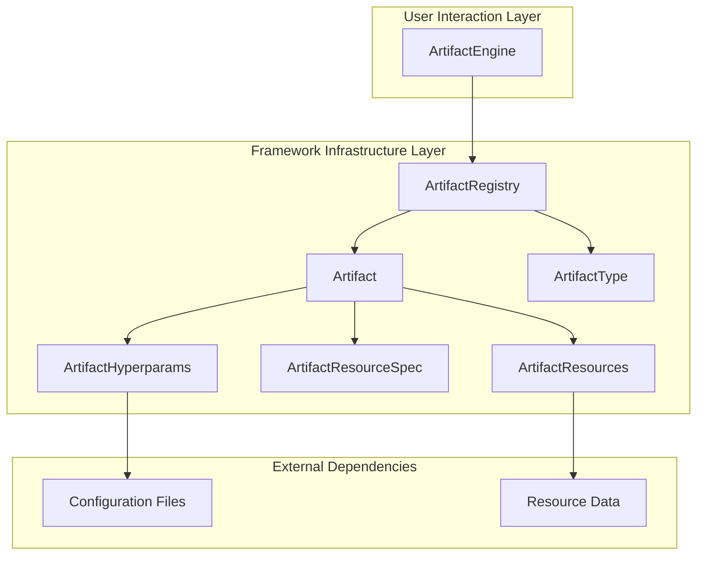

# Architecture

  

## Architectural Layers

### User Interaction Layer

The interface through which users engage with the framework’s validation capabilities.

### Framework Infrastructure Layer

The internal computational and management system that executes and maintains artifact workflows.

### External Dependency Layer

The interface that connects the framework to external inputs and configurations required for operation.

Crucially, user-facing interfaces are separated from internal framework infrastructure: users interact primarily with `ArtifactEngine` while the framework handles the complexity of artifact registration, instantiation, and execution through its internal infrastructure components.

## Architecture Diagram

