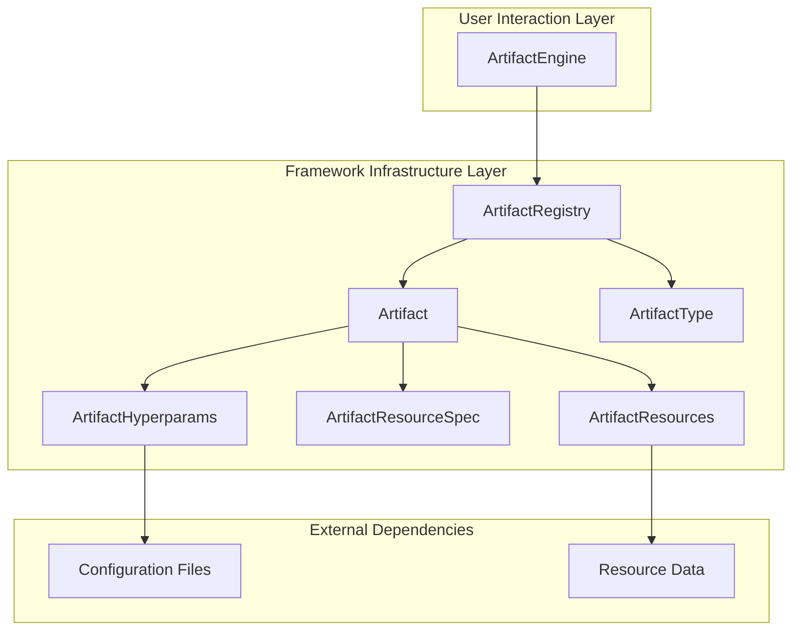

# Architecture

  

`artifact-core` follows a layered architecture offering maximal extendibility while exposing a simple interface to end-users:

## User Interaction Layer
The interface boundary between users and the framework's validation capabilities.

## Framework Infrastructure Layer
The internal computational and management infrastructure that powers artifact execution.

## External Dependencies
External inputs and configurations that the framework depends on for operation.

This architecture enables artifact-core to provide a clean separation between user-facing interfaces and internal framework infrastructure. Users interact primarily with ArtifactEngine while the framework handles the complexity of artifact registration, instantiation, and execution through its internal infrastructure components.