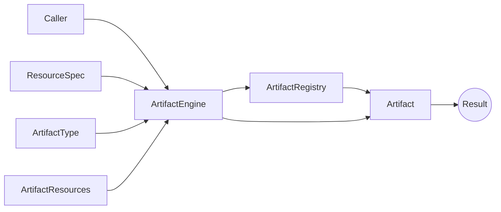

# Core Entities

<p align="center">
  
</p>

`artifact-core` operates by coordinating the interaction of specialized entities across its three [architectural layers](architecture.md):

## User Interaction Layer

- **ArtifactEngine**: Unified interface for executing validation artifacts declaratively. It delegates artifact instantiation to registries and provides a streamlined entry point for execution.

```python
engine = TableComparisonEngine(resource_spec=spec)

pca_plot = engine.produce_dataset_comparison_plot(
    plot_type=TableComparisonPlotType.PCA_PROJECTION_PLOT,
    dataset_real=df_real,
    dataset_synthetic=df_synthetic,
)
```

## Framework Infrastructure Layer

- **Artifact**: Abstract computational unit defining the `compute()` method contract.  
  Artifacts are heterogeneous (multi-modal) and categorized by their return type (modality):
  - **Scores** – Single numerical metrics.
  - **Arrays** – NumPy arrays containing computed data.
  - **Plots** – Matplotlib figures used for visualization.
  - **Collections** – Groups of related artifacts (e.g., multiple scores or plots).

- **ArtifactType**: Enumeration system that assigns unique identifiers to artifact implementations.

- **ArtifactRegistry**: The management layer that organizes, registers, and instantiates artifacts by type. Each registry groups artifacts sharing compatible resource types, return modalities, and resource specifications.

- **ArtifactResources**: data containers providing the inputs required for artifact computation.  

- **ArtifactResourceSpec**: Schema definitions that describe the structural and semantic properties of validation resources (e.g., feature types and data formats for tabular data).

- **ArtifactHyperparams**: Configuration objects that parameterize artifact behavior.

## External Dependencies

- **Configuration Files**: JSON-based parameter definitions that control artifact behavior.

- **Resource Data**: Domain-specific datasets and validation resources that serve as the inputs for artifact computation (e.g., pandas DataFrames for tabular validation tasks).

## Integration Flow

**Artifacts** are callables modeling individual validation workflows.

Artifact initialization requires:

- Static metadata characterizing the validation resources---provided as a `ResourceSpec` instance.
- Optional configuration parameters---provided as an `ArtifactHyperparams` instance.

**Artifact Registries** organize and manage artifacts by domain and modality (i.e., return type).

They serve as lookup tables from which artifacts can be retrieved dynamically.

Registries read artifact hyperparameters from configuration files.

Artifact retrieval requires:

- The artifact identifier, provided as an `ArtifactType` enum instance.
- The resource specification, provided as a `ResourceSpec` instance.  

**Artifact Engines** orchestrate artifact execution across modalities within a given domain.

They maintain access to all relevant registries, delegate artifact initialization and provide unified execution interfaces for each artifact modality.

Engine initialization requires:

- A `ResourceSpec` instance describing the available validation resources.

Once initialized, an engine exposes functions such as `compute_score()` (one for each modality).

When called with an `ArtifactType` enum and corresponding resources, the engine:

- Retrieves the appropriate artifact from the relevant `ArtifactRegistry`.
- Injects the provided `ArtifactResources` into the artifact instance.
- Executes the artifact’s validation workflow and returns the result.

