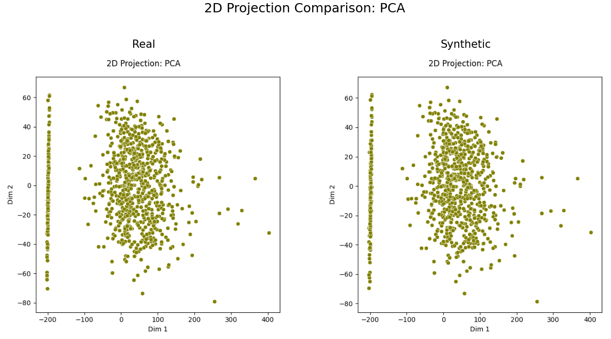

# Domain Toolkits

<p align="center">
  
</p>

## Toolkit Contents

In line with Artifact-ML's overall organization, `artifact-core` provides distinct [domain toolkits](https://artifact-ml.readthedocs.io/en/latest/domain_toolkits/).

Each toolkit implements its own flavour of all core interfaces.

Thereby, toolkits provide their own:

**Resource Spec**: static resource metadata container.

**Artifact Types**: enumerations used to specify validation artifacts.

**Artifact Engine**: unified interface for the computation of domain-specific artifacts.

```python
import pandas as pd

from artifact_core.table_comparison import (
    TableComparisonEngine,
    TableComparisonPlotType,
    TabularDataSpec
)

df_real = pd.read_csv("real_data.csv")

df_synthetic = pd.read_csv("synthetic_data.csv")

data_spec = TabularDataSpec.from_df(
    df=df_real, 
    cat_features=categorical_features, 
    cont_features=continuous_features
)

engine = TableComparisonEngine(resource_spec=data_spec)

pca_plot = engine.produce_dataset_comparison_plot(
    plot_type=TableComparisonPlotType.PCA_JUXTAPOSITION,
    dataset_real=df_real,
    dataset_synthetic=df_synthetic,
)

pca_plot
```

<p align="center">
  
</p>

## Supported Toolkits

- [Table Comparison Toolkit](table_comparison.md) — toolkit supporting tabular data synthesis workflows.
- [Binary Classification](binary_classification.md) — toolkit supporting binary classification workflows.