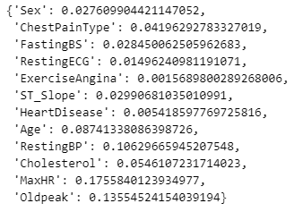
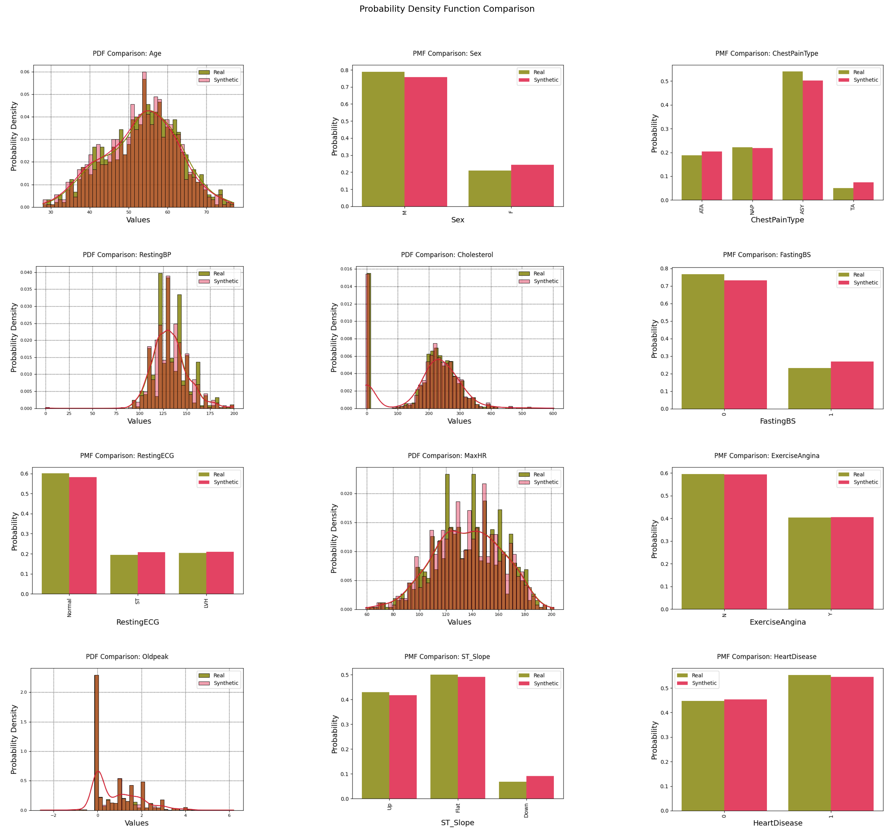

# User Guide

<p align="center">
  
</p>

## Usage Sketch

```python
import pandas as pd
from artifact_core.libs.resource_spec.tabular.spec import TabularDataSpec
from artifact_core.table_comparison import (
    TableComparisonEngine,
    TableComparisonScoreType,
)

df_real = pd.read_csv("real_data.csv")

df_synthetic = pd.read_csv("synthetic_data.csv")

spec = TabularDataSpec.from_df(
    df=df_real, 
    cat_features=categorical_features, 
    cont_features=continuous_features
)

engine = TableComparisonEngine(resource_spec=spec)

dict_js_distance_per_feature = engine.produce_dataset_comparison_score_collection(
    score_collection_type=TableComparisonScoreCollectionType.JS_DISTANCE,
    dataset_real=df_real,
    dataset_synthetic=df_synthetic,
)

dict_js_distance_per_feature
```

<p align="center">
  
</p>

```python
from artifact_core.table_comparison import (
    TableComparisonPlotType,
)

pca_plot = engine.produce_dataset_comparison_plot(
    plot_type=TableComparisonPlotType.PCA_JUXTAPOSITION,
    dataset_real=df_real,
    dataset_synthetic=df_synthetic,
)

pca_plot
```

<p align="center">
  
</p>

```python
pdf_plot = engine.produce_dataset_comparison_plot(
    plot_type=TableComparisonPlotType.PDF,
    dataset_real=df_real,
    dataset_synthetic=df_synthetic,
)

pdf_plot
```

<p align="center">
  
</p>

## Computing Validation Artifacts

Artifact engines provide the primary interface for computing validation artifacts. Create an engine instance with your resource specification, then use the engine's methods to compute individual artifacts or collections of artifacts by specifying the artifact type and input data. The engine handles all complexity of artifact lookup, instantiation, and execution, providing a clean interface where you specify what you want to compute and the data to compute it on. This declarative approach eliminates repetitive imperative code for artifact configuration, parameter management, and result handling.

```python
# Create engine with resource specification
engine = TableComparisonEngine(resource_spec=spec)

# Compute individual artifacts
score = engine.produce_dataset_comparison_score(score_type=ScoreType.MEAN_JS_DISTANCE, dataset_real=df_real, dataset_synthetic=df_synthetic)
plot = engine.produce_dataset_comparison_plot(plot_type=PlotType.PCA_JUXTAPOSITION, dataset_real=df_real, dataset_synthetic=df_synthetic)
```

## Overriding Artifact Hyperparameters

When using `artifact-core` as a package in your own project, you can override the default configuration of existing artifacts:

### How Configuration Override Works

1. Create a `.artifact-ml` directory in your project root
2. Create a configuration file named after the domain toolkit of interest (e.g., `table_comparison.json`)
3. Define your custom configuration in JSON format
4. Your configuration override will be automatically detected and merged with the default one

### Example: Overriding Table Comparison Configuration

Create a file at `.artifact-ml/table_comparison.json` in your project root:

```json
{
  "scores": {
    "MEAN_JS_DISTANCE": {
      "n_bins_cts_histogram": 200,
      "categorical_only": true
    }
  },
  "plots": {
    "TSNE_JUXTAPOSITION": {
      "perplexity": 50,
      "learning_rate": 200,
      "max_iter": 2000
    }
  }
}
```

This configuration will override the default settings for the `MEAN_JS_DISTANCE` score and the `TSNE_JUXTAPOSITION` plot, while keeping the default settings for all other artifacts.

### Configuration Structure

The configuration file follows the same structure as the default configuration:

```json
{
  "scores": {
    "score_type_name": {
      "param1": value1,
      "param2": value2
    }
  },
  "arrays": { ... },
  "plots": { ... },
  "score_collections": { ... },
  "array_collections": { ... },
  "plot_collections": { ... }
}
```

Only include the sections and parameters you want to override.

Your configuration will be merged with the default one automatically, with your settings taking precedence.

## Custom Artifacts

`artifact-core` supports project-specific custom artifacts, enabling users to extend domain toolkits with specialized validation logic tailored to their unique requirements.

Custom artifacts integrate seamlessly with the existing framework infrastructure while providing complete flexibility.

### Creating Custom Artifacts

**1. Configure Custom Artifact Path**

Update the relevant domain toolkit configuration file (see the relevant section above) to point to your custom artifacts directory. Note that the required path is to be specified relative to the parent of the .artifact-ml folder hosting the relevant config file---typically your project root. The setup is clarified in the artifact-core demo.

```json
{
  "custom_artifact_path": "/path/to/your/custom_artifacts",
  "score_collections": {
    "CUSTOM_SCORE": {
      "param1": value1,
      "param2": value2
    }
  }
}
```

**2. Implement Custom Artifact**

Create your custom artifact by extending the appropriate base class.

Select the relevant domain-specific registry corresponding to your artifact's modality (e.g. score, array, plot etc.) and register your implementation.

```python
import pandas as pd
from artifact_core.base.artifact_dependencies import NO_ARTIFACT_HYPERPARAMS
from artifact_core.table_comparison.artifacts.base import TableComparisonScore
from artifact_core.table_comparison.registries.scores.registry import TableComparisonScoreRegistry

@TableComparisonScoreRegistry.register_custom_artifact("CUSTOM_SCORE")
class CustomScore(TableComparisonScore[NO_ARTIFACT_HYPERPARAMS]):
    def _compare_datasets(
        self, dataset_real: pd.DataFrame, dataset_synthetic: pd.DataFrame
    ) -> float:
        # Implement your custom validation logic
        custom_metric = compute_your_metric(dataset_real, dataset_synthetic)
        return custom_metric
```


If your custom artifact requires configuration parameters create a corresponding hyperparameters class and pass the desired values in the toolkit config file:

```python
from dataclasses import dataclass
from artifact_core.base.artifact_dependencies import ArtifactHyperparams

@dataclass
class CustomScoreHyperparams(ArtifactHyperparams):
    threshold: float
    use_weights: bool

@TableComparisonScoreRegistry.register_custom_artifact_hyperparams("CUSTOM_SCORE")
@dataclass
class CustomScoreHyperparams(ArtifactHyperparams):
    threshold: float
    use_weights: bool

@TableComparisonScoreRegistry.register_custom_artifact("CUSTOM_SCORE")
class CustomScore(TableComparisonScore[CustomScoreHyperparams]):
    def _compare_datasets(self, dataset_real: pd.DataFrame, dataset_synthetic: pd.DataFrame) -> float:
        # Access hyperparameters via self._hyperparams.threshold, self._hyperparams.use_weights
        return computed_score
```

```json
{
  "scores": {
    "CUSTOM_SCORE": {
      "threshold": 0.5,
      "use_weights": true
    }
  }
}
```

### Using Custom Artifacts

Once configured, custom artifacts can be used exactly like built-in ones:

```python
# Use custom artifact with string identifier
custom_score = engine.produce_dataset_comparison_score(
    score_type="CUSTOM_SCORE",
    dataset_real=df_real,
    dataset_synthetic=df_synthetic,
)
```

### Contributing Custom Artifacts

If you develop a custom artifact that could benefit the broader community, consider contributing it.

Custom artifacts that demonstrate broad applicability, statistical rigor, and clean implementation are excellent candidates for inclusion in the core framework.