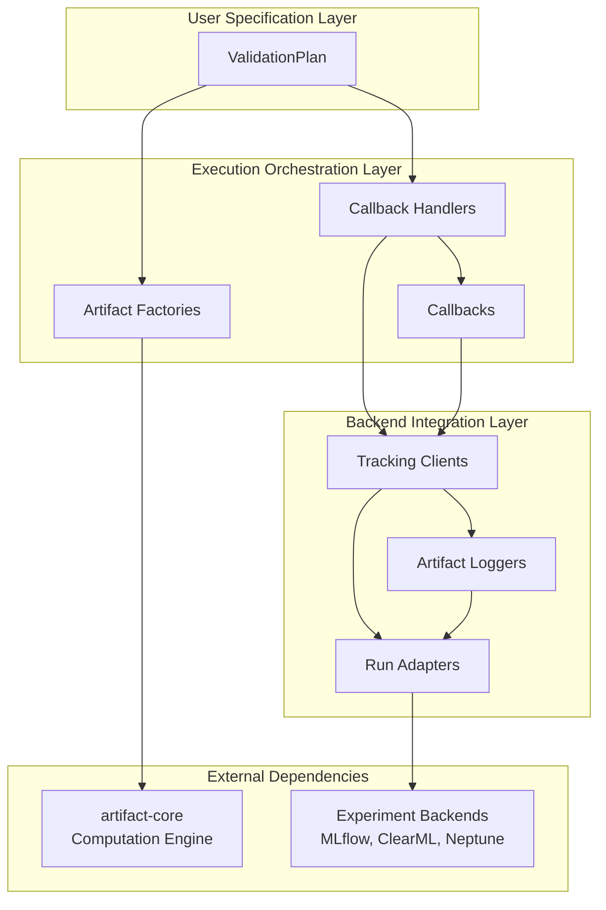

# ⚙️ artifact-experiment

> Experiment orchestration and tracking for the Artifact framework.

<p align="center">
  
</p>


[](https://github.com/vasileios-ektor-papoulias/artifact-ml/actions/workflows/ci_push_main.yml)
[](https://codecov.io/gh/vasileios-ektor-papoulias/artifact-ml/flags#experiment)
[](https://www.codefactor.io/repository/github/vasileios-ektor-papoulias/artifact-ml)

[](https://sonarcloud.io/summary/new_code?id=vasileios-ektor-papoulias_artifact-experiment&branch=main)
[](https://sonarcloud.io/summary/new_code?id=vasileios-ektor-papoulias_artifact-experiment&branch=main)
[](https://sonarcloud.io/summary/new_code?id=vasileios-ektor-papoulias_artifact-experiment&branch=main)
[](https://sonarcloud.io/summary/new_code?id=vasileios-ektor-papoulias_artifact-experiment&branch=main)


---

## 📋 Overview

`artifact-experiment` constitutes the experiment management extension to the Artifact framework.

It bridges the gap between validation computation and experiment tracking through a core **validation plan** abstraction responsible for the execution and tracking of artifact collections.

It stands alongside:
- [`artifact-core`](../artifact-core/README.md): Framework foundation providing a flexible minimal interface for the computation of validation artifacts.
- [`artifact-torch`](../artifact-torch/README.md): PyTorch integration for rapid prototyping with seamless validation using Artifact-ML.

**Core Value Proposition:**
- **Reusable Validation Workflows**: Define validation plans once, execute across different models and datasets
- **Backend-Agnostic Tracking**: Unified interface supporting MLflow, ClearML, Neptune, and local filesystem
- **Seamless Integration**: Direct integration with artifact-core's computation engine
- **Flexible Callback Architecture**: Extensible system for custom artifact computation and tracking workflows

## 🚀 Installation

Clone the Artifact-ML monorepo by running:

```bash
git clone https://github.com/vasileios-ektor-papoulias/artifact-ml.git
```

Install the `artifact-experiment` package by running:
```bash
cd artifact-ml/artifact-experiment
poetry install
```

## 📚 Usage Sketch

### Validation Plan Configuration

```python
from typing import List
from artifact_experiment.table_comparison.validation_plan import (
    TableComparisonPlan,
    TableComparisonScoreType,
    TableComparisonPlotType,
    TableComparisonScoreCollectionType,
    TableComparisonArrayCollectionType,
    TableComparisonPlotCollectionType,
)

class MyValidationPlan(TableComparisonPlan):
    @staticmethod
    def _get_score_types() -> List[TableComparisonScoreType]:
        return [
            TableComparisonScoreType.MEAN_JS_DISTANCE,
            TableComparisonScoreType.CORRELATION_DISTANCE,
        ]

    @staticmethod
    def _get_plot_types() -> List[TableComparisonPlotType]:
        return [
            TableComparisonPlotType.PDF,
            TableComparisonPlotType.CDF,
            TableComparisonPlotType.PCA_JUXTAPOSITION,
        ]

    @staticmethod
    def _get_score_collection_types() -> List[TableComparisonScoreCollectionType]:
        return [
            TableComparisonScoreCollectionType.JS_DISTANCE
            ]

    @staticmethod
    def _get_array_collection_types() -> List[TableComparisonArrayCollectionType]:
        return [
            TableComparisonArrayCollectionType.MEAN_JUXTAPOSITION,
            TableComparisonArrayCollectionType.STD_JUXTAPOSITION,
        ]

    @staticmethod  
    def _get_plot_collection_types() -> List[TableComparisonPlotCollectionType]:
        return [
            TableComparisonPlotCollectionType.PDF
            ]
```

### Validation Plan Execution

```python
import pandas as pd

from artifact_core.libs.resource_spec.tabular.spec import TabularDataSpec

# Load and prepare data
df_real = pd.read_csv("real_data.csv")
df_synthetic = pd.read_csv("synthetic_data.csv")

continuous_features = ["feature1", "feature2", "feature3"]
resource_spec = TabularDataSpec.from_df(
    df=df_real,
    ls_cts_features=continuous_features,
    ls_cat_features=[col for col in df_real.columns if col not in continuous_features]
)

# Execute validation plan
plan = MyValidationPlan.build(resource_spec=resource_spec)
plan.execute_table_comparison(dataset_real=df_real, dataset_synthetic=df_synthetic)

# Access computed artifacts
js_distance = plan.scores.get("MEAN_JS_DISTANCE")
pca_plot = plan.plots.get("PCA_JUXTAPOSITION")
feature_means = plan.array_collections.get("MEAN_JUXTAPOSITION")
```

### Experiment Tracking Integration

#### MLflow Integration
```python
from artifact_experiment.libs.tracking.mlflow.client import MlflowTrackingClient

# Setup MLflow experiment
MLFLOW_EXPERIMENT_NAME = "artifact-experiment-demo"
experiment_id = MlflowTrackingClient.create_experiment(experiment_name=MLFLOW_EXPERIMENT_NAME)

# Create tracking client and build validation plan
mlflow_client = MlflowTrackingClient.build(experiment_id=experiment_id)
plan = MyValidationPlan.build(resource_spec=resource_spec, tracking_client=mlflow_client)

# Execute validation (results automatically logged to MLflow)
plan.execute_table_comparison(dataset_real=df_real, dataset_synthetic=df_synthetic)

# Stop MLflow run
mlflow_client.run.stop()
```

#### ClearML Integration
```python
from artifact_experiment.libs.tracking.clear_ml.client import ClearMLTrackingClient

# Create ClearML tracking client
CLEAR_ML_PROJECT_NAME = "artifact-experiment-demo"
clearml_client = ClearMLTrackingClient.build(experiment_id=CLEAR_ML_PROJECT_NAME)

# Build and execute validation plan
plan = MyValidationPlan.build(resource_spec=resource_spec, tracking_client=clearml_client)
plan.execute_table_comparison(dataset_real=df_real, dataset_synthetic=df_synthetic)
clearml_client.run.stop()
```

#### Neptune Integration
```python
from artifact_experiment.libs.tracking.neptune.client import NeptuneTrackingClient

# Create Neptune tracking client
NEPTUNE_PROJECT_NAME = "artifact-experiment-demo"
neptune_client = NeptuneTrackingClient.build(experiment_id=NEPTUNE_PROJECT_NAME)

# Build and execute validation plan
plan = MyValidationPlan.build(resource_spec=resource_spec, tracking_client=neptune_client)
plan.execute_table_comparison(dataset_real=df_real, dataset_synthetic=df_synthetic)
neptune_client.run.stop()
```

#### Local Filesystem Integration
```python
from artifact_experiment.libs.tracking.filesystem.client import FilesystemTrackingClient

# Create filesystem tracking client (saves to ~/artifact_ml/)
EXPERIMENT_ID = "artifact-experiment-demo"
filesystem_client = FilesystemTrackingClient.build(experiment_id=EXPERIMENT_ID)

# Build and execute validation plan
plan = MyValidationPlan.build(resource_spec=resource_spec, tracking_client=filesystem_client)
plan.execute_table_comparison(dataset_real=df_real, dataset_synthetic=df_synthetic)
filesystem_client.run.stop()

# Results saved to ~/artifact_ml/artifact-experiment-demo/<filesystem_client.run.run_id>
```

## 🏗️ Architecture

`artifact-experiment` follows a layered architecture that separates validation specification, execution orchestration, backend integration, and external dependencies:



### User Specification Layer
The interface for declaratively specifying validation requirements and experiment configurations.

### Execution Orchestration Layer
The internal workflow coordination system that transforms specifications into executable validation processes.

### Backend Integration Layer
The abstraction boundary that enables unified experiment tracking across multiple backend platforms.

### External Dependencies
External systems that the framework integrates with for validation computation and experiment persistence.

## 🚀 Core Entities

The framework operates by coordinating the interaction of specialized entities across the four aforementioned layers:

### **User Specification Layer**
Users define validation requirements through simple subclass hooks, eliminating complex implementation details:

- **ValidationPlan**: Provides declarative validation specification through subclass hooks, transforming user requirements into executable workflows with experiment tracking capabilities.

```python
class MyValidationPlan(TableComparisonPlan):
    @staticmethod
    def _get_score_types() -> List[TableComparisonScoreType]:
        return [TableComparisonScoreType.MEAN_JS_DISTANCE]
    
    @staticmethod 
    def _get_plot_types() -> List[TableComparisonPlotType]:
        return [TableComparisonPlotType.PDF]
```

**Architecture Role**: ValidationPlan orchestrates the entire validation workflow by using ArtifactFactories to create computation callbacks and CallbackHandlers to execute them, transforming specifications into executable validation workflows.

**Result Management**: ValidationPlan caches all computed artifacts in RAM for immediate access and inspection, while simultaneously leveraging experiment tracking exports for persistent storage and collaboration.

### **Execution Orchestration Layer**
The orchestration layer transforms user specifications into executable workflows through coordinated entity interaction:

- **ArtifactFactories**: Create callbacks that integrate with artifact-core's computation engine, bridging validation specification with actual computation
- **Callbacks**: Execute individual validation computations and report results to tracking clients for export
- **CallbackHandlers**: Orchestrate callback execution across artifact types, managing validation workflow execution and coordinating with tracking clients

### **Backend Integration Layer**
The integration layer provides backend-agnostic experiment tracking through specialized components:

- **TrackingClients**: Coordinate experiment export by orchestrating loggers and adapters for unified backend interaction
- **ArtifactLoggers**: Handle artifact-specific export logic, converting computed results into backend-compatible formats
- **RunAdapters**: Normalize backend-specific run objects, providing consistent interfaces across different experiment tracking platforms

```python
# Unified interface across backends
mlflow_client = MlflowTrackingClient.build(experiment_id="my_experiment")
clearml_client = ClearMLTrackingClient.build(experiment_id="my_project") 
neptune_client = NeptuneTrackingClient.build(experiment_id="my_project")
filesystem_client = FilesystemTrackingClient.build(experiment_id="my_experiment")
```

**Entity Coordination**: TrackingClients coordinate experiment export by using ArtifactLoggers for artifact-specific export logic and RunAdapters for backend normalization. RunAdapters interface directly with experiment backends while ArtifactLoggers depend on adapters for actual export execution.

### **External Dependencies**
External systems and frameworks that the validation plan ecosystem depends on for computation and persistence:

- **artifact-core Computation Engine**: Individual validation computation units derive from `artifact-core`. `artifact-experiment` delegates validation logic to `artifact-core` **Artifact** instances. These are wrapped in callbacks and executed through handlers to build comprehensive validation workflows.

- **Experiment Tracking Backends**: External platforms that provide persistent storage and collaboration capabilities for experiment results. Supported backends include MLflow, ClearML, Neptune, and local filesystem, all accessed through the unified RunAdapter interface.

**Integration Flow**: ArtifactFactories wrap artifact-core artifacts in callbacks for validation computation, while RunAdapters interface with experiment tracking backends for result persistence, creating a seamless bridge between validation computation and experiment tracking ecosystems.

### **Seamless Integration Flow**
The complete flow demonstrates how entities collaborate to achieve the framework's goals:

1. **ValidationPlan** defines artifacts through subclass hooks
2. **ArtifactFactories** create callbacks integrating with artifact-core computation
3. **CallbackHandlers** orchestrate callback execution workflows
4. **Callbacks** perform computations and report to tracking clients
5. **TrackingClients** coordinate export using loggers and adapters  
6. **RunAdapters** normalize backend interfaces for seamless integration
7. **ArtifactLoggers** handle artifact-specific export to experiment backends

This coordinated interaction transforms artifact-core's raw validation capabilities into reusable, executable validation plans with automatic experiment tracking across multiple backends.

## 🎯 Domain-Specific Validation Plans

**Reusable Validation Plans With Unified Experiment Tracking**

Research teams working on similar problems can share complete validation workflows through `artifact-experiment`'s domain-specific validation plan abstractions.

This experiment orchestration approach enables:

- **Elimination of validation orchestration duplication** across different models targeting the same evaluation needs
- **Standardized experiment tracking** preventing inconsistencies in result export and storage across research projects
- **Decoupled validation specification** from experiment tracking implementation, allowing researchers to focus on defining what to validate rather than how to track results

Instead of each project implementing custom validation orchestration and experiment logging, the framework provides executable validation plans that bridge domain-specific artifact computation with backend-agnostic experiment tracking.

**Declarative Validation Plans**: Researchers define which artifacts to compute through simple subclass hooks, with the framework handling orchestration complexity and artifact computation coordination.

**Backend-Agnostic Tracking**: Validation plans export results to any supported backend (MLflow, ClearML, Neptune, filesystem) through a unified interface, eliminating tracking implementation concerns.

**Artifact Computation Integration**: Plans coordinate with artifact-core engines to execute comprehensive validation suites, transforming model outputs into structured evaluation results automatically.

**Reproducible Experiment Workflows**: Complete validation specifications can be version-controlled and shared across research teams, ensuring consistent evaluation protocols and facilitating collaboration.

### 📊 Table Comparison Validation Plans

`artifact-experiment` provides a concrete implementation for tabular dataset comparison: the **TableComparisonPlan**.

This is intended to serve research projects in synthetic tabular data generation.

**Scope**: Complete validation plan for comparing real and synthetic tabular datasets.

**Artifact Integration**: Direct integration with artifact-core's TableComparisonEngine for comprehensive validation artifact computation.

**Declarative Configuration**: Simple subclass hooks for specifying desired validation artifacts without complex implementation details.

**Reference Implementation**: The usage examples above demonstrate complete table comparison validation workflows with experiment tracking integration.

## 🔧 Framework Extension

### Creating ValidationPlans for New Domains

Each ArtifactEngine in `artifact-core` should have a corresponding ValidationPlan in `artifact-experiment`. When contributing new artifact types to `artifact-core`, extend `artifact-experiment` with the corresponding validation plan:

```python
from artifact_experiment.base.validation_plan import ValidationPlan

class NewDomainValidationPlan(ValidationPlan[...]):
    @staticmethod
    def _get_callback_factory() -> Type[NewDomainCallbackFactory]:
        return NewDomainCallbackFactory
        
    # Implement required artifact type methods...
```

### Adding New Tracking Backends

To support a new experiment tracking backend:

1. **Create RunAdapter**: Normalize the backend's native run object
2. **Create TrackingClient**: Implement the unified tracking interface  
3. **Implement ArtifactLoggers**: Handle backend-specific artifact export

```python
from artifact_experiment.base.tracking.adapter import RunAdapter
from artifact_experiment.base.tracking.client import TrackingClient
from artifact_experiment.base.tracking.logger import ArtifactLogger

# 1. Create RunAdapter
class MyBackendRunAdapter(RunAdapter[MyNativeRunType]):
    def upload(self, path_source: str, dir_target: str):
        # Implement backend-specific file upload
        pass
    
    def stop(self):
        # Implement run termination logic
        pass

# 2. Create TrackingClient
class MyBackendTrackingClient(TrackingClient[MyBackendRunAdapter]):
    @staticmethod
    def _get_score_logger(run: MyBackendRunAdapter) -> ArtifactLogger[float, MyBackendRunAdapter]:
        return MyBackendScoreLogger(run=run)
    
    # Implement other logger getters...

# 3. Implement ArtifactLoggers  
class MyBackendScoreLogger(ArtifactLogger[float, MyBackendRunAdapter]):
    def log(self, artifact: float, artifact_name: str):
        # Implement backend-specific score logging
        pass
```

## 🤝 Contributing

Contributions are welcome. Please refer to the [project's contribution guidelines](../docs/contributing.md) for development standards and submission procedures.

## 📄 License

This project is licensed under the [MIT License](https://img.shields.io/github/license/vasileios-ektor-papoulias/artifact-ml).