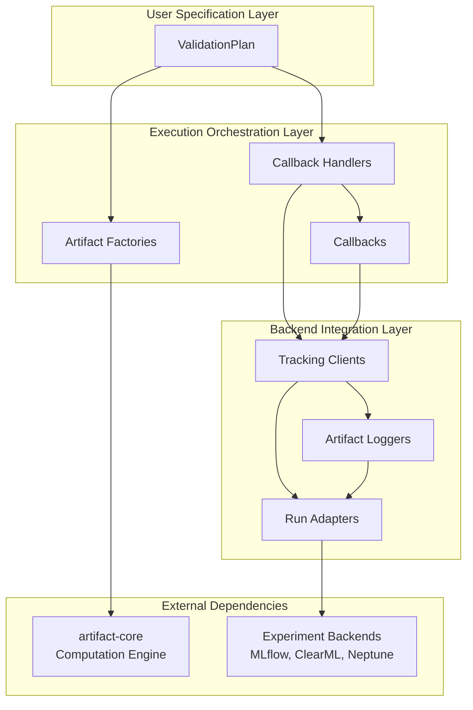

# ⚙️ artifact-experiment

> Executable validation plans for the Artifact framework, exporting results to popular experiment tracking services.


<p align="center">
  
</p>


---

## 📋 Overview


## 🏗️ Architecture

artifact-experiment follows a three-layer architecture that separates validation specification, execution orchestration, and backend integration:



```python
import pandas as pd
from typing import List
from artifact_core.libs.resource_spec.tabular.spec import TabularDataSpec
from artifact_experiment.libs.tracking.mlflow.client import MlflowTrackingClient
from artifact_experiment.table_comparison.validation_plan import (
    TableComparisonArrayCollectionType,
    TableComparisonArrayType,
    TableComparisonPlotCollectionType,
    TableComparisonPlotType,
    TableComparisonScoreCollectionType,
    TableComparisonScoreType,
    TableComparisonPlan,
)

# Load datasets
df_real = pd.read_csv("real_data.csv")
df_synthetic = pd.read_csv("synthetic_data.csv")

# Define resource specification
continuous_features = ["feature1", "feature2", "feature3"]
resource_spec = TabularDataSpec.from_df(
    df=df_real,
    ls_cts_features=continuous_features,
    ls_cat_features=[col for col in df_real.columns if col not in continuous_features]
)

# Define a custom validation plan
class MyValidationPlan(TableComparisonPlan):
    @staticmethod
    def _get_score_types() -> List[TableComparisonScoreType]:
        return [TableComparisonScoreType.MEAN_JS_DISTANCE]

    @staticmethod
    def _get_array_types() -> List[TableComparisonArrayType]:
        return []

    @staticmethod
    def _get_plot_types() -> List[TableComparisonPlotType]:
        return [
            TableComparisonPlotType.PDF_PLOT,
            TableComparisonPlotType.PCA_PROJECTION_PLOT,
        ]

    @staticmethod
    def _get_score_collection_types() -> List[TableComparisonScoreCollectionType]:
        return [TableComparisonScoreCollectionType.JS_DISTANCE]

    @staticmethod
    def _get_array_collection_types() -> List[TableComparisonArrayCollectionType]:
        return [
            TableComparisonArrayCollectionType.MEANS,
            TableComparisonArrayCollectionType.STDS,
        ]

    @staticmethod
    def _get_plot_collection_types() -> List[TableComparisonPlotCollectionType]:
        return [
            TableComparisonPlotCollectionType.PDF_PLOTS,
        ]

# Create and execute the validation plan
plan = MyValidationPlan.build(resource_spec=resource_spec)
plan.execute(dataset_real=df_real, dataset_synthetic=df_synthetic)

# Access computed artifacts
js_distance = plan.scores.get("MEAN_JS_DISTANCE")
pca_plot = plan.plots.get("PCA_PROJECTION_PLOT")
```

## 🔄 Experiment Tracking Integration

### MLflow

```python
# Create or get an MLflow experiment
MLFLOW_EXPERIMENT_NAME = "My Experiment"
experiment_id = MlflowTrackingClient.create_experiment(experiment_name=MLFLOW_EXPERIMENT_NAME)

# Create a tracking client
mlflow_client = MlflowTrackingClient.build(experiment_id=experiment_id)

# Build the validation plan with tracking
plan = MyValidationPlan.build(resource_spec=resource_spec, tracking_client=mlflow_client)

# Execute the plan (results will be logged to MLflow)
plan.execute(dataset_real=df_real, dataset_synthetic=df_synthetic)

# Stop the run when done
mlflow_client.run.stop()
```

### ClearML

```python
from artifact_experiment.libs.tracking.clear_ml.client import ClearMLTrackingClient

# Create a ClearML tracking client
CLEAR_ML_PROJECT_NAME = "My Project"
clear_ml_client = ClearMLTrackingClient.build(experiment_id=CLEAR_ML_PROJECT_NAME)

# Build and execute the validation plan
plan = MyValidationPlan.build(resource_spec=resource_spec, tracking_client=clear_ml_client)
plan.execute(dataset_real=df_real, dataset_synthetic=df_synthetic)
clear_ml_client.run.stop()
```

### Neptune

```python
from artifact_experiment.libs.tracking.neptune.client import NeptuneTrackingClient

# Create a Neptune tracking client
NEPTUNE_PROJECT_NAME = "My Project"
neptune_client = NeptuneTrackingClient.build(experiment_id=NEPTUNE_PROJECT_NAME)

# Build and execute the validation plan
plan = MyValidationPlan.build(resource_spec=resource_spec, tracking_client=neptune_client)
plan.execute(dataset_real=df_real, dataset_synthetic=df_synthetic)
neptune_client.run.stop()
```

### Local Filesystem

```python
from artifact_experiment.libs.tracking.filesystem.client import FilesystemTrackingClient

# Create a filesystem tracking client
filesystem_tracker = FilesystemTrackingClient.build(experiment_id="my_experiment")

# Build and execute the validation plan
plan = MyValidationPlan.build(resource_spec=resource_spec, tracking_client=filesystem_tracker)
plan.execute(dataset_real=df_real, dataset_synthetic=df_synthetic)
filesystem_tracker.run.stop()
```

## 🏗️ Architecture

The framework follows a modular architecture with the following key components:

### 1. Validation Plans

Validation plans define what artifacts to compute and how to execute them.

They are built on top of the `artifact-core` engine and provide a high-level interface for executing validation workflows.

They are configured by implementing subcalss hooks determining the artifacts of interest:

```python
class MyValidationPlan(TableComparisonPlan):
    @staticmethod
    def _get_score_types() -> List[TableComparisonScoreType]:
        return [...]  # Define which scores to compute
    
    # Define other artifact types to compute...
```

### 2. Callbacks

Callbacks handle the computation of artifacts and their tracking. The framework provides a flexible callback system that allows for easy extension and customization.

- **Callback**: Base class for all callbacks
- **Callback Handlers**: Manage groups of related callbacks

Each callback subtype comes with an associated handler.

Callback subtypes:

- **CacheCallback**: Executes a computation and stores output in state.
- **TrackingCallback**: Executes a computation, stores output in state and exports to an experiment tracking run.
- **ArtifactCallback**: Integration with `artifact-core`: a **TrackingCallback** whose computation delegates to an **Artifact**.

### 3. Tracking

The tracking system provides a unified interface for logging artifacts to different experiment tracking backends.

- **TrackingClient**: Base class for all tracking clients.
- **RunAdapter**: Adapts native run objects from different backends.
- **ArtifactLogger**: Handles the logging of specific artifact types.
```

## 🚀 Installation

### Using Poetry (Recommended)

```bash
git clone https://github.com/vasileios-ektor-papoulias/artifact-experiment.git
cd artifact-experiment
poetry install
```

### Using Pip

```bash
git clone https://github.com/vasileios-ektor-papoulias/artifact-experiment.git
cd artifact-experiment
pip install .
```

## 🔧 Extending the Framework

### 1. Creating a **ValidationPlan** to Match a New **ArtifactEngine**

Each **ArtifactEngine** in `artifac-core` has a **ValidationPlan** counterpart defined in `artifact-experiment`.

To illustrate: the **TableComparisonEngine** provides an interface for executing table comarison artifacts. The same artifact collection is made available for tracking (through `artifact-experiment`) using the **TableComparisonPlan** class.

When contributing new artifact types to `artifact-core`, it's suggested to also provide the relevant extension to `artifact-experiment` as in the the example above.

### 2. Adding Support for a New Tracking Backend

To add support for a new tracking backend:

1. Create a new **RunAdapter** for the backend
2. Create a new **TrackingClient** for the backend
3. Implement the necessary loggers (**ArtifactLogger**) for different artifact types

```python
# Example: Implementing a new tracking backend

# 1. Create a RunAdapter
class MyBackendRunAdapter(RunAdapter[MyNativeRunType]):
    # Implement required methods...

# 2. Create a TrackingClient
class MyBackendTrackingClient(TrackingClient[MyBackendRunAdapter]):
    # Implement required methods...

# 3. Implement loggers
class MyBackendScoreLogger(ArtifactLogger[float, MyBackendRunAdapter]):
    # Implement required methods...
```

## 🤝 Contributing

Contributions are welcome! 

Please feel free to submit a Pull Request following the guidelines in [the general Artifact-ML README](https://github.com/vasileios-ektor-papoulias/artifact-ml/blob/main/README.md).

## 📄 License

This project is licensed under the MIT License - see the LICENSE file for details.
