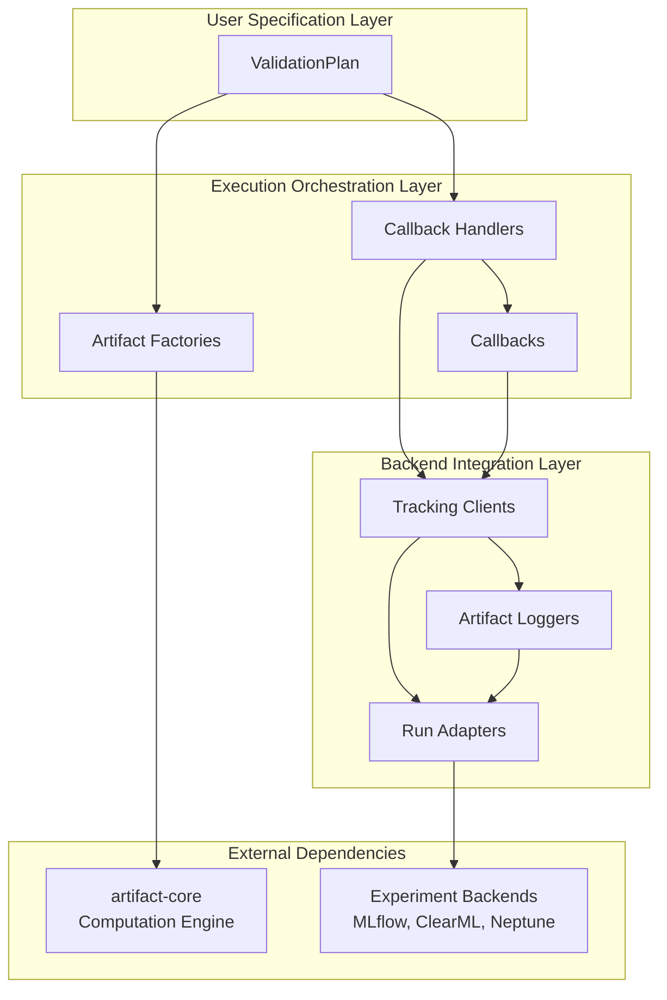

# ⚙️ artifact-experiment

> Experiment tracking extension for the Artifact framework providing a configurable validation plan abstraction that orchestrates the execution of artifact collections and manages the storage of results to popular experiment tracking services.

<p align="center">
  
</p>


---

## 📋 Overview

**artifact-experiment** bridges the gap between validation computation and experiment tracking by providing **executable validation plan abstractions** that leverage `artifact-core` for computation and export results to popular experiment tracking backends.

It extends the Artifact framework ecosystem alongside:
- **artifact-core**: Framework foundation providing flexible interfaces for heterogeneous validation artifact computation
- **artifact-torch**: PyTorch integration enabling rapid prototyping with seamless validation integration

## 🎯 Key Value Propositions

- **Reusable Validation Workflows**: Define validation plans once, execute across different models and datasets
- **Backend-Agnostic Tracking**: Unified interface supporting MLflow, ClearML, Neptune, and local filesystem
- **Seamless Integration**: Direct integration with artifact-core's computation engine
- **Flexible Callback Architecture**: Extensible system for custom artifact computation and tracking workflows

## 🏗️ Architecture

artifact-experiment follows a three-layer architecture that separates validation specification, execution orchestration, and backend integration:



### User Specification Layer
Configuration abstractions that eliminate validation implementation complexity by requiring only specification of desired artifacts through subclass hooks. Users define which validation artifacts they want computed without worrying about execution details.

### Execution Orchestration Layer
Framework infrastructure that handles validation workflow execution automatically. The callback system manages artifact computation scheduling, the handlers coordinate execution across artifact types, and factories integrate with `artifact-core`'s computation engine.

### Backend Integration Layer
Concrete tracking client implementations that handle experiment logging to different backends. Run adapters normalize backend-specific run objects, while artifact loggers handle the actual export of computed artifacts to the target experiment tracking system.

## 🚀 Core Entities

The framework achieves executable validation plans with experiment tracking through coordinated interaction of specialized entities across three architectural layers:

### **ValidationPlan: Validation Specification Interface**
Users define validation requirements through simple subclass hooks, eliminating complex implementation details:

```python
class MyValidationPlan(TableComparisonPlan):
    @staticmethod
    def _get_score_types() -> List[TableComparisonScoreType]:
        return [TableComparisonScoreType.MEAN_JS_DISTANCE]
    
    @staticmethod 
    def _get_plot_types() -> List[TableComparisonPlotType]:
        return [TableComparisonPlotType.PDF_PLOT]
```

**Architecture Role**: ValidationPlan orchestrates the entire validation workflow by using ArtifactFactories to create computation callbacks and CallbackHandlers to execute them, transforming specifications into executable validation workflows.

**Result Management**: ValidationPlan caches all computed artifacts in RAM for immediate access and inspection, while simultaneously leveraging experiment tracking exports for persistent storage and collaboration.

### **Execution Orchestration: From Specification to Computation**
The orchestration layer transforms user specifications into executable workflows through coordinated entity interaction:

- **ArtifactFactories**: Create callbacks that integrate with artifact-core's computation engine, bridging validation specification with actual computation
- **Callbacks**: Execute individual validation computations and report results to tracking clients for export
- **CallbackHandlers**: Orchestrate callback execution across artifact types, managing validation workflow execution and coordinating with tracking clients

### **Backend Integration: Unified Experiment Tracking**
The integration layer provides backend-agnostic experiment tracking through specialized components:

```python
# Unified interface across backends
mlflow_client = MlflowTrackingClient.build(experiment_id="my_experiment")
clearml_client = ClearMLTrackingClient.build(experiment_id="my_project") 
neptune_client = NeptuneTrackingClient.build(experiment_id="my_project")
filesystem_client = FilesystemTrackingClient.build(experiment_id="my_experiment")
```

**Entity Coordination**: TrackingClients coordinate experiment export by using ArtifactLoggers for artifact-specific export logic and RunAdapters for backend normalization. RunAdapters interface directly with experiment backends while ArtifactLoggers depend on adapters for actual export execution.

### **Seamless Integration Flow**
The complete flow demonstrates how entities collaborate to achieve the framework's goals:

1. **ValidationPlan** defines artifacts through subclass hooks
2. **ArtifactFactories** create callbacks integrating with artifact-core computation
3. **CallbackHandlers** orchestrate callback execution workflows
4. **Callbacks** perform computations and report to tracking clients
5. **TrackingClients** coordinate export using loggers and adapters  
6. **RunAdapters** normalize backend interfaces for seamless integration
7. **ArtifactLoggers** handle artifact-specific export to experiment backends

This coordinated interaction transforms artifact-core's raw validation capabilities into reusable, executable validation plans with automatic experiment tracking across multiple backends.

## 📚 Usage Examples

### Basic Validation Plan

```python
from typing import List
import pandas as pd
from artifact_core.libs.resource_spec.tabular.spec import TabularDataSpec
from artifact_experiment.table_comparison.validation_plan import (
    TableComparisonPlan,
    TableComparisonScoreType,
    TableComparisonPlotType,
    TableComparisonScoreCollectionType,
    TableComparisonArrayCollectionType,
    TableComparisonPlotCollectionType,
)

class ComprehensiveValidationPlan(TableComparisonPlan):
    @staticmethod
    def _get_score_types() -> List[TableComparisonScoreType]:
        return [
            TableComparisonScoreType.MEAN_JS_DISTANCE,
            TableComparisonScoreType.PAIRWISE_CORRELATION_DISTANCE,
        ]

    @staticmethod
    def _get_plot_types() -> List[TableComparisonPlotType]:
        return [
            TableComparisonPlotType.PDF_PLOT,
            TableComparisonPlotType.CDF_PLOT,
            TableComparisonPlotType.PCA_PROJECTION_PLOT,
        ]

    @staticmethod
    def _get_score_collection_types() -> List[TableComparisonScoreCollectionType]:
        return [TableComparisonScoreCollectionType.JS_DISTANCE]

    @staticmethod
    def _get_array_collection_types() -> List[TableComparisonArrayCollectionType]:
        return [
            TableComparisonArrayCollectionType.MEANS,
            TableComparisonArrayCollectionType.STDS,
        ]

    @staticmethod  
    def _get_plot_collection_types() -> List[TableComparisonPlotCollectionType]:
        return [TableComparisonPlotCollectionType.PDF_PLOTS]

# Load and prepare data
df_real = pd.read_csv("real_data.csv")
df_synthetic = pd.read_csv("synthetic_data.csv")

continuous_features = ["feature1", "feature2", "feature3"]
resource_spec = TabularDataSpec.from_df(
    df=df_real,
    ls_cts_features=continuous_features,
    ls_cat_features=[col for col in df_real.columns if col not in continuous_features]
)

# Execute validation plan
plan = ComprehensiveValidationPlan.build(resource_spec=resource_spec)
plan.execute_table_comparison(dataset_real=df_real, dataset_synthetic=df_synthetic)

# Access computed artifacts
js_distance = plan.scores.get("MEAN_JS_DISTANCE")
pca_plot = plan.plots.get("PCA_PROJECTION_PLOT")
feature_means = plan.array_collections.get("MEANS")
```

### Experiment Tracking Integration

#### MLflow Integration
```python
from artifact_experiment.libs.tracking.mlflow.client import MlflowTrackingClient

# Setup MLflow experiment
MLFLOW_EXPERIMENT_NAME = "Synthetic Data Validation"
experiment_id = MlflowTrackingClient.create_experiment(experiment_name=MLFLOW_EXPERIMENT_NAME)

# Create tracking client and build validation plan
mlflow_client = MlflowTrackingClient.build(experiment_id=experiment_id)
plan = ComprehensiveValidationPlan.build(resource_spec=resource_spec, tracking_client=mlflow_client)

# Execute validation (results automatically logged to MLflow)
plan.execute_table_comparison(dataset_real=df_real, dataset_synthetic=df_synthetic)

# Stop MLflow run
mlflow_client.run.stop()
```

#### ClearML Integration
```python
from artifact_experiment.libs.tracking.clear_ml.client import ClearMLTrackingClient

# Create ClearML tracking client
CLEAR_ML_PROJECT_NAME = "Data Synthesis Validation"
clearml_client = ClearMLTrackingClient.build(experiment_id=CLEAR_ML_PROJECT_NAME)

# Build and execute validation plan
plan = ComprehensiveValidationPlan.build(resource_spec=resource_spec, tracking_client=clearml_client)
plan.execute_table_comparison(dataset_real=df_real, dataset_synthetic=df_synthetic)
clearml_client.run.stop()
```

#### Neptune Integration
```python
from artifact_experiment.libs.tracking.neptune.client import NeptuneTrackingClient

# Create Neptune tracking client
NEPTUNE_PROJECT_NAME = "data-validation/experiments"
neptune_client = NeptuneTrackingClient.build(experiment_id=NEPTUNE_PROJECT_NAME)

# Build and execute validation plan
plan = ComprehensiveValidationPlan.build(resource_spec=resource_spec, tracking_client=neptune_client)
plan.execute_table_comparison(dataset_real=df_real, dataset_synthetic=df_synthetic)
neptune_client.run.stop()
```

#### Local Filesystem Integration
```python
from artifact_experiment.libs.tracking.filesystem.client import FilesystemTrackingClient

# Create filesystem tracking client (saves to ~/artifact_ml/)
filesystem_client = FilesystemTrackingClient.build(experiment_id="my_validation_experiment")

# Build and execute validation plan
plan = ComprehensiveValidationPlan.build(resource_spec=resource_spec, tracking_client=filesystem_client)
plan.execute_table_comparison(dataset_real=df_real, dataset_synthetic=df_synthetic)
filesystem_client.run.stop()

# Results saved to ~/artifact_ml/my_validation_experiment/
```

## 🔧 Framework Extension

### Creating ValidationPlans for New Domains

Each ArtifactEngine in `artifact-core` should have a corresponding ValidationPlan in `artifact-experiment`. When contributing new artifact types to `artifact-core`, extend `artifact-experiment` with the corresponding validation plan:

```python
from artifact_experiment.base.validation_plan import ValidationPlan

class NewDomainValidationPlan(ValidationPlan[...]):
    @staticmethod
    def _get_callback_factory() -> Type[NewDomainCallbackFactory]:
        return NewDomainCallbackFactory
        
    # Implement required artifact type methods...
```

### Adding New Tracking Backends

To support a new experiment tracking backend:

1. **Create RunAdapter**: Normalize the backend's native run object
2. **Create TrackingClient**: Implement the unified tracking interface  
3. **Implement ArtifactLoggers**: Handle backend-specific artifact export

```python
from artifact_experiment.base.tracking.adapter import RunAdapter
from artifact_experiment.base.tracking.client import TrackingClient
from artifact_experiment.base.tracking.logger import ArtifactLogger

# 1. Create RunAdapter
class MyBackendRunAdapter(RunAdapter[MyNativeRunType]):
    def upload(self, path_source: str, dir_target: str):
        # Implement backend-specific file upload
        pass
    
    def stop(self):
        # Implement run termination logic
        pass

# 2. Create TrackingClient
class MyBackendTrackingClient(TrackingClient[MyBackendRunAdapter]):
    @staticmethod
    def _get_score_logger(run: MyBackendRunAdapter) -> ArtifactLogger[float, MyBackendRunAdapter]:
        return MyBackendScoreLogger(run=run)
    
    # Implement other logger getters...

# 3. Implement ArtifactLoggers  
class MyBackendScoreLogger(ArtifactLogger[float, MyBackendRunAdapter]):
    def log(self, artifact: float, artifact_name: str):
        # Implement backend-specific score logging
        pass
```

## 🚀 Installation

### Using Poetry (Recommended)

```bash
git clone https://github.com/vasileios-ektor-papoulias/artifact-experiment.git
cd artifact-experiment
poetry install
```

### Using Pip

```bash
git clone https://github.com/vasileios-ektor-papoulias/artifact-experiment.git
cd artifact-experiment
pip install .
```

## 🤝 Contributing

Contributions are welcome! Please feel free to submit a Pull Request following the guidelines in [the general Artifact-ML README](https://github.com/vasileios-ektor-papoulias/artifact-ml/blob/main/README.md).

## 📄 License

This project is licensed under the MIT License - see the LICENSE file for details.
