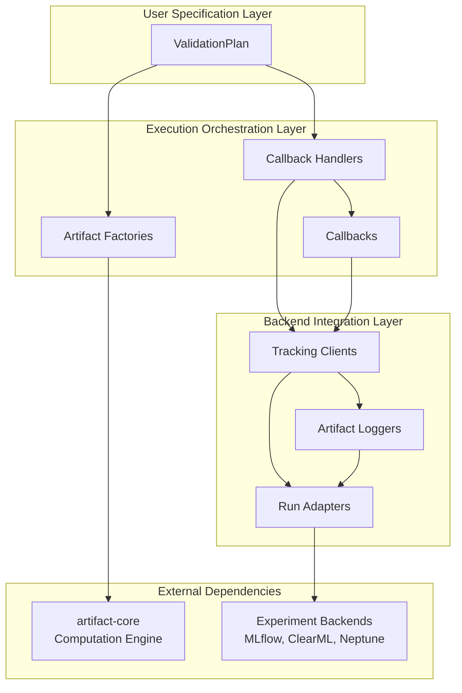

# Architecture

  

`artifact-experiment` follows a layered architecture that separates validation specification, execution orchestration, backend integration, and external dependencies:

## User Specification Layer
The interface for declaratively specifying validation requirements and experiment configurations.

## Execution Orchestration Layer
The internal workflow coordination system that transforms specifications into executable validation processes.

## Backend Integration Layer
The abstraction boundary that enables unified experiment tracking across multiple backend platforms.

## External Dependencies
External systems that the framework integrates with for validation computation and experiment persistence.