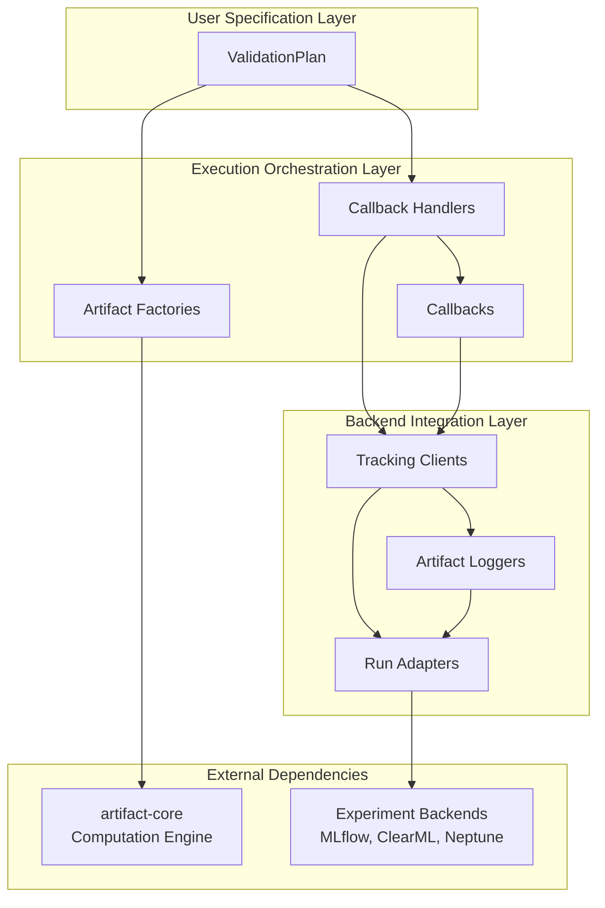

# Architecture

  

## Architectural Layers

### User Specification Layer

The interface through which users declaratively specify validation workflows and experiment configurations.

### Execution Orchestration Layer

The internal coordination system that transforms user specifications into executable validation workflows.

### Backend Integration Layer

The abstraction layer that unifies experiment tracking and management across multiple backend systems.

### External Dependency Layer

The interface that connects the framework to external systems for validation computation and experiment persistence.

## Architecture Diagram

