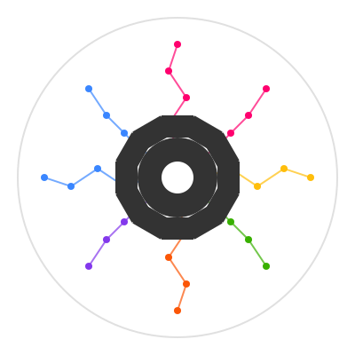

# artifact-experiment

  

[`artifact-experiment`](https://github.com/vasileios-ektor-papoulias/artifact-ml/artifact-experiment) constitutes the experiment orchestration and tracking extension to [Artifact-ML](https://github.com/vasileios-ektor-papoulias/artifact-ml).

It provides tools to build complete reusable, validation workflows with integrated tracking via purely declarative configuration.

It stands alongside:

- [`artifact-core`](https://github.com/vasileios-ektor-papoulias/artifact-ml/tree/main/artifact-core): a unified interface for the declarative computation of diverse validation artifacts in ML experiments.
- [`artifact-torch`](https://github.com/vasileios-ektor-papoulias/artifact-ml/tree/main/artifact-torch): PyTorch integration for building reusable deep-learning workflows declaratively.

## Topics

- [Getting Started](getting_started.md) - quick installation instructions.
- [User Guide](user_guide.md) — general user instructions.
- [Architecture](architecture.md) — high level framework architecture.  
- [Core Entities](core_entities.md) — framework core entity specification.
- [Development Guide](development_guide.md) — low-level development guidelines.