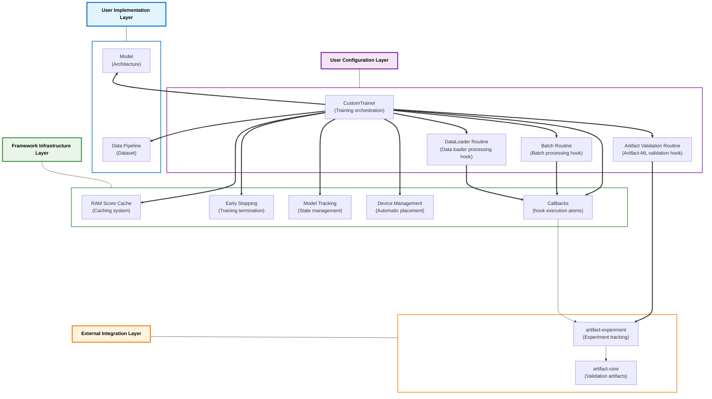

# ⚙️ artifact-torch

> PyTorch integration for the Artifact framework: `artifact-torch` abstracts training infrastructure, enabling researchers to focus on architectural innovation.

<p align="center">
  
</p>


---

## 📋 Overview

`artifact-torch` provides PyTorch integration for the Artifact framework.

It stands alongside:
- [`artifact-core`](https://github.com/vasileios-ektor-papoulias/artifact-ml/tree/main/artifact-core): Framework foundation providing a flexible minimal interface for the computation of validation artifacts.
- [`artifact-experiment`](https://github.com/vasileios-ektor-papoulias/artifact-ml/tree/main/artifact-experiment): The framework's experiment tracking extension, providing **executable validation plan abstractions** exporting results to popular tracking backends (e.g. Mlflow).

`artifact-torch` abstracts common deep learning engineering patterns—training loops, device management, callback systems, and validation orchestration—allowing researchers to focus on architectural innovation over infrastructure development.

**Core Value Proposition:**
- **Interface-driven design**: Implement clean contracts rather than complex training infrastructure
- **Automatic validation integration**: Seamless connection to artifact-core's validation ecosystem
- **Type safety throughout**: Full type checking for models, data flow, and component compatibility
- **Domain-specific extensions**: Specialized toolkits for different problem domains

## 🚀 Usage Sketch

```python
from artifact_experiment.libs.tracking.filesystem.client import FilesystemTrackingClient

# Experiment tracking client
tracking_client = FilesystemTrackingClient.build(experiment_id="research_experiment")

# Model initialization (implementation required)
model = MyModel.build(architecture_config)

# Data pipeline (implementation required)
dataset = MyDataset(processed_data)

# Artifact-ML validation hook (configuration required)
validation_routine = MyValidationRoutine.build(validation_data, tracking_client)

# Training loop (configuration required)
trainer = MyTrainer.build(
    model=model,
    train_loader=DataLoader(dataset, batch_size=config.batch_size),
    artifact_routine=validation_routine,
    tracking_client=tracking_client
)

# Execution with integrated validation
training_metrics = trainer.train()
```
**For a conceptual illustration of `artifact-torch` entities and abstractions refer to the `Architecture` section below.**
**For comprehensive usage examples and detailed implementation patterns, refer to the demo project in [`./demo`](https://github.com/vasileios-ektor-papoulias/artifact-ml/tree/main/artifact-torch/demo) as well as its documentation in `./demo/README.md`.**

## 🏗️ Architecture

The framework employs a three-layer architecture with standardized interface contracts that enable maximal infrastructure reuse. Beyond abstracting engineering concerns, adherence to these type contracts unlocks instant access to comprehensive validation capabilities. Researchers select a problem domain (e.g., tabular data synthesis), adhere to its contracts and focus solely on architectural innovations. They no longer need to write lengthy experiment scripts with messy logic tailored to individual models. Training infrastructure can be shared. This eliminates implementation overhead and accelerates research velocity.



### User Implementation Layer
The boundary where researchers implement domain-specific logic and model architectures.

### User Configuration Layer
The interface for configuring training behavior and validation workflows through declarative specifications.

### Framework Infrastructure Layer
The automated training infrastructure that operates transparently behind user configurations.

### External Integration Layer
The connection points to external Artifact framework components.

## 🔧 Core Abstractions

The framework achieves project-agnostic training infrastructure through coordinated interaction of specialized abstractions across the four aforementioned layers:

### **User Implementation Layer**
Core components that researchers implement to encode their specific research problem logic:

- **Model Interfaces**: Domain-specific protocols (e.g., `TableSynthesizer`) that define contracts for model integration with the training framework. Researchers extend these interfaces and implement required methods for training and validation.

- **Model I/O Types**: Type-safe contracts using `ModelInput` and `ModelOutput` TypedDict classes that specify exactly what flows through models during training, enabling static type checking and callback compatibility verification.

- **Data Abstractions**: Type-safe wrappers around PyTorch's data primitives with enhanced functionality, including generic `Dataset[T]` wrapper and enhanced `DataLoader` with automatic device management.

```python
class MyModel(TableSynthesizer[MyModelInput, MyModelOutput]):
    def training_step(self, batch: MyModelInput) -> MyModelOutput:
        # Model-specific training logic
        pass
    
    def generate_synthetic_data(self, num_samples: int) -> pd.DataFrame:
        # Domain-specific generation logic
        pass
```

**Architecture Role**: These components encode the unique aspects of each research project while conforming to framework contracts that enable infrastructure sharing.

### **User Configuration Layer**
Abstractions that eliminate implementation complexity by requiring only configuration through subclass hooks:

- **CustomTrainer**: Orchestrates the complete training process while providing configuration hooks for domain-specific requirements. Users implement hook methods for optimizer selection, early stopping criteria, and callback configuration while the framework handles training loop execution, device management, and gradient computation.

- **Validation Routines**: Specialized routine configurations that integrate validation into training workflows:
  - **BatchRoutine**: Configures callback execution during individual batch processing
  - **DataLoaderRoutine**: Orchestrates callback execution after processing complete dataloaders
  - **ArtifactRoutine**: Integrates artifact-core validation capabilities into periodic training evaluation

```python
class MyTrainer(CustomTrainer[MyModelInput, MyModelOutput]):
    def _get_optimizer(self) -> torch.optim.Optimizer:
        return torch.optim.Adam(self.model.parameters(), lr=0.001)
    
    def _get_artifact_routine(self) -> MyArtifactRoutine:
        return MyArtifactRoutine.build(validation_data, tracking_client)
```

**Architecture Role**: These configurations eliminate training infrastructure duplication by providing reusable orchestration logic that adapts to domain-specific requirements through hook methods.

### **Framework Infrastructure Layer**
Concrete framework components that handle training infrastructure automatically:

- **Callback System**: Type-aware execution hooks that inject custom behavior at specific training points. Callbacks use variance-based type parameters to ensure compatibility with model I/O types through static analysis.

- **Training Infrastructure Components**: Automatic systems that operate behind the scenes:
  - **Device Management**: Automatic tensor placement and device coordination
  - **RAM Caching**: Intelligent caching for computed validation scores
  - **Early Stopping**: Configurable training termination based on validation metrics
  - **Model Tracking**: State management and best model persistence

```python
# Framework automatically manages device placement, caching, early stopping
trainer = MyTrainer.build(model=model, train_loader=train_loader)
trainer.train()  # All infrastructure handled automatically
```

**Architecture Role**: These components execute training tasks automatically, freeing researchers from infrastructure concerns while providing comprehensive training capabilities.

### **External Integration Layer**
Seamless connections to the broader Artifact ecosystem:

- **artifact-core Integration**: Automatic validation artifact computation during training through specialized routines that coordinate with domain-specific engines.

- **artifact-experiment Integration**: Experiment tracking and result export to popular backends (MLflow, ClearML, Neptune, filesystem) through unified tracking client interfaces.

**Architecture Role**: These integrations connect training workflows to comprehensive validation and experiment tracking capabilities without requiring additional implementation effort.

## 📁 Implementation Guidelines

### Project Organization

The following template summarizes the various entities that need to be implemented when building a deep learning project with `artifact-torch`:

```
project_root/
├── model/
│   ├── io.py                    # ModelInput/ModelOutput type definitions
│   ├── model.py                 # Framework interface implementation
│   └── architectures/           # Neural network implementations
├── data/
│   ├── dataset.py              # Type-safe dataset implementation
│   └── preprocessing/          # Data transformation pipeline
├── trainer/
│   └── trainer.py              # CustomTrainer extension
├── routines/
│   ├── artifact.py             # Validation routine configuration
│   ├── batch.py                # Batch-level callback routines
│   └── loader.py               # DataLoader-level callback routines
└── config/
    └── configuration files
```

### Implementation Sequence

1. **Define I/O Types**: Establish type contracts for model inputs and outputs
2. **Implement Model Interface**: Extend domain-specific interfaces with your architecture
3. **Configure Data Pipeline**: Implement type-safe dataset and dataloader components
4. **Configure Validation**: Configure validation routines by implementing subclass hooks
5. **Configure Training**: Configure CustomTrainer by implementing subclass hooks
6. **Orchestration**: Create a high-level API for simplified usage (optional)

**Detailed Implementation Example**: See the comprehensive tabular VAE demo in `demo/` which demonstrates the complete implementation pattern for tabular data synthesis.

## 🎯 Domain-Specific Toolkits

**Project-Agnostic Training Infrastructure With Integrated Validation**

Multiple PyTorch research projects targeting the same application domain can share training infrastructure and validation routines through `artifact-torch`'s domain toolkit design.

This training-centric approach delivers:

- **Elimination of training loop duplication** across models targeting the same domain
- **Standardized validation integration** during training, preventing inconsistencies in evaluation timing and logic
- **Decoupled model development** from training infrastructure concerns, accelerating architectural experimentation

Rather than requiring researchers to implement custom training loops for each model, the framework provides domain-specific training toolkits. Models within a domain share training infrastructure by conforming to minimal interface contracts that specify how they integrate with the training loop and produce validation outputs.

**Domain Model Interfaces**: Each toolkit defines model protocols (e.g., `TableSynthesizer`) that capture the minimal training and generation contracts required for domain-specific training orchestration.

**Validation During Training**: Training routines automatically integrate with artifact-core engines through specialized callbacks that execute validation at configurable intervals, using model outputs appropriate to the domain.

**Shared Training Infrastructure**: Core training components (optimizers, device management, checkpointing) are reused across all models within a domain, while domain-specific validation hooks ensure appropriate evaluation.

**Rapid Prototyping**: Researchers implement only their model architecture and conform to the domain interface, gaining instant access to full training infrastructure with integrated validation capabilities.

### 📊 Table Comparison

`artifact-torch` provides a concrete implementation for tabular data synthesis: the **Table Comparison Toolkit**.

This is intended to serve research projects in synthetic tabular data generation.

**Scope**: Complete toolkit for tabular data synthesis and evaluation.

**Core Interface**: `TableSynthesizer` protocol defining tabular generation contracts.

**Validation Integration**: `TableComparisonRoutine` managing the execution of Artifact-ML table comparison validation plans.

**Reference Implementation**: The `demo/` directory contains a complete VAE-based tabular data synthesis project built with `artifact-torch` demonstrating all toolkit components.

## 🔧 Framework Extension

### Adding Domain Toolkits

1. **Domain Directory**: Create `domain_name/` in project root
2. **Interface Definition**: Define domain-specific model protocols
3. **Validation Integration**: Implement corresponding validation routines

### Component Extension

**Model Type Contract Development**: Define new `Model`, `ModelInput` and `ModelOutput` contracts in `core/model` for domain-specific data flow patterns, enabling type-safe callback development and static compatibility verification.

**Callback Development**: Place in `libs/components/callbacks/`, inherit from appropriate base classes, implement required hook methods.

**Model Tracker Development**: Extend `ModelTracker[T]` in `libs/components/model_tracking/` with domain-specific best model tracking criteria (e.g., validation loss improvement, custom metric optimization).

**Early Stopping Criteria**: Extend `EarlyStopper[T]` in `libs/components/early_stopping/` with domain-specific termination logic.

## 🚀 Installation

### Using Poetry (Recommended)

```bash
git clone https://github.com/vasileios-ektor-papoulias/artifact-ml.git
cd artifact-ml/artifact-torch
poetry install
```

## 🤝 Contributing

Contributions are welcome. Please refer to the [central Artifact-ML contribution guidelines](https://github.com/vasileios-ektor-papoulias/artifact-ml/blob/main/README.md) for development standards and submission procedures.

## 📄 License

This project is licensed under the MIT License - see the LICENSE file for details.
