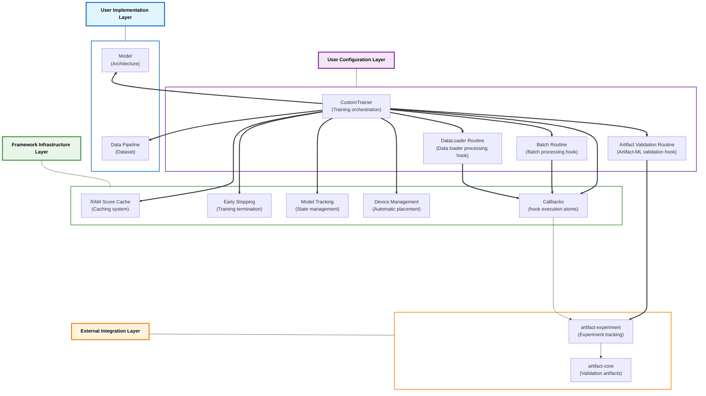

# ⚙️ artifact-torch

> PyTorch integration for the Artifact framework: `artifact-torch` abstracts training infrastructure, enabling researchers to focus on architectural innovation.

<p align="center">
  
</p>


---

## 📋 Overview

`artifact-torch` provides PyTorch integration for the Artifact framework.

It stands alongside:
- `artifact-core`:  The framework core, providing a flexible minimal interface for the computation of heterogeneous validation artifacts.
- `artifact-experiment`: The framework's experiment tracking extension, providing **executable validation plan abstractions** that utilize `artifact-core` to export results to popular tracking backends (e.g. Mlflow).

`artifact-torch` abstracts common deep learning engineering patterns—training loops, device management, callback systems, and validation orchestration—allowing researchers to focus on architectural innovation over infrastructure development.

**Core Value Proposition:**
- **Interface-driven design**: Implement clean contracts rather than complex training infrastructure
- **Automatic validation integration**: Seamless connection to artifact-core's validation ecosystem
- **Type safety throughout**: Full type checking for models, data flow, and component compatibility
- **Domain-specific extensions**: Specialized toolkits for different problem domains

## 🚀 Basic Usage Sketch

```python
from artifact_experiment.libs.tracking.filesystem.client import FilesystemTrackingClient

# Experiment tracking client
tracking_client = FilesystemTrackingClient.build(experiment_id="research_experiment")

# Model initialization (implementation required)
model = MyModel.build(architecture_config)

# Data pipeline (implementation required)
dataset = MyDataset(processed_data)

# Artifact-ML validation hook (configuration required)
validation_routine = MyValidationRoutine.build(validation_data, tracking_client)

# Training loop (configuration required)
trainer = DomainTrainer.build(
    model=model,
    train_loader=DataLoader(dataset, batch_size=config.batch_size),
    artifact_routine=validation_routine,
    tracking_client=tracking_client
)

# Execution with integrated validation
training_metrics = trainer.train()
```
**For a conceptual illustration of `artifact-torch` entities and abstractions refer to the `Architecture` section below.**
**For comprehensive usage examples and detailed implementation patterns, refer to the demo project in `./demo` as well as its documentation in `./demo/README.md`.**

## 🏗️ Architecture

The framework employs a three-layer architecture with standardized interface contracts that enable maximal infrastructure reuse. Beyond abstracting engineering concerns, adherence to these type contracts unlocks instant access to comprehensive validation capabilities. Researchers select a problem domain (e.g., tabular data synthesis), adhere to its contracts and focus solely on architectural innovations. They no longer need to write lengthy experiment scripts with messy logic tailored to individual models. Training infrastructure can be shared. This eliminates implementation overhead and accelerates research velocity.



### User Implementation Layer
Component implementations that encode the core logic of the research problem. Components include: model interfaces defining training and generation behavior, and data pipelines for loading and processing datasets.

### User Configuration Layer
Abstractions that eliminate implementation burden by requiring only configuration through subclass hooks, with the rest of the logic being pre-built. Users leverage existing orchestration logic by specifying how they want it configured rather than implementing complex execution flows from scratch. Components include: `CustomTrainer` extensions configuring training behavior (optimization, early stopping, checkpointing), and validation routines (`BatchRoutine`, `DataLoaderRoutine`, `ArtifactRoutine`) specifying callback execution workflows at different training phases.

### Framework Infrastructure Layer
Concrete framework classes that handle training infrastructure automatically, requiring no programming effort from users. These components operate behind the scenes to execute training tasks, freeing users from infrastructure concerns. Components include: the callback execution system, automatic device management, RAM caching, early stopping mechanisms, and model state tracking.

### External Integration Layer
Automatic connections to the broader Artifact ecosystem for validation and experiment tracking. Components include: `artifact-core` integration for validation artifact computation and `artifact-experiment` integration for experiment tracking and result export.

## 🔧 Core Abstractions

### Model Interfaces

**Purpose**: Define contracts for model integration with the training framework.

**Implementation Requirement**: Extend domain-specific interfaces (e.g., `TableSynthesizer` for tabular synthesis) and implement required methods for training and validation.

**Framework Integration**: The trainer uses these interfaces to execute training while validation routines use generation methods for artifact computation.

### Model I/O Types

**Purpose**: Ensure type safety and component compatibility through standardized input/output definitions.

**Design Pattern**: Define `ModelInput` and `ModelOutput` TypedDict classes that specify exactly what flows through your model during training.

**Type Variance Benefits**: I/O types determine callback compatibility—the framework's type system ensures only compatible callbacks can be used with your model.

### CustomTrainer

**Purpose**: Orchestrate the complete training process while providing configuration hooks for domain-specific requirements.

**Framework Responsibilities**: Training loop execution, device management, gradient computation, checkpoint handling, and metric aggregation.

**User Configuration**: Implement hook methods for optimizer selection, early stopping criteria, callback configuration, and validation routine integration.


### Callback System

**Purpose**: Provide extensible hooks for custom behavior injection at specific training points.

**Type Variance Architecture**: Callbacks are model I/O type-aware through variance-based type parameters. The framework uses type variance to enable static type analysis tools to determine which callbacks are compatible with your model: only callbacks compatible with your specific `ModelInput` and `ModelOutput` types can be correctly instantiated.

**Core Callback Types**:

- **Batch Callbacks**: Execute on individual training batches, providing immediate per-batch computations
  - `BatchScoreCallback`: Compute scalar metrics from single batches
  - `BatchArrayCallback`: Generate arrays from single batches  
  - `BatchPlotCallback`: Create visualizations from single batches
  - Collection variants: `BatchScoreCollectionCallback`, `BatchArrayCollectionCallback`, `BatchPlotCollectionCallback`

- **DataLoader Callbacks**: Execute after processing entire dataloaders, aggregating results across all batches
  - `DataLoaderScoreCallback`: Compute metrics by aggregating batch results
  - `DataLoaderArrayCallback`: Generate arrays by combining batch outputs
  - `DataLoaderPlotCallback`: Create visualizations from aggregated data
  - Collection variants: `DataLoaderScoreCollectionCallback`, `DataLoaderArrayCollectionCallback`, `DataLoaderPlotCollectionCallback`

**Type Safety Mechanism**: Through variance-based generics, the framework enables static type analysis to verify that only compatible callbacks can be instantiated with your model's I/O types.

### Routines

**Purpose**: Combine multiple callbacks into standalone execution flows that are injected into the training loop at specific points.

**Architectural Relationship**: Routines operate one abstraction level above callbacks—they orchestrate collections of related callbacks into cohesive execution units rather than executing individual behaviors.

**Type Variance Integration**: Like callbacks, routines use type variance to enable static type analysis to determine compatibility. Static type checkers can verify which routine types are compatible with your model based on I/O type compatibility.

**Core Routine Types**:

- **BatchRoutine**: Combines batch callbacks into execution flows triggered during individual batch processing
  - Configures which batch callbacks to execute and when
  - Provides batch-level cache management and result aggregation
  - Executes during the training loop's batch processing phase

- **DataLoaderRoutine**: Orchestrates dataloader callbacks into flows executed after processing complete dataloaders  
  - Manages multiple callback handler types (scores, arrays, plots, collections)
  - Provides dataloader-level cache management and result aggregation
  - Executes at epoch boundaries or when explicitly triggered

- **ArtifactRoutine**: Integrates artifact-core validation capabilities into periodic training evaluation
  - Orchestrates model-specific actions required for validation plan execution (e.g., synthetic data generation for generative models, prediction generation for classification models)
  - Coordinates artifact computation through artifact-core based on model outputs
  - Manages validation plan execution and result export across different model domains

**Execution Integration**: The `CustomTrainer` integrates these routines at appropriate training loop hooks, ensuring proper execution timing and resource management.

### Data Abstractions

**Purpose**: Provide type-safe wrappers around PyTorch's data primitives with enhanced functionality.

**Components**: Generic `Dataset[T]` wrapper, enhanced `DataLoader` with automatic device management, and `DeviceManager` for placement handling.

**Integration Benefits**: Automatic device management and type-safe data flow through the training pipeline.

## 📁 Implementation Guidelines

### Project Organization

The framework expects a specific project structure that separates concerns and promotes maintainability:

```
project_root/
├── model/
│   ├── io.py                    # ModelInput/ModelOutput type definitions
│   ├── synthesizer.py           # Framework interface implementation
│   └── architectures/           # Neural network implementations
├── data/
│   ├── dataset.py              # Type-safe dataset implementation
│   └── preprocessing/          # Data transformation pipeline
├── trainer/
│   └── trainer.py              # CustomTrainer extension
├── routines/
│   ├── artifact.py             # Validation routine configuration
│   ├── batch.py                # Batch-level callback routines
│   └── loader.py               # DataLoader-level callback routines
└── config/
    └── configuration files
```

### Implementation Sequence

1. **Define I/O Types**: Establish type contracts for model inputs and outputs
2. **Implement Model Interface**: Extend domain-specific interfaces with your architecture
3. **Configure Data Pipeline**: Implement type-safe dataset and dataloader components
4. **Configure Validation**: Define validation routines and artifact generation plans
5. **Configure Training**: Extend CustomTrainer with domain-specific hooks
6. **Orchestration**: Create high-level APIs for simplified usage (optional)

**Detailed Implementation Example**: See the comprehensive tabular VAE demo in `demo/` which demonstrates the complete implementation pattern for tabular data synthesis.

## 🎯 Domain-Specific Toolkits

### Table Comparison

**Scope**: Complete toolkit for tabular data synthesis and evaluation.

**Core Interface**: `TableSynthesizer` protocol defining tabular generation contracts.

**Validation Integration**: `TableComparisonRoutine` managing the execution of Artifact-ML table comparison validation plans.

**Reference Implementation**: The `demo/` directory contains a complete VAE-based tabular data synthesis project built with `artifact-torch` demonstrating all toolkit components.

## 🔧 Framework Extension

### Adding Domain Toolkits

1. **Domain Directory**: Create `domain_name/` in project root
2. **Interface Definition**: Define domain-specific model protocols
3. **Validation Integration**: Implement corresponding validation routines

### Component Extension

**Model Type Contract Development**: Define new `Model`, `ModelInput` and `ModelOutput` contracts in `core/model` for domain-specific data flow patterns, enabling type-safe callback development and static compatibility verification.

**Callback Development**: Place in `libs/components/callbacks/`, inherit from appropriate base classes, implement required hook methods.

**Model Tracker Development**: Extend `ModelTracker[T]` in `libs/components/model_tracking/` with domain-specific best model tracking criteria (e.g., validation loss improvement, custom metric optimization).

**Early Stopping Criteria**: Extend `EarlyStopper[T]` in `libs/components/early_stopping/` with domain-specific termination logic.

## 🚀 Installation

### Using Poetry (Recommended)

```bash
git clone https://github.com/vasileios-ektor-papoulias/artifact-ml.git
cd artifact-ml/artifact-torch
poetry install
```

### Using Pip

```bash
git clone https://github.com/vasileios-ektor-papoulias/artifact-ml.git
cd artifact-ml/artifact-torch  
pip install .
```

## 🤝 Contributing

Contributions are welcome. Please refer to the [main Artifact-ML contribution guidelines](https://github.com/vasileios-ektor-papoulias/artifact-ml/blob/main/README.md) for development standards and submission procedures.

## 📄 License

This project is licensed under the MIT License - see the LICENSE file for details.
