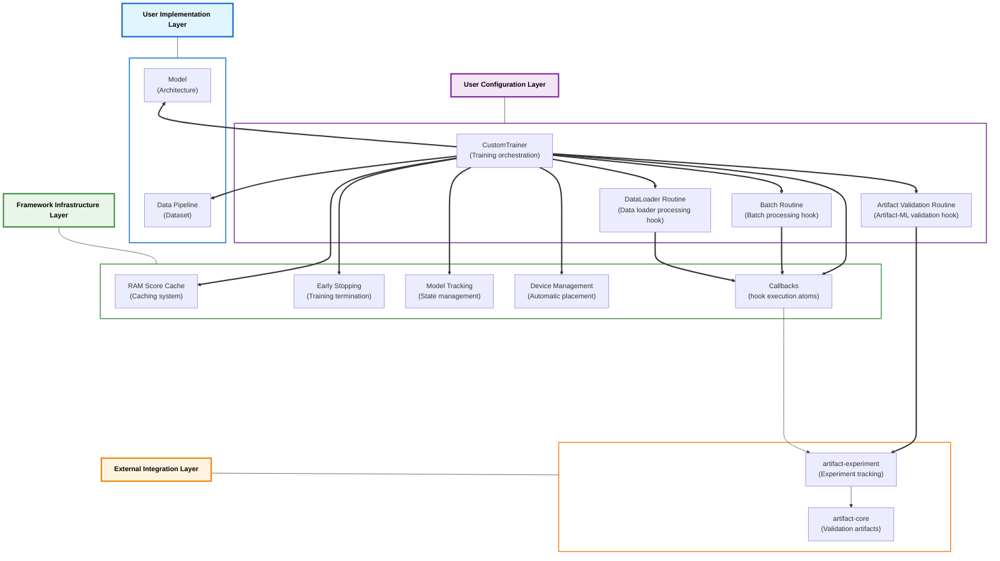

# Architecture

  

## Architectural Layers

### User Implementation Layer

The interface through which researchers design and implement custom model architectures and data pipelines.

### User Configuration Layer

The interface through which users define and manage reusable experiment workflows through declarative configuration.

### Framework Infrastructure Layer

The underlying automated system that executes and manages experiment workflows.

### External Integration Layer

The interface that connects the framework to external Artifact-ML components and services.

## Architecture Diagram

