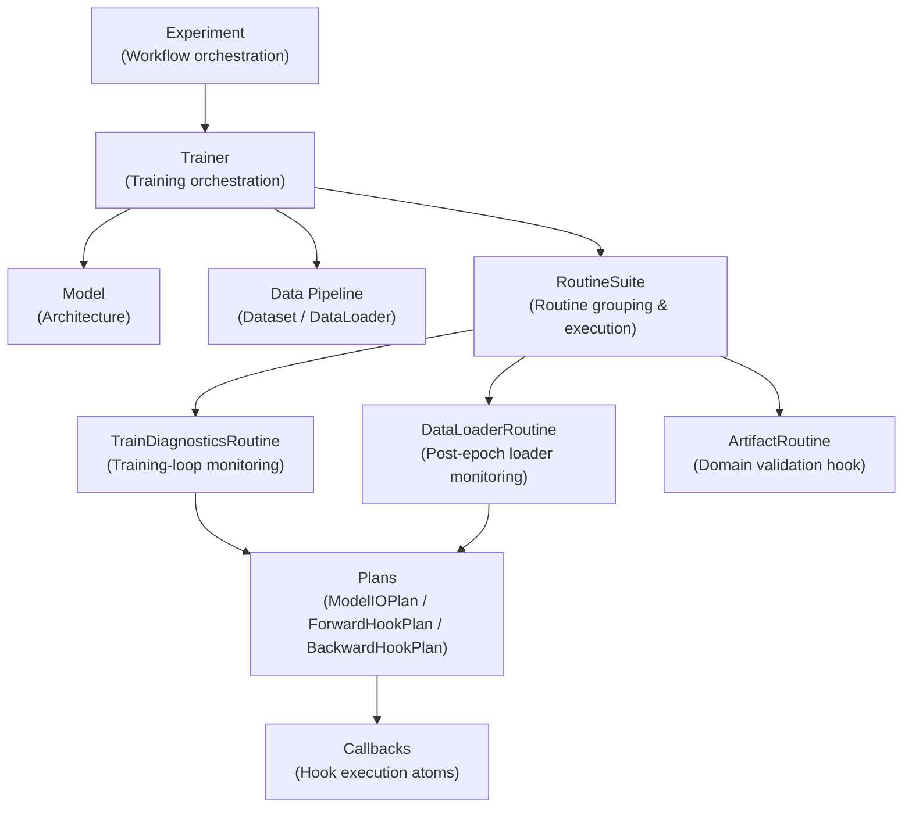
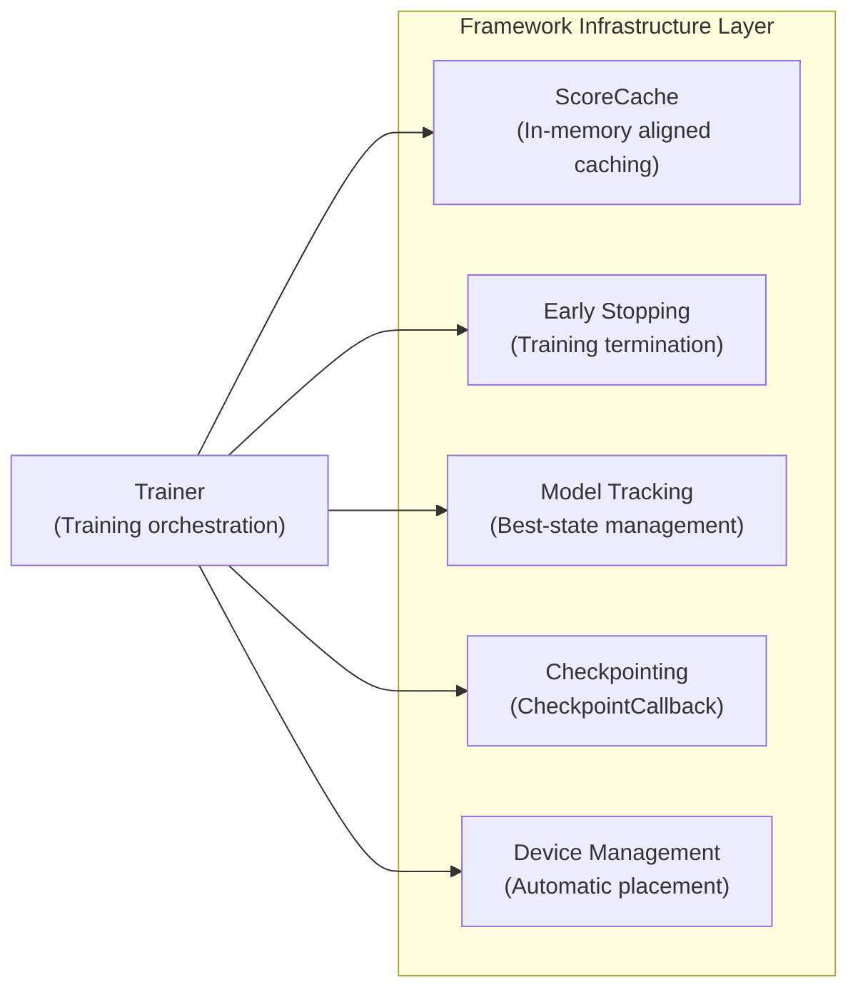
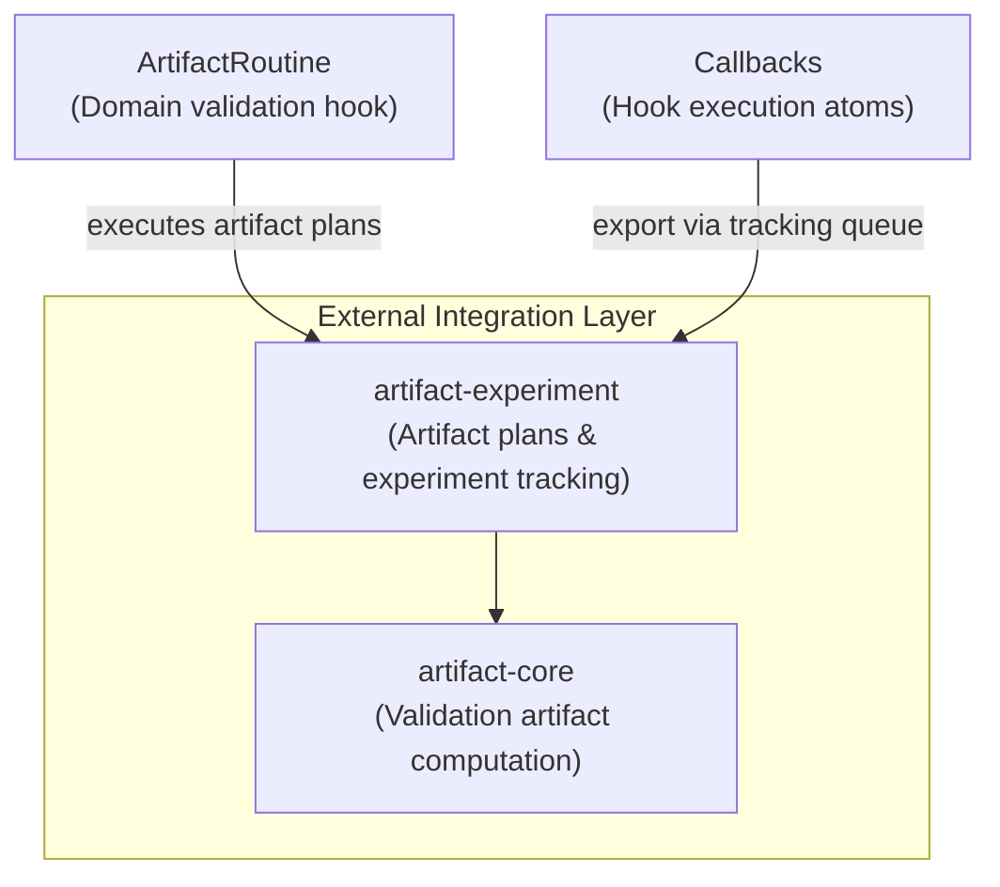

# Architecture

  

## Architectural Layers

### User Implementation Layer

The interface through which researchers design and implement custom model architectures and data pipelines: `Model` subclasses (with their `ModelInput`/`ModelOutput` type contracts) and `Dataset`/`DataLoader` implementations.

### User Configuration Layer

The interface through which users define and manage reusable experiment workflows through declarative configuration:

- **Experiment**: the top-level orchestrator. Users subclass a domain experiment (e.g. `TabularSynthesisExperiment`, `BinaryClassificationExperiment`) and declare which trainer and routines to use; the framework builds and wires everything.
- **Trainer**: training-loop configuration via hook methods (optimizer, scheduler, device, early stopping, model tracking, checkpoint period).
- **Routines**: validation workflow executors injected into the training loop (`TrainDiagnosticsRoutine`, `DataLoaderRoutine`, `ArtifactRoutine`).
- **Plans**: declarative groupings of callbacks (`ModelIOPlan`, `ForwardHookPlan`, `BackwardHookPlan`) returned as classes from routine hooks.

### Framework Infrastructure Layer

The underlying automated system that executes and manages experiment workflows: the `RoutineSuite` grouping routines inside the trainer, the callback execution machinery, the in-memory `ScoreCache`, early stopping, model tracking, checkpointing, and device management.

### External Integration Layer

The interface that connects the framework to external Artifact-ML components and services: artifact plans and tracking clients from `artifact-experiment`, validation artifact computation from `artifact-core`.

## Architecture Diagrams

### Declarative Configuration Hierarchy

How user-declared components compose: the experiment orchestrates the trainer, which drives the user's model and data pipeline and executes the routines (grouped in a framework-managed `RoutineSuite`); routines execute plans, and plans group callbacks.

All nodes except the model, the data pipeline, `RoutineSuite` and `Callbacks` are declaratively configured by the user (via subclassing); the model and data pipeline are user implementations, while `RoutineSuite` and callback execution are framework-managed.

```mermaid
graph TB
    Experiment["Experiment<br/>(Workflow orchestration)"]
    Trainer["Trainer<br/>(Training orchestration)"]
    Model["Model<br/>(Architecture)"]
    Data["Data Pipeline<br/>(Dataset / DataLoader)"]
    RoutineSuite["RoutineSuite<br/>(Routine grouping & execution)"]
    TrainDiagnosticsRoutine["TrainDiagnosticsRoutine<br/>(Training-loop monitoring)"]
    DataLoaderRoutine["DataLoaderRoutine<br/>(Post-epoch loader monitoring)"]
    ArtifactRoutine["ArtifactRoutine<br/>(Domain validation hook)"]
    Plans["Plans<br/>(ModelIOPlan / ForwardHookPlan / BackwardHookPlan)"]
    Callbacks["Callbacks<br/>(Hook execution atoms)"]

    Experiment --> Trainer
    Trainer --> Model
    Trainer --> Data
    Trainer --> RoutineSuite
    RoutineSuite --> TrainDiagnosticsRoutine
    RoutineSuite --> DataLoaderRoutine
    RoutineSuite --> ArtifactRoutine
    TrainDiagnosticsRoutine --> Plans
    DataLoaderRoutine --> Plans
    Plans --> Callbacks
```

For a detailed account of what each routine contains and when it runs inside the training loop, see [The Training Loop](training_loop.md).

### Training-Loop Infrastructure

The framework services the trainer manages internally during the training loop.

```mermaid
graph LR
    Trainer["Trainer<br/>(Training orchestration)"]

    subgraph infraLayer [Framework Infrastructure Layer]
        direction TB
        Cache["ScoreCache<br/>(In-memory aligned caching)"]
        EarlyStopping["Early Stopping<br/>(Training termination)"]
        ModelTracking["Model Tracking<br/>(Best-state management)"]
        Checkpointing["Checkpointing<br/>(CheckpointCallback)"]
        Device["Device Management<br/>(Automatic placement)"]
    end

    Trainer --> Cache
    Trainer --> EarlyStopping
    Trainer --> ModelTracking
    Trainer --> Checkpointing
    Trainer --> Device
```

### External Integration Flow

How validation results leave the training loop: the artifact routine delegates to `artifact-experiment` plans (powered by `artifact-core`), and callbacks export scores and plots through the tracking queue to `artifact-experiment` tracking clients.

```mermaid
graph TB
    ArtifactRoutine["ArtifactRoutine<br/>(Domain validation hook)"]
    Callbacks["Callbacks<br/>(Hook execution atoms)"]

    subgraph externalLayer [External Integration Layer]
        ArtifactExp["artifact-experiment<br/>(Artifact plans & experiment tracking)"]
        ArtifactCore["artifact-core<br/>(Validation artifact computation)"]
    end

    ArtifactRoutine -->|executes artifact plans| ArtifactExp
    Callbacks -->|export via tracking queue| ArtifactExp
    ArtifactExp --> ArtifactCore
```

## Execution Flow

A typical workflow proceeds as follows:

1. (Optional) The user implements custom **Callbacks** tailored to their model's I/O profile by extending the base callback classes in `artifact_torch.nn.callbacks`. These integrate seamlessly with the framework's pre-built callbacks.
2. The user declares **Plans** by subclassing `ModelIOPlan`, `ForwardHookPlan` or `BackwardHookPlan`, selecting the callbacks (framework-provided and custom) each plan groups; similarly, they declare the domain artifact plan (e.g. a `TableComparisonPlan` subclass) selecting the validation artifacts to compute.
3. The user declares **Routines** by subclassing `TrainDiagnosticsRoutine`, `DataLoaderRoutine` and the domain `ArtifactRoutine` (e.g. `TableComparisonRoutine`), returning the plan classes (per `DataSplit` where applicable) along with execution periods and generation parameters.
4. The user configures the **Trainer** via its hook methods (optimizer, scheduler, device, early stopping, model tracking, checkpoint period) and subclasses a domain **Experiment** (e.g. `TabularSynthesisExperiment`), declaring the trainer and routine classes to use via classmethod hooks (`_get_trainer`, `_get_train_diagnostics_routine`, `_get_loader_routine`, `_get_artifact_routine`).
5. `Experiment.build(...)` receives the model, `DataSplit`-keyed data loaders, artifact routine data and an optional tracking client. It builds the routines from the declared classes and injects them into the trainer via `Trainer.build(...)`.
6. The **Trainer** groups the injected routines in a `RoutineSuite` and executes the training loop. After each epoch it executes the routine suite, the checkpoint callback, the model tracker and the early stopper.
7. **Routines** execute their **Plans**, which in turn execute **Callbacks**. Results are cached in the trainer's `ScoreCache` (an aligned in-memory cache exposed as `epoch_scores`) and exported to `artifact-experiment` tracking clients via the tracking queue.
8. The **Artifact Routine** delegates artifact computation to `artifact-experiment` plans, which are powered by `artifact-core` validation artifacts.

For a detailed breakdown of the epoch lifecycle---which routine holds which plans and when each runs---see [The Training Loop](training_loop.md).
