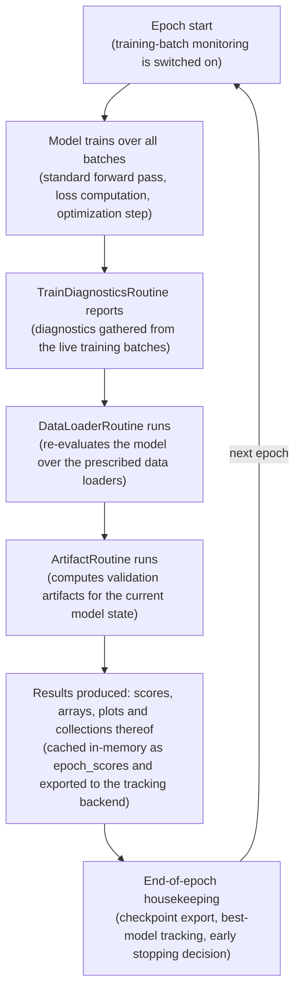
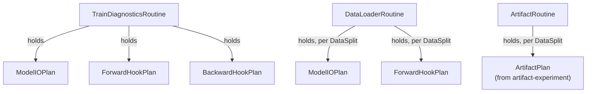

# The Training Loop

  

This page explains how the training loop executes the validation components you declare. [`artifact-torch`](https://github.com/vasileios-ektor-papoulias/artifact-ml/tree/main/artifact-torch) structures these components around two framework-specific abstractions:

- **Routines** (`artifact_torch.nn.routines`, `artifact_torch.spi`): the framework's units of validation work, executed by the trainer around each epoch. Three kinds exist: `TrainDiagnosticsRoutine`, `DataLoaderRoutine` and `ArtifactRoutine`.
- **Plans** (`artifact_torch.nn.plans`): the framework's declarative callback groupings. Each routine is configured by declaring which plans it executes, and each plan declares which callbacks (or, for artifact plans, which validation artifacts) it runs.

Both are introduced in [Core Entities](core_entities.md) and situated in the overall design in [Architecture](architecture.md). This page details what each routine contains, at which point of the loop it runs, and the configuration surface this exposes---see the [User Guide](user_guide.md) for the corresponding step-by-step setup.

## Anatomy of an Epoch

The `Trainer` executes the following cycle until the early stopper signals termination:

1. **Epoch preprocessing**: the `TrainDiagnosticsRoutine` attaches its plans' callbacks to the model, so they can observe the epoch's live training batches.
2. **Training batches**: for each batch, the model's forward pass produces a `ModelOutput`; the loop reads `model_output["t_loss"]`, backpropagates and steps the optimizer (and scheduler, if configured). Attached diagnostics callbacks observe inputs, outputs, activations and gradients as they happen.
3. **Epoch postprocessing**, in order:
    - the **routine suite** executes its routines: train diagnostics report, the data loader routine re-runs the model over its loaders, the artifact routine computes validation artifacts (each subject to its own periodicity---see below);
    - the **checkpoint callback** exports a checkpoint if the epoch matches the checkpoint period;
    - the **model tracker** updates its best-model state against the configured criterion;
    - the **early stopper** updates and decides whether training continues.

Routine results (scores) are appended to the trainer's in-memory `ScoreCache`, exposed as `epoch_scores`; all callback and artifact results are simultaneously exported to the tracking backend via the tracking queue.

## The Routines

A *routine* in `artifact-torch` is a class encapsulating a validation workflow that the trainer injects into the training loop: you declare a routine by subclassing one of the three framework bases below and implementing its classmethod hooks; the framework instantiates and schedules it. Each routine holds one or more *plans* (see [The Plans](#the-plans) below).

### TrainDiagnosticsRoutine

Monitors the training loop *itself*: its callbacks observe the actual training batches, including gradients.

- **Contains**: up to one `ModelIOPlan`, one `ForwardHookPlan` and one `BackwardHookPlan` (hooks: `_get_model_io_plan()`, `_get_forward_hook_plan()`, `_get_backward_hook_plan()`; return `None` to omit). Hooks are *not* keyed by data split---the routine always concerns the training batches.
- **When it runs**: callbacks attach before each epoch's batches (each callback decides participation via its own `period`) and the routine reports collected results at epoch end.
- **Note**: this is the only place backward-hook (gradient) callbacks can run, since post-epoch evaluation happens under `torch.no_grad()`.

### DataLoaderRoutine

Post-epoch monitoring over prescribed data loaders: re-runs the model in evaluation mode (no gradients) over each configured loader.

- **Contains**: one `ModelIOPlan` and one `ForwardHookPlan` *per data split* (hooks: `_get_model_io_plan(data_split)`, `_get_forward_hook_plan(data_split)`). It is built with a `DataSplit`-keyed mapping of loaders; splits without a loader are ignored.
- **When it runs**: at epoch end. For each split, the routine first attaches callbacks (period-gated); only if at least one callback is active does it sweep the loader, then executes the plans. This means no wasted forward passes on epochs where nothing is due.

### ArtifactRoutine

The domain-specific validation hook: delegates artifact computation to an `artifact-experiment` plan powered by `artifact-core`. Domain toolkits provide concrete bases---e.g. `TableComparisonRoutine`, which generates synthetic data via the model's `generate(params)` and compares it against the real dataset.

- **Contains**: one **artifact plan** (e.g. a `TableComparisonPlan` subclass) *per data split* (hook: `_get_artifact_plan(data_split)`), plus routine-level hyperparameters (e.g. `_get_generation_params()` for tabular synthesis).
- **When it runs**: at epoch end, but only for splits whose period matches---`_get_period(data_split)` sets a per-split cadence (return `None` to disable a split).

## The Plans

A *plan* in `artifact-torch` is a declarative grouping of callbacks, sitting between routines and the individual callbacks they execute. The framework provides three plan bases in `artifact_torch.nn.plans`, one per callback kind; you declare a plan by subclassing the appropriate base and implementing one classmethod hook per result type (scores, arrays, plots, and their collections), each receiving a build context that carries the tracking writers.

- **`ModelIOPlan[ModelInputT, ModelOutputT]`**: callbacks observing forward-pass inputs and outputs---e.g. the framework's `LossCallback`, or custom callbacks computing metrics from your model's output fields.
- **`ForwardHookPlan[ModelT]`**: callbacks observing intermediate activations via forward hooks---e.g. `AllActivationsPDF`.
- **`BackwardHookPlan[ModelT]`**: callbacks observing gradients via backward hooks (train diagnostics only).
- **Artifact plans** (`ArtifactPlan` from `artifact-experiment`, e.g. `TableComparisonPlan`): declare *which validation artifacts* to compute by artifact type---no callbacks involved; computation is delegated to `artifact-core`.

Custom callbacks tailored to your model's I/O profile extend the base classes in `artifact_torch.nn.callbacks` and are returned from plan hooks alongside framework-provided ones.

## Periodicity: Who Runs When

Cadence is controlled at three levels, all in epochs:

| Level | Mechanism | Applies to |
|---|---|---|
| Callback | `period` constructor argument (e.g. `LossCallback(period=5, ...)`) | Hook callbacks inside `ModelIOPlan` / `ForwardHookPlan` / `BackwardHookPlan` |
| Routine, per split | `_get_period(data_split)` | `ArtifactRoutine` |
| Trainer | `_get_checkpoint_period()` | Checkpointing |

The model tracker and early stopper update every epoch.

## Where Results Go

Every result reaches two destinations:

1. **In-memory**: routine scores are merged into the trainer's `ScoreCache`, available after (and during) training as the `epoch_scores` dataframe.
2. **Tracking backend**: callbacks and artifact plans write results through the tracking queue, which the `artifact-experiment` tracking client exports to the configured backend (MLflow, ClearML, Neptune, filesystem, or in-memory).

## Configuration Summary

| You subclass | Declaring | Via hooks |
|---|---|---|
| `ModelIOPlan` / `ForwardHookPlan` / `BackwardHookPlan` | which callbacks run | `_get_score_callbacks(context)`, `_get_plot_callbacks(context)`, ... |
| Domain artifact plan (e.g. `TableComparisonPlan`) | which validation artifacts to compute | `_get_score_types()`, `_get_plot_types()`, ... |
| `TrainDiagnosticsRoutine` | training-batch monitoring | `_get_model_io_plan()`, `_get_forward_hook_plan()`, `_get_backward_hook_plan()` |
| `DataLoaderRoutine` | post-epoch loader monitoring | `_get_model_io_plan(data_split)`, `_get_forward_hook_plan(data_split)` |
| Domain artifact routine (e.g. `TableComparisonRoutine`) | domain validation | `_get_period(data_split)`, `_get_artifact_plan(data_split)`, `_get_generation_params()` |
| `Trainer` | training mechanics | `_get_optimizer(model)`, `_get_scheduler(optimizer)`, `_get_device()`, `_get_checkpoint_period()`, `_get_early_stopper()`, `_get_stopper_update_data()`, `_get_model_tracker()`, `_get_model_tracking_criterion()` |
| Domain experiment (e.g. `TabularSynthesisExperiment`) | the overall workflow | `_get_trainer()`, `_get_train_diagnostics_routine()`, `_get_loader_routine()`, `_get_artifact_routine()` |
