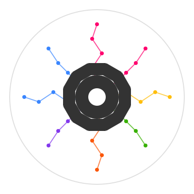

# Design Philosophy

  

## Organization by Validation Requirements: Domain Toolkits

Our view is that the natural common ground among ML experiments lies in their validation workflows.

When deciding which logic should be shareable among models, we start by asking a simple question:

*What does the model do?*

Any model that can answer this question in the same way should be able to share the same validation workflow.

To formalize this, we identify model families through validation resource grouping: we determine the minimal resources required to execute validation logic and group models by their capacity to emit them.

This principle gives rise to [**domain toolkits**](domain_toolkits.md): self-contained validation ecosystems aligned with specific application domains (e.g., tabular data synthesis, binary classification).

Each toolkit integrates shared framework infrastructure with domain-specific evaluation primitives, facilitating the development of experiment workflows reusable by all models that *do the same thing*.

## Structural Differentiation within Domains: Type Hierarchies

We treat auxiliary model structure as orthogonal to validation requirements.  

Within a given validation domain, models are organized into a **type hierarchy** that captures their additional structure.

Workflows are then defined in a **dual hierarchy**, enabling the automatic determination of model–workflow compatibility through static type-checking.

Ultimately, this enables the development of reusable end-to-end  workflows, not just validation components.

This principle is exemplified in `artifact-torch`, where we capture the auxiliary structure underpinning deep learning models by the I/O profile of their forward pass.