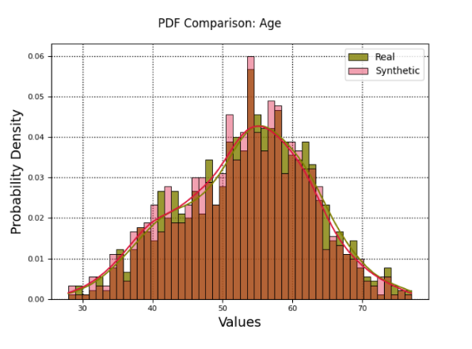

# Artifact-ML

  

## Overview

[Artifact-ML](https://github.com/vasileios-ektor-papoulias/artifact-ml/tree/main) eliminates imperative glue code in ML experiments by providing the tools to build **reusable** workflows **declaratively**.

By *reusable*, we refer to workflows that are defined once with the potential to be reused by any model within the same task category.

By *declarative*, we refer to building through expressing high-level intent---rather than catering to implementation details.

## Topics

- [Packages](packages.md) — overview of the packages comprising the framework.  
- [Getting Started](getting_started.md) — quick installation instructions.  
- [Value Proposition](value_proposition.md) — high-level description of the problem addressed by the project.  
- [Motivating Example](motivating_example.md) — a concrete example illustrating the problem (and solution) in action.  
- [Design Philosophy](design_philosophy.md) — the core ideas and principles that shape the framework.  
- [Domain Toolkits](domain_toolkits.md) — a note on the project's organization by application domain.

  

